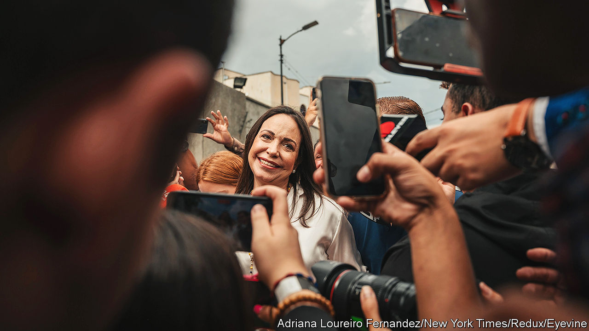
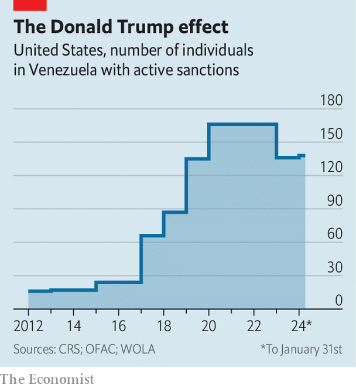

###### Autocratic tactics

# Nicolás Maduro, Venezuela’s dictator, thumbs his nose at Joe Biden 

##### But will America reinstate all of its sanctions on the South American country? 

 

> Jan 31st 2024 

In the unlikely event that a free and fair election were to be held in Venezuela this year, Nicolás Maduro, its , would almost certainly be voted out of office. That is especially true were he to face María Corina Machado, a  who won the opposition primary last October with 92% of the vote. One poll in November found that 70% of those surveyed said they would elect her, with just 9% supporting Mr Maduro. So it came as little surprise when, on January 27th, a Supreme Court stuffed with his cronies ratified a ban on Ms Machado seeking any political office for 15 years.

The move was swiftly justified by spokesmen spouting the regime’s twisted logic. Prohibiting the country’s most popular politician from being on the ballot papers was nothing other than a valiant defence of democracy, they insisted. “We want elections which are competitive for everyone, free for all,” claimed Jorge Rodríguez, the head of the government’s rubber-stamp National Assembly. He then added that there was no way “that woman” would ever be a candidate. 

It is just the latest example of Mr Maduro thumbing his nose at the United States. In October President Joe Biden’s administration lifted sanctions for six months on most of the country’s oil, mining and gold sectors in exchange for the regime agreeing, with members of the opposition, to a deal signed in Barbados which includes releasing political prisoners and holding broadly democratic elections this year. 

Since then a handful of prisoners have been freed. But democracy remains elusive in the rogue state. In December Mr Maduro held a dodgy referendum which he claimed gave him the remit to annex two-thirds of neighbouring Guyana, a move designed to create geopolitical headaches. 

On January 29th, in response to Ms Machado’s ban, the US Department of the Treasury announced the reimposition of one sanction. American companies transacting with Venezuela’s state-owned mining company, Minerven, would have until February 13th to disentangle themselves from it. The big question now is: will Mr Biden have the mettle to impose more noteworthy sanctions, such as on the oil sector, on April 18th, the deadline for Mr Maduro to play ball?

Ms Machado believes in free markets and calls Margaret Thatcher a hero. That makes her unusual in Venezuela, a socialist state which has been ruled by Mr Maduro since 2013 and, before that, by Hugo Chávez, his political mentor. She used to be seen as the hardline fringe of the opposition, and as recently as 2018 tweeted that the only way to rid the country of Mr Maduro’s regime was not via the ballot, but “by force”. She now argues that elections can bring about change. She has also repeatedly said that Mr Maduro runs a “terrorist regime” and should “face justice” for crimes he has committed against humanity.

Even before the Supreme Court decision, Ms Machado was banned from office on the grounds that she failed to declare some assets when she was a congresswoman (an allegation she says is baseless). Justifying its latest ruling, the Supreme Court cited various reasons, including the fact that she had expressed support for American sanctions. The court also confirmed a similar ban on Henrique Capriles, another opposition politician. 

Indeed, despite the Barbados deal, the regime is taking a harder-line stance against its perceived enemies. On January 22nd it announced that 32 people had been arrested for allegedly plotting to assassinate Mr Maduro and Vladímir Padrino, the defence minister. Detention warrants were issued for a further 14 “suspects” including Tamara Sujú, a human-rights activist, and Sebastiana Barráez, a journalist, both of whom live abroad. Three of Ms Machado’s campaign directors were detained earlier this month. The government has said it is unleashing what it has described as “Furia Bolivariana”: a “fury” in the name of the country’s 19th-century independence hero, Simón Bolívar.

 


Others see it as sheer pragmatism. “Allowing Machado to stand was never a possibility in this situation, where the government sets the rules,” says Luis Vicente León, a pollster. He thinks that Ms Machado’s past threats of retaliation meant her candidacy was a non-starter. Given that Mr Maduro’s regime survived an escalation in sanctions under Donald Trump (see chart), it seems it is calculating that it can withstand sanctions once more. 

Mr Maduro has used the past few months to consolidate his power further. His regime has more leverage over the United States. On January 30th Delcy Rodríguez, the vice-president, tweeted that if America snapped back an embargo, Venezuela would stop taking repatriated Venezuelan migrants, record numbers of whom arrived in the United States last year. 

Meanwhile the deal in Barbados led to a prisoner swap whereby an ally of Mr Maduro, Alex Saab, a Colombian businessman who faced charges in the United States for allegedly helping the regime launder $350m, was granted clemency by Mr Biden and returned to Venezuela. He now runs Venezuela’s international investment centre. Mr Saab was arrested in 2020 in Cape Verde, during a refuelling pit-stop when on the way to Iran. The Iranian regime has helped Venezuela’s, by buying gold, and it could do so again. 

Even so, the return of sanctions on Venezuela’s oil sector would still be a big financial hit. It would mean that the regime would again have to resort to selling its oil at as much as a 40% discount on the black market, at an estimated loss of $500m per month in a country where GDP was just $92bn last year.

One possible compromise being suggested in Caracas, the capital, is that Ms Machado withdraws her candidacy and supports a non-banned candidate. But the opposition leader, whose political mantra is  (Until the end), emphatically dismissed that option on January 29th. “There is no retreat,” she said. “We have a mandate. And we will complete it.” Venezuela is set on a collision course. ■

