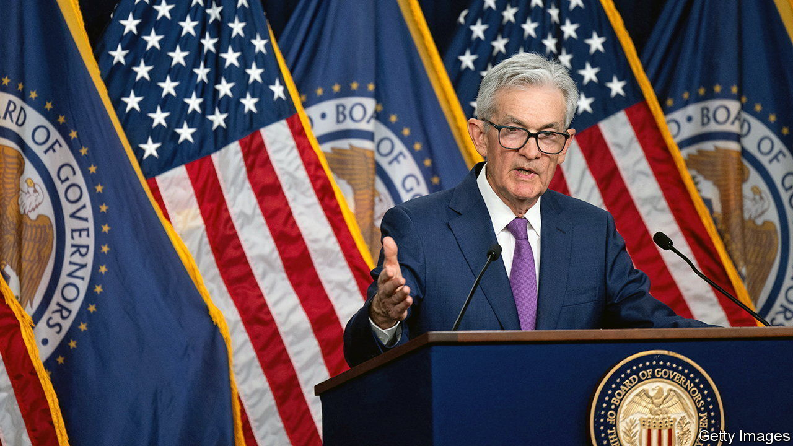
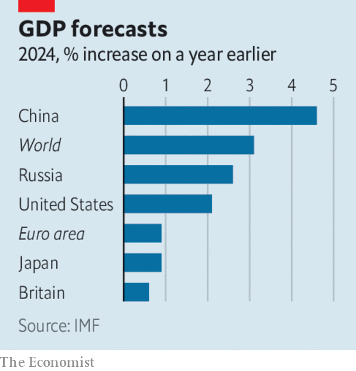

###### The world this week

# Business 

#####  

 

> Feb 1st 2024 

The kept its main interest rate on hold at a range of 5.25% to 5.5%. It was the fourth consecutive time the central bank has held rates. With inflation on the wane, investors are impatient for a rate cut; the Fed offered little information about when it expects to do that. It did issue a more neutral outlook by saying that it was “moving into better balance” on jobs and inflation, but it all but ruled out a rate cut in March. Stockmarkets swooned. 
me

The  also kept its main rate steady, at 5.25%. The central bank said it required more proof that inflation will fall again, and stay down, before cutting rates, though it removed language in its statement about the possibility of “further tightening”. 

 withheld its usual forward guidance for the year when it presented its quarterly earnings. The planemaker’s 737 Max 9 aircraft were grounded when a panel fell from an airliner soon after take-off. The 737 Max 9s have started flying again, though the Federal Aviation Administration has limited Boeing’s production of the plane. 

 reported a big jump in revenues, boosted in large part by artificial intelligence, which it is now applying “across every layer of our tech stack”, according to Satya Nadella, its chief executive. The company pointed to the success of its Azure AI cloud service, which provides access to large and small language models integrated with infrastructure, data and tools. But Microsoft’s share price dipped, as investors fretted about the increasing costs of keeping up with AI developments. 

 A “notably larger” rise in spending on AI at  also weighed on market sentiment after it announced its results, even though revenue grew more than expected at Google’s cloud-services business. 

 withdrew its proposed acquisition of , following objections from the European Union. IRobot makes the Roomba autonomous vacuum cleaner; the EU claimed the deal would have allowed Amazon to hoover up competition in the market. After Amazon’s announcement iRobot said it would shed a third of its staff, after sales fell by 25% last year. 

Bumps in the road

After becoming the world’s biggest seller of electric vehicles,  said it expects its profit last year will have grown by up to 86%. But it also warned of increasing competition from Chinese rivals. Meanwhile Renault called off its planned IPO of , its EV division, because of “current equity-market conditions”; in other words, souring investor sentiment on growth in the EV industry. 

“It’s true the pace of EV growth has slowed,”  said in its earnings, but it pointed out that EV sales are still rising, and should account for 10% of all car sales in America this year. The weak spot in the carmaker’s otherwise positive outlook remains China; it sold 2.1m vehicles there in 2023, down from a peak of 4m in 2017.

Although it is a laggard in EVs,  retained its crown as the world’s biggest seller of vehicles in total, notching up 11.2m in sales last year. Volkswagen parked in the number-two spot again, selling 9.2m.

In a surprising change to its strategy, , under the direction of the Saudi government, abandoned an aim of increasing its maximum oil output and is to stick to current targets. Some industry watchers wondered if this was a response to a possible slowing of demand, whereas others said it was a reaction to spare capacity. 

 

The IMF said it now expects the to grow by 3.1% this year, up from the 2.9% it forecast last October. This is in part because of “greater-than-expected resilience” in the American economy, which expanded at an annual rate of 3.3% in the last three months of 2023. But the fund’s biggest upward revision was to  GDP, which it now thinks will grow by 2.6%. Despite sanctions by the West, Russia has been able to sell its oil elsewhere. Exports of Russian diesel to Brazil, for instance, have soared over the past year.

The  registered zero growth in the final quarter of 2023, narrowly avoiding a recession (GDP fell by 0.1% in the previous three months). The economy grew by just 0.5% for the whole year.

A judge in Hong Kong ruled that  be put into liquidation. Saddled with over $300bn in liabilities, the developer is at the heart of China’s property crisis. The ruling applies to its Hong Kong-based holding company, part of a sprawling financial network. Enforcing the order will depend on courts and officials in mainland China, where most of Evergrande’s assets are held. 

Rich man, poor man

A judge in Delaware struck down the $55.8bn pay package awarded by Tesla to  in 2018, finding that as the “superstar CEO”, he had “dominated the process” that led to the deal. “Never incorporate your company in the state of Delaware,” Mr Musk retorted on X. He is going to ask Tesla’s shareholders “immediately” to transfer the company’s incorporation base to Texas. 

