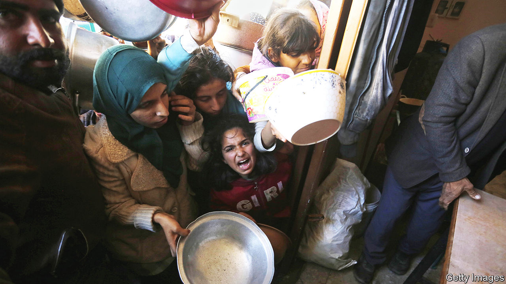
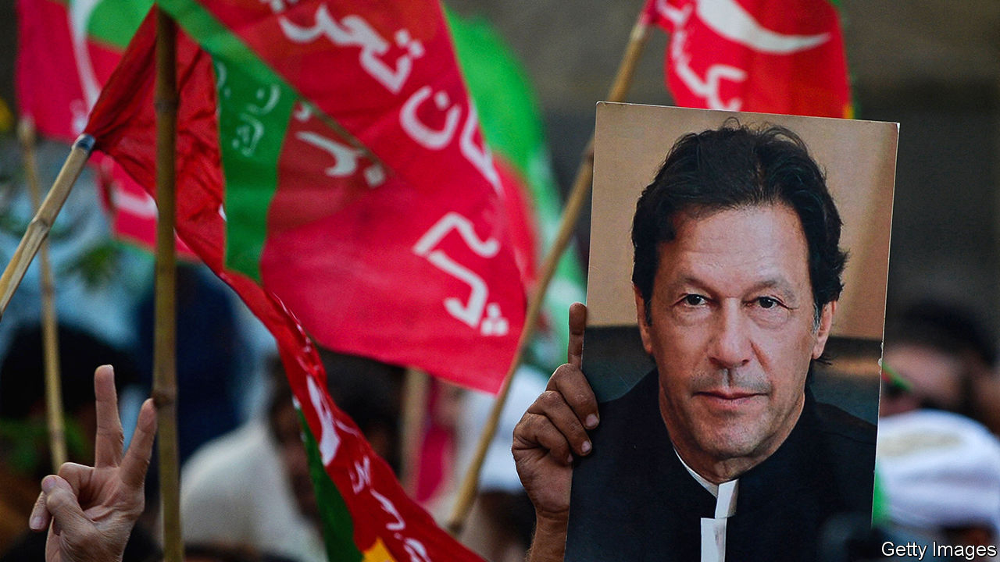

###### The world this week

# Politics 

#####  

 

> Feb 1st 2024 

American, Egyptian, Israeli and Qatari negotiators met in Paris to discuss the framework for a long  in the fighting in Gaza. It would allow for the exchange of hostages still being held in  with Palestinian prisoners in . Binyamin Netanyahu, Israel’s prime minister, said he would not accept a deal that required Israeli troops to leave Gaza permanently without Israel’s “total victory” over Hamas. Nonetheless Ismail Haniyeh, a senior Hamas leader, said the group was considering the proposal.

Three  were killed and 40 others wounded in a strike on a base in Jordan known as Tower 22, which supports American operations in Iraq and Syria. Kataib Hizbullah, an Iranian-backed Iraqi militia, is believed to have been responsible. America hinted that its response might come in waves. 

Israel said it had evidence that at least a dozen of the 13,000 Gaza-based staff members of , the UN agency that helps Palestinians, were  in Hamas’s attack on Israel on October 7th. In response more than ten countries, including America and Germany, UNRWA’s two largest funders, said they would freeze donations. UNRWA says that without the money it will be forced to cease operations at the end of February amid the humanitarian crisis in Gaza. 

Israeli troops disguised as medics and other civilian roles killed three members of Palestinian armed groups in a hospital in the . Israel says the raid prevented a major imminent attack. A doctor at the hospital said one of the men was receiving medical treatment. Experts believe Israel’s ruse probably violated the laws of war.

The Iranian-backed  attacked more merchant ships linked to America and Britain off the coast of Yemen. America carried out more air strikes on Houthi targets, including the destruction of a fleet of drones that were being prepared to attack vessels.

Israeli government ministers attended a conference in Jerusalem calling for the  and the relocation of the Palestinian population from there. America said it was troubled by the meeting and said such suggestions were “incendiary and irresponsible”. Binyamin Netanyahu said it did not represent government policy, but the presence of some of his allies raised questions.

The African National Congress,  ruling party, suspended Jacob Zuma, a former president, after he said he would campaign for a newly formed rival party. The split makes it more likely that the ANC will lose its majority for the first time in national elections, which are due to be held later this year.

Burkina Faso, Mali and Niger, three west African countries run by military juntas, said they would withdraw from , the regional bloc, which has been pressing for a return to civilian rule.

The chief prosecutor of the International Criminal Court said both sides in  civil war may have committed war crimes. Fighting broke out last year between the Sudanese Armed Forces and the Rapid Support Forces, a paramilitary group implicated in genocidal acts in Darfur.

Police in  arrested dozens of people suspected of having links to the gunmen who attacked a Catholic church in Istanbul, killing a man. Islamic State claimed responsibility. The two gunmen, one from Russia the other from Tajikistan, were arrested.

The quid pro quo

The Biden administration confirmed that it would sell 40 . The confirmation of the arms deal came the day after Turkey  Sweden’s membership of NATO. America had linked the sale of the fighter jets to Turkey’s ratification of Sweden’s application. Meanwhile, the Pentagon reported that  to foreign countries rose by 56% last year. The biggest sales were Apache helicopters and rocket systems to Poland and Chinook helicopters to Germany. 

After intense negotiations, the European Union agreed to release €50bn ($54bn) in aid to . Because the money is coming from the EU budget it required unanimous approval. Viktor Orban, the prime minister of Hungary, had been blocking the deal until this week’s summit. 

Meanwhile , Ukraine’s president, was reported to have asked Valery Zaluzhny, the country’s most senior general,. Tensions between the two men are running high after General Zaluzhny said that the war was at a stalemate, contradicting the official line that Ukraine is making advances. 

, the president of the European Council, decided not to stand as a candidate for the European Parliament in June’s election. Mr Michel faced a backlash after he said he would run, as he would have had to quit his job ahead of the end of his term in late November. 

The  amnesty bill for Catalan nationalists was surprisingly defeated in a parliamentary vote. The Junts per Catalunya party withdrew its support, claiming the amnesty would not cover Catalan politicians who are being investigated on terrorism charges. Last year huge protests were held throughout Spain against the amnesty, the centrepiece of a deal that allowed the Socialists to continue in government. The bill could be resubmitted with revisions. 

The Democratic Unionist Party in   to the power-sharing executive that it walked out of two years ago. Sir Jeffrey Donaldson, the DUP leader, agreed to a deal with the government in Westminster that will reduce checks and paperwork on goods moving from the British mainland to the province and staying there. But the Brexit-imposed Irish sea border is not going away entirely. 

expanded their  by blocking roads and highways into the French capital, which became known as the “siege of Paris”. The farmers have a wide range of grievances, including stringent green targets, high fuel prices and cheap grain imports from Ukraine. Farmers also demonstrated in Belgium and Germany. 

 


 was handed two more prison sentences: 14 years for selling state gifts for personal profit and ten years for leaking classified documents. His wife was also imprisoned. Mr Khan, who has been in prison since August in the state-gifts case and barred from political office, says all the charges against him are politically motivated. His party has faced restrictions in campaigning ahead of a general election scheduled for February 8th.

In  the Constitutional Court ruled that the reformist Move Forward party had broken the law by wanting to change the country’s legal code, which outlaws any criticism of the monarchy. The court ordered the party to ditch its policy. Though no MPs will be punished by the court’s decision, it gives ammunition to Move Forward’s enemies, who want to abolish the party. 

The Philippines and Vietnam signed an agreement to co-operate on maritime security in the . Chinese state media said the deal “will only irritate the situation” and increase the risk of conflict. 

 president, Luiz Inácio Lula da Silva, sacked the deputy head of Abin, the country’s intelligence agency, and four other officials, amid claims that Abin spied on critics of Jair Bolsonaro during his presidency. Police raided properties associated with Carlos Bolsonaro, one of the former president’s sons, who is suspected of being at the heart of the spying ring. He has denied any wrongdoing. 

America’s House of Representatives came closer to impeaching , the , for, Republicans say, failing to stop the surge of migrants crossing the Mexican border. Voting along party lines a committee approved two articles of impeachment, which will be put to the full House. 

It’s pay-back time

E. Jean Carroll pledged to use the $83m that  was  her in damages on something he hates. A jury awarded the $83m for defamatory remarks made by Mr Trump against Ms Carroll, whom he sexually abused according to another court jury. After coming face-to-face with him in court, she described Mr Trump as “just something in a suit”. 

