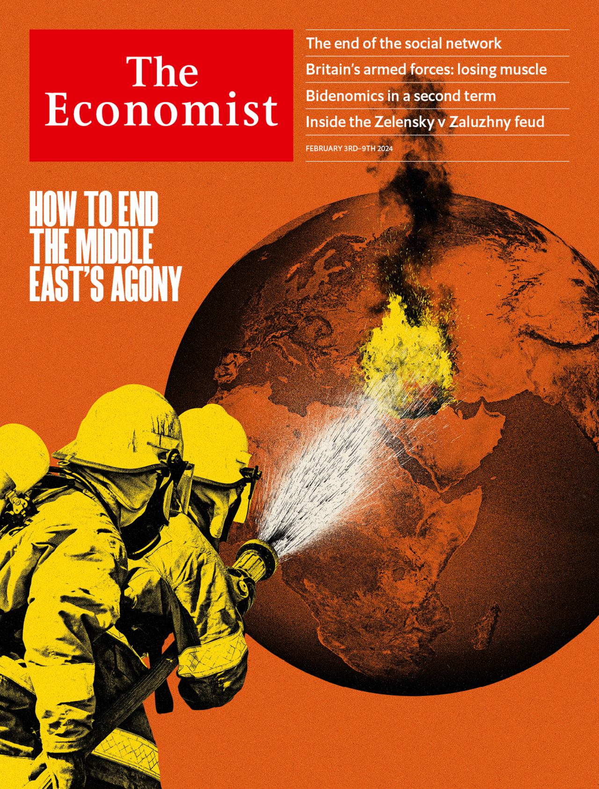
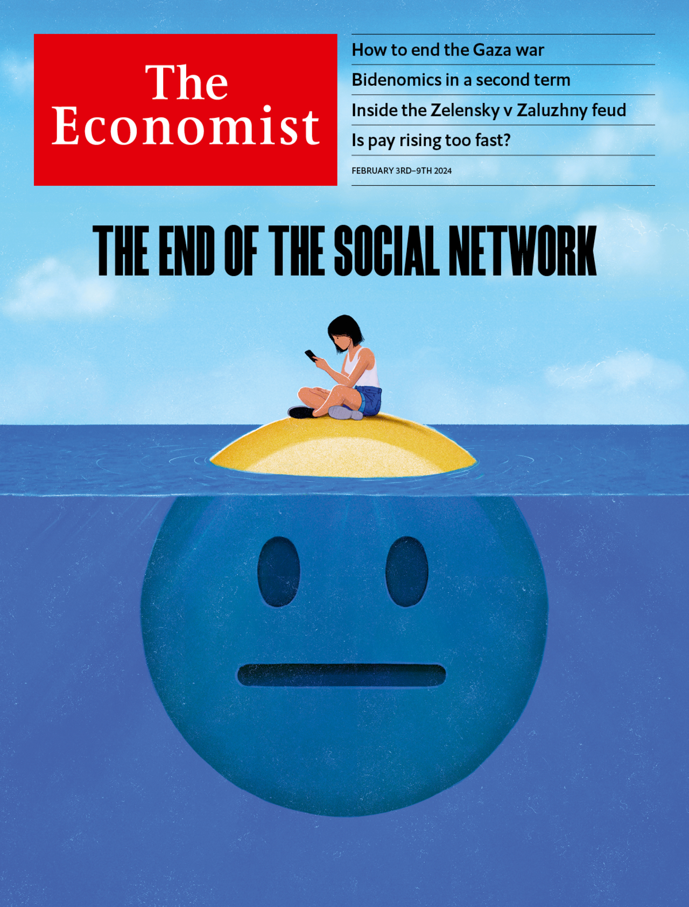

###### The Economist

# This week’s covers 

##### How we saw the world 

> Feb 1st 2024 

This week we have two covers. In Britain, America, the Middle East and Africa, we put the conflict in the Middle East on our cover. In the months after Hamas committed the worst atrocity against Jews since the Holocaust, fighting has spread across the region. With ten countries now caught up in the fighting, it is easy to despair. But there is a way out. Our cover focuses on a transformative deal taking shape in negotiations, led by America and Saudi Arabia, which seek to reset Israeli politics, open a path to a Palestinian state and forge a deal between Israel and Saudi Arabia in which mutual recognition is underpinned by American security guarantees. Peace in the Middle East will always be hard-won. But the world must seize this chance, because the pull towards war is unrelenting.

 


 

 


Meanwhile, in Europe and Asia, our cover explores the end of the social network. Even as social media draw vast amounts of attention from addicts and critics alike, they are undergoing a profound but little-noticed transformation. Status updates from friends have given way to videos from strangers that resemble a hyperactive tv. Public posting is increasingly migrating to closed groups, rather like email. This matters, because social media are how people experience the internet. When platforms swing back towards private groups, they inevitably have less oversight. When people escape their echo chambers, they may well face more extreme content. When users embrace harmless entertainment, they see less news. As social networks wither, platform operators and users should devote more time to grappling with these new problems.

 


 

