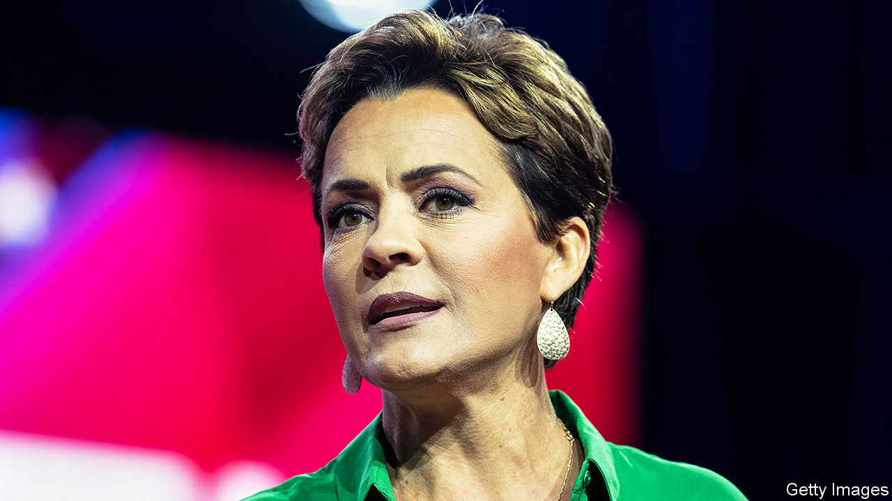

###### The Lake tape

# A leaked recording shakes up the Republican Party in Arizona 

##### Kari Lake stages a coup and faces a backlash 

 

> Feb 1st 2024 

“WE’D LIKE to share with you that we have a brand-new AZGOP chair, Jeff DeWit,” said the recorded greeting on the voicemail of the Arizona Republican Party. “He is wonderful to work for, and I know you will be happy getting to know him.” But the recording, still playing on January 25th, was doubly outdated. Mr DeWit was hardly “brand-new”: he had taken over as party chair a year before (with Donald Trump’s backing), promising to unite the party’s feuding factions. More important, he had resigned the previous day, after what amounted to a coup orchestrated by the party’s likely candidate for Senate, Kari Lake—amid drama worthy of reality TV.

Arizona will be a critical state in the elections in November. “There’s no path to the White House that doesn’t run through Arizona,” says Caroline Wren, an adviser to Ms Lake. “And Arizona might well be the 51st Senate seat,” determining whether or not Republicans can wrest back control.


Republican bigwigs were keen to field a Senate candidate with the best chance of winning. The lesson from the midterms was that strident Trump-backed candidates tend to lose. Ms Lake’s own defeat in the Arizona governor’s contest was a prime example: the former TV news anchor was a vocal supporter of Mr Trump’s false claim that the 2020 election was stolen. About 11 months ago Mr DeWit approached Ms Lake with a message from “very powerful people” back east and an offer he hoped she would not refuse: an inducement to sit out the coming election cycle. 

Unfortunately for Mr DeWit, she not only refused, but recorded the conversation—and last week it was leaked to , a British news website. In the ten-minute tape Mr DeWit is heard suggesting that Ms Lake “pause” her electoral ambitions for two years. “Is there a number” that would persuade her to do so, he asks? An offended Ms Lake rejects the attempt to buy her off: “They’re going to have to fucking kill me to stop me,” she says. 

Mr DeWit claims that the tape was selectively edited. Yet he felt compelled to go.

Why did Ms Lake wait nearly 11 months to release the recording? Some Arizona Republicans had grown frustrated with Mr DeWit (among his sins, apparently, was being seen at several events of Ron DeSantis, the Florida governor who until recently was competing for the Republican presidential nomination) and were preparing to challenge his leadership at a meeting of the state party on January 27th. Ms Lake’s leak was exquisitely timed to bring about Mr DeWit’s resignation and enable that meeting to elect a new leader, Gina Swoboda, a Trump-endorsed conservative praised by her fans for her knowledge of election law. 

In a text to a local political journalist, Dennis Welch, Mr DeWit complained about “the total mess that Kari caused”, which had brought “divisiveness and chaos”. Ms Lake now faces a backlash. At the party meeting “she was literally booed off the stage,” says Sandra Dowling, a retired school superintendent who has been a Republican Party member since 1981. “What you hear in these boos was, Kari, we’re really mad at you, and we’re mad at you for taking out someone we loved.” Ms Dowling reckons Ms Lake has a lot of damage control to do even to win the Senate primary. 

The coup leaves Arizona’s Republican leadership, which was already MAGA-aligned, looking Trumpier than ever, and that could be a problem come November 5th. Republicans enjoy an advantage of about five percentage points over Democrats among registered voters in Arizona, and should win statewide elections, points out Samara Klar, a political scientist at the University of Arizona. But more than a third of voters here identify as independents, and many seem put off by Mr Trump. The party  to help woo them. Democrats achieved surprising wins not only in the presidential election (Joe Biden won narrowly in 2020) but also the race for governor and both Senate seats: a trifecta not seen in Arizona for over 70 years.

In office, those Democrats tend to behave like independents—and often to sound like Republicans, notes Professor Klar. In the case of Senator Kyrsten Sinema, that has involved actually leaving the Democratic Party to become an independent. Whether she opts to run for re-election is one of the uncertainties hanging over this year’s contest. Some doubt that she could muster the required number of signatures in time to get on the ballot. 

Arizona will be getting a lot more attention from people “back east”. Mr Trump cancelled an appearance at what was to have been a big fund-raiser for the Arizona Republican Party in Phoenix last week. But he is expected to visit soon. Two other former presidents did make it to Arizona: George W. Bush and Bill Clinton took the stage jointly on January 31st at a conference in Scottsdale organised by TIGER 21, a network of rich people. It was a demonstration of civility in stark contrast to the strife within parties—let alone between them. ■

