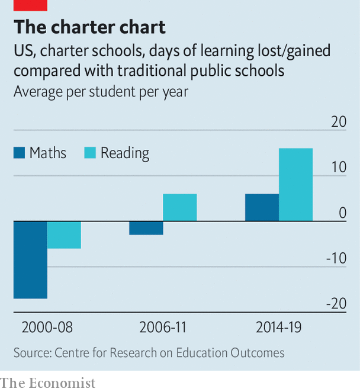

###### Political orphans

# Charter schools do things that all Democrats say they support 

##### And yet the party has turned against them 

 

> Feb 1st 2024 

A year ago New York’s governor, Kathy Hochul, a Democrat, proposed to adjust a state cap on charter schools, the publicly funded but privately run schools that have become a locus of innovation and controversy in American education. Ms Hochul’s plan was not ambitious, but it would have allowed dozens of new charter schools to open in New York City, where they already attract about 15% of public-school students and where thousands of families languish on waiting lists. But the governor’s plan drew fervent protests from fellow Democrats, including state legislators aligned with teachers’ unions. After a bruising fight, the governor had to settle last autumn for a small increase.

The row reflected a discouraging change in the politics of charter schools. Once a topic of unusual bipartisan enthusiasm, the schools have become divisive, particularly among Democrats. Barack Obama campaigned on charter-school expansion in 2008, but Joe Biden declared in 2020 that he was not enamoured of them. (His administration has nonetheless maintained federal funding for charters.) Republicans are more favourably inclined overall, and Donald Trump increased support during his presidency. But Republican priorities have shifted since George W. Bush, as president, and his brother Jeb, as governor of Florida, championed charters as beacons of racial equity. These days Republicans prioritise vouchers that allow parents to use taxpayer funds to enroll children in religious schools. 


The relative neglect of charters comes just as fresh evidence has arisen that they are successful. Last June a comprehensive new study emerged from Stanford University. It is the latest of three national studies carried out over two decades by the Centre for Research on Education Outcomes (CREDO). The first study analysed 13 states and three big cities between 2000 and 2008 by comparing charter pupils with peers in other public schools. On average charter pupils performed worse in reading and maths. This was hardly inspiring. Four years later, a follow-up study had mixed results: charter pupils performed better in reading but worse in maths.

 


Fast forward to June’s study, which used data from 2014 to 2019. Its results show a positive trajectory over time (see chart). In all 31 geographic locations studied (29 states, New York City and the District of Columbia), pupils in charters outperformed their traditional public-school peers, on average. Pupils gained the equivalent of six days of learning in maths and 16 days in reading each year. “We don’t see a revolution,” says Macke Raymond, the lead researcher of the Stanford studies. “We are seeing thousands of [charter] schools getting a little bit better every year.” Other recent studies, such as research by Douglas Harris at Tulane University and investigators at the University of Arkansas, also report positive results.

This is a departure not just from past findings of CREDO but also from the broader patterns of past research. During the 1990s and early 2000s, as the charter movement gathered momentum, Democrats and Republicans promoted the innovation more from instinct or a preference for parental choice than on the basis of evidence. It can be hard to study how particular schools shape educational outcomes, since so many other factors—economic circumstance and parental educational attainment, for example—are influential. Early studies often delivered mixed results. Research was like a Rorschach test: stakeholders interpreted new studies according to their own biases. 

The latest CREDO report provides clear evidence of success and also describes which types of charter schools seem to be working best. Larger charter management organisations (cmos in the jargon), which run multiple schools at a time, have stronger results on average than stand-alone charters. There were also hundreds of successful charters where disadvantaged pupils (black, Hispanic, poor pupils or English-learners) performed similarly to or better than their more advantaged peers.

Charter enrolment is growing and the schools’ impact on American children is substantial. In 2021 about 4m public-school pupils studied in charters, more than double the number enrolled back in 2010. Forty-five states and the District of Columbia allow them. In Chicago, where 15% of public-school students enroll, black and Hispanic families are disproportionately represented, as is typical in cities that offer them. In poverty-stricken Philadelphia, a third of public-school children are educated in charters.

Republican support for charters reflected a preference for parental choice among right-leaning politicians, but the policy did not pay clear dividends at election time, since the schools had the most impact in big cities, which are often dominated by Democrats. Vouchers offer political benefits because they are attractive to religious, home-schooling and suburban voters. Amid great fanfare, Arizona, Arkansas, Florida and other Republican-led states have passed laws allowing parents to use vouchers to direct public dollars to private schools they choose, including religious ones, or for other educational assistance. “Republicans have long been supportive of charter schools even though most of their constituents do not attend,” says Michael Petrilli of the Fordham Institute, a think-tank. However, school-choice plans “can result in money actually in the pockets of Republican constituents…and so I think that has obvious appeal.”

Mr Trump has seized on school choice as a campaign issue for 2024. He hopes to tap into the emotional “parents’ rights” movement visible in the form of shouting matches at school-board meetings, as conservative parents have lately battled teaching about DEI and trans rights while their liberal opponents seek curriculums they regard as inclusive and essential. 

Democrats have no obvious parent-friendly education policy to promote now they have turned away from charter-school expansion. According to a survey by , a journal, while 55% of Republicans support charter schools, only 38% of Democrats do. More white Democratic voters oppose charters than do non-white Democratic voters. Many of the white respondents say they fear charters undermine racial equity, which may surprise the black and Hispanic voters whose children are flourishing in them. ■

