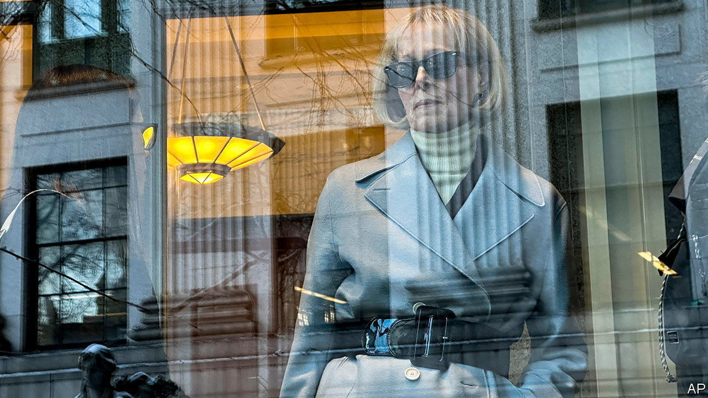

###### Grab him by the purse

# Donald Trump is ordered to pay for his bullying 

##### A jury awarded E. Jean Carroll $83m in a second defamation trial 

 

> Jan 27th 2024 

If ordered to pay millions of dollars for defaming someone, most people would learn their lesson and zip it. Not so Donald Trump. Last May a jury in Manhattan determined that he owed E. Jean Carroll, an advice columnist, $5m in damages for  her nearly 30 years ago and then, in 2022, accusing her of making it up. Unbowed by the judgment, he called her a “whack job” on cnn the next day and denied ever having met her (even though they were photographed together). “I have no idea who the hell she is,” he protested.

Mr Trump now has a big new incentive to restrain himself, thanks to a whopping judgment in a separate but related defamation trial. On January 26th a different jury awarded Ms Carroll $83m for another set of insults and denials over the assault, these ones made by Mr Trump in 2019. Punitive damages represented four-fifths of the total—a sum clearly intended to deter the presumptive Republican nominee for president from defaming Ms Carroll again. Her lawyers had asked for $24m in compensatory damages and “an unusually high punitive award”. Mr Trump called the verdict “absolutely ridiculous!” in a social-media post, and vowed to appeal. The sum may well be reduced: calculating reputational harm is inherently subjective. But at least for now the lesson appears to have sunk in. Mr Trump made no reference to Ms Carroll after the trial.

The case stems from an encounter at Bergdorf Goodman, a department store in New York, in the mid-1990s. Ms Carroll alleges that, while they shopped in the lingerie department, Mr Trump pushed her against a dressing-room wall and raped her. In 2019 she published a book describing publicly the attack for the first time. Mr Trump said it never happened and accused her of trying to juice book sales, adding, “she’s not my type.” In 2022 Ms Carroll sued him under a law that allowed sexual-assault victims a one-year window to . At last year’s civil trial a jury determined that Mr Trump had “sexually abused” Ms Carroll but that he had not raped her. Those findings were not being re-litigated in this case. Lewis Kaplan, the judge who presided over both trials, said there would be no “do-overs by disappointed litigants”.

Mr Trump stayed away from the first trial, but he attended this one and testified, albeit for less than five minutes. Those appearances marked an effort to bring the campaign trail to the courthouse, to underscore the supposed lawfare being waged against him by Democrats (Reid Hoffman, a co-founder of LinkedIn and Democratic donor, helped finance Ms Carroll’s first case). Before Mr Trump’s testimony Judge Kaplan demanded to know exactly what he would say, lest he suggest that the attack never happened.

Sure enough when Mr Trump called Ms Carroll’s account “false” under oath, Judge Kaplan ordered it struck from the record. The defendant’s huffing and puffing—he stormed out during closing arguments—no doubt helped Ms Carroll’s case. “You saw how he has behaved through this trial,” her lawyer told the jury. “Rules don’t apply to Donald Trump.” Judge Kaplan also sparred with Mr Trump’s pugnacious lawyer, Alina Habba, who he warned might spend “some time in the lockup”.

Ms Carroll will not receive the full damages while Mr Trump is appealing against the decision, which may take months. If he has the amount in cash he could pay it to the court, which will hold it during the appeals process (as he did with the previous award to Ms Carroll). Or he could try to secure a loan against his other assets. Much of his money is tied up in property. Mr Trump likes to brag about his wealth—one of the reasons the jury opted to award such a thumping sum in damages. 

More legal peril awaits Mr Trump, who stands accused of 91 felonies in four criminal cases. The first, a federal trial over his election interference in 2020, was scheduled to begin in March. But it is on hold until an appellate court rules on Mr Trump’s claim of immunity from prosecution for crimes committed in office. 

In the meantime he can expect an even bigger penalty in yet another civil lawsuit in New York related to his real-estate business. In September Arthur Engoron, the judge overseeing that case, agreed with prosecutors that Mr Trump and his firm committed fraud by  to secure better loan terms. Letitia James, the state attorney-general, wants Mr Trump and his co-defendants to be fined $370m and barred from serving as a corporate director in the state of New York. 

Judge Engoron will also have to clarify what he intended when he ordered the cancellation of corporate charters that enable the Trump Organisation to operate in the state. His initial ruling was unclear about whether he really meant for Mr Trump’s properties to be sold off and the business wound down. That would be a rare punishment: only a dozen companies in the state have been subjected to it in nearly 70 years. Whatever the penalty, it will probably be paused until Mr Trump appeals against it and the underlying fraud judgment, which will take months. ■


