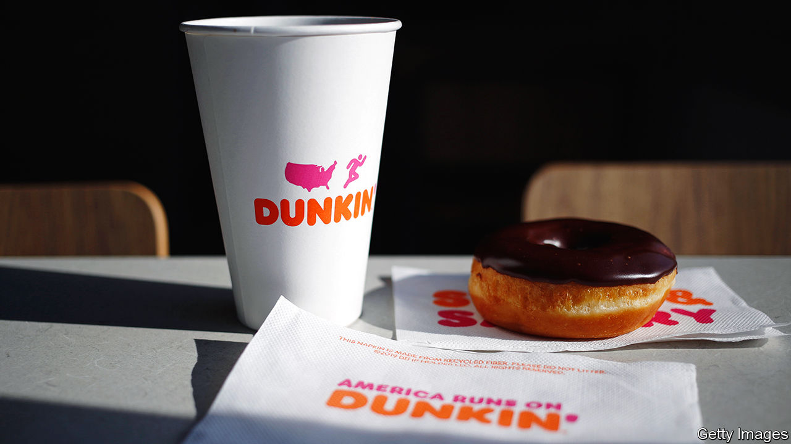

###### Lactose laws

# Dunkin’ faces a moo-ving class-action suit from the lactose intolerant 

##### Is the interpretation of the Americans With Disabilities Act by the plaintiffs udderly silly? 

 

> Feb 1st 2024 

DUNKIN’ sells about 60 cups of coffee every second. That works out to be about 2bn cups a year. The coffee-and-doughnut chain brags there are 25,000 ways to order coffee in its shops. A recently filed class-action lawsuit claims that customers ordering plant-based or lactose-free milk with theirs are charged $0.50-2.15 more than those ordering cow’s milk. This amounts to discrimination under the Americans with Disabilities Act (ADA), the plaintiffs argue.

The ADA became law in 1990. Its aim was to give disabled people equal access to places of business, and expanded it in 2008 to broaden the definition of disability. The suit asserts that lactose intolerance (the gastronomical symptoms of which are not at all pleasant) is a disability and that the plaintiffs are entitled to damages from Dunkin’. 

Some are sceptical that this violates the ADA. Many consuming plant-based drinks are doing so because of taste or because they think cows’ burps are bad for the planet. The lawsuit also asserts there is no material difference in cost between milk and non-dairy alternatives. But Ben Pierce, an analyst at the Good Food Institute, says that “gallon for gallon, plant-based milk prices were 87% higher than conventional milk in 2022.” 

Arlene Kanter, head of the disability law and policy programme at Syracuse University, says the plaintiffs have a strong case. Lactose intolerance meets the definition of disability as it is a substantial limitation on a life activity (the right to drink supersized takeaway coffee). If a wheelchair-bound driver needs helps filling their car with petrol, petrol stations legally cannot charge them extra. Keith Gibson, the lawyer who represents the plaintiffs, says that “Dunkin’ Donuts does not have to offer soy, almond or oat milk for its coffee or lattes. But once they do, the surcharge then is discriminatory.”

Dunkin’ has until March 4th to respond to the complaint. Some chains, such as Tim Hortons, do not charge for non-dairy milk. Starbucks was sued in 2022 for charging more for plant-based milk. That case is still pending. Meanwhile, even the lawsuit’s named plaintiffs intend to continue going to Dunkin’. ■


