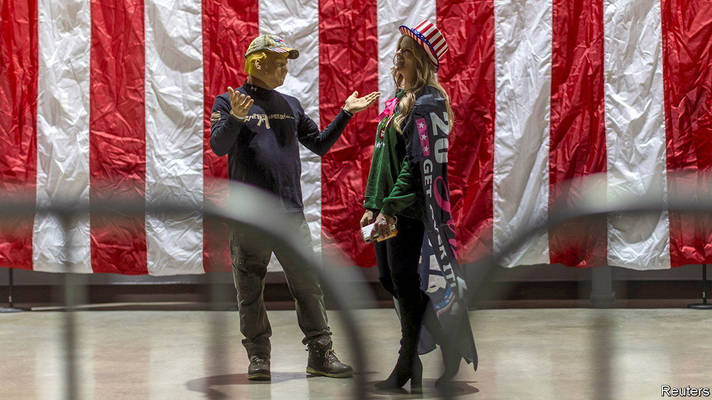

###### Fear and voting in Las Vegas

# How Nevada’s Republicans made their primary irrelevant 

##### The state is holding both a caucus and a primary. Voters are confused 

 

> Feb 1st 2024 

PARTICIPATING IN Nevada’s Republican primary this year is a bit like playing a choose-your-own-adventure game. Your first choice is between voting in the state-run primary election or the caucus put on by Nevada’s Republican Party. You pick the February 6th primary, since the state has kindly mailed you a ballot. But wait: Donald Trump, your preferred candidate, isn’t listed. Instead you can choose between Nikki Haley, two people who are no longer running and four others you have never heard of. What if you picked the caucus on February 8th? Well, then you can vote for Mr Trump or Ryan Binkley, a pastor from Texas. Fans of Ms Haley are out of luck. 

How did Nevada end up with duelling Republican primaries? In 2021 the state legislature passed a law replacing the caucuses run by the Democratic and Republican parties with state-run primaries on the first Tuesday of February. The move was intended to boost Nevada’s importance in presidential-primary elections by holding them earlier and making them more representative of the electorate. President Joe Biden and the Democratic National Committee endorsed the change. Nevada and New Hampshire would vote on the same day, behind only South Carolina. 


The bill was bipartisan, but the Nevada Republican Party revolted. Michael McDonald, its chairman and an ardent supporter of Mr Trump, argues that the party objected to the primary because it didn’t require voter-ID. He feared that Democrats, and specifically members of the powerful culinary union, would change their party preference on the day of the poll to skew the results of the Republican primary. To exert control, Republicans decided to put on a caucus. The result is two votes in three days and utter confusion. 

If a candidate is on the primary ballot they are barred from participating in the caucus, which is the only way to win any of the state’s delegates. Ms Haley has suggested that Mr Trump’s allies in Nevada pushed for a caucus to help his chances. When she was asked why she decided to participate in the meaningless primary instead, she said her campaign would “focus on the states that are fair”. Mr McDonald—who along with several other high-profile Nevada Republicans recently pleaded not guilty to charges alleging that they tried to falsely pledge Nevada’s electoral votes to Mr Trump in 2020—denies that the party put its thumb on the scale. 

The duelling primaries have probably not changed the outcome of the contest. But they have changed politics in the Silver State in two ways. First, voters are miffed that they are being denied an actual choice between the top two candidates. While waiting in line to enter a Trump rally in Las Vegas on January 27th, several said they were baffled when they opened their primary ballot and didn’t see Mr Trump’s name. Karen Marrs, a Las Vegan, says she does not trust the party. “I’m going to do what Trump tells me to do,” she explains. 

Nevada is not the only important swing state where a chaotic Republican Party could be a liability in November. Republicans in Michigan mutinied against their MAGA party chair, and Arizona’s party chairman resigned on January 24th after a  that he had tried to bribe Kari Lake, a Trumpian provocateur, to stay out of politics. 

Second, caucuses are less likely than primaries to reveal how voters will act in November because fewer people take part. Queuing for hours in churches and schools requires more time from voters than posting a ballot. Because Nevada is one of just six states that will in effect decide the presidential election, the opinions of voters there have outsize importance. 

Mr Trump encouraged Nevadans to caucus during his rally. But in his remarks he revealed the vote’s irrelevance. “Don’t waste your time on primary,” he urged. “Waste all of your time on caucus.”■

