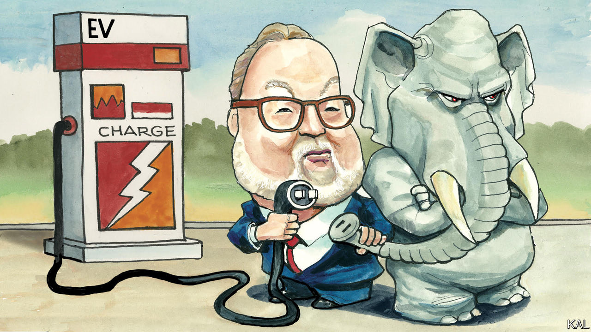

###### Lexington

# How to overcome the biggest obstacle to electric vehicles 

##### A Republican politico wants to save electrification from politics 

 

> Feb 1st 2024 

Packing ever more ions into ever smaller batteries, spangling the landscape with charging stations, lowering the cost to make electric cars and trucks: these are complex, exciting challenges that engineers, regulators and others will probably solve. The tougher problem, the one that may define the limit of the American market for electric vehicles, is much stupider. It is polarisation, the stuff that makes an EV go but in its metaphorical incarnation is cursing not only America’s politics but, increasingly, its culture and marketplace. 

Three researchers who studied the adoption of electric and plug-in hybrid vehicles between 2012 and 2022 discovered that fully half of them went to Americans living in the 10% of counties with the highest proportion of Democratic voters. A third went to just the top 5% of such places. The pattern held even when the researchers controlled for income and population density. 

Lucas Davis, a professor at Berkeley’s Haas School of Business who was an author of the study, was startled that the correlation with ideology did not subside over the period under review, a decade during which the electric-vehicle market diversified with scores of models. “The market has matured in many ways, and I expected to see more of a broadening of EVs across the political spectrum,” he says. “I think the results suggest that it may be harder than previously believed to achieve widespread EV adoption.” 

From the popularity of what the researchers called “conspicuous” EVs, they tentatively concluded that many purchases were driven by “extrinsic” motivations—a desire to advertise one’s concern about climate change. That is a signal many Republican drivers are eager not to send. 

This problem has caught the attention of one of America’s most experienced Republican campaign operatives, Mike Murphy. A past devotee of internal combustion, Mr Murphy grew up in Detroit and boasts he has averaged about eight miles per gallon over the years. But when he traded in his Porsche for an electric BMW he became entranced by both the superior performance and the community of engineers and enthusiasts trying to overcome the obstacles to electrification. “It’s like the Apollo programme,” he says. “They’re full of joy. They’re solving really tough engineering problems and have a purpose to that. And that’s a bit infectious.”

Mr Murphy decided to apply his skills to knocking down the barrier that the boffins were less equipped to defeat. In January he launched an outfit, the EV Politics Project, to advise automakers on how to overcome Republican resistance and also to counter what he expects, in the 2024 campaign, to be an intensifying barrage of attacks on electrification. 

Mr Murphy undertook a poll to gauge the problem. He discovered that Democrats and Republicans had similar attitudes toward car brands in general but split radically over electric-only carmakers. Democrats approved of them by a net margin of 15 points, whereas Republicans disapproved by 40 points—”an Osama bin Laden number,” Mr Murphy says. While 61% of Democrats said their friends and relatives would praise them for a “smart move” if they bought an eV, only 19% of Republicans said that. 

The son of a labour lawyer and grandson of carworkers, Mr Murphy fears the American auto industry will not survive if electrification falters. “If half the American market is ruling this stuff out based on bullshit and tribalism—and on marketing that doesn’t understand that—that’s a gift to the People’s Republic of China,” he says. Mr Murphy is a Reagan Republican who advised the likes of John McCain, Jeb Bush and Mitt Romney. The toughest adversary he confronts over the politics of electrification is the same one he has been tilting against for years, unsuccessfully, over the direction of his party: Donald Trump. 

Mr Trump has identified in the polarisation over electric vehicles the kind of energy that has powered his politics since 2016. “MAY THEY ROT IN HELL”, he wished of EV supporters, among others, on Christmas Day. He owned a Tesla, according to his aides, but he has claimed electric vehicles are bad for the environment, require charging every 15 minutes and will cause 40% of American auto jobs to disappear in a year or two. Some Republican-led states have begun imposing fees on EVs, restrictions on how they can be sold and even new taxes, purportedly to make up for lost fuel-tax revenue, though Republican leaders, starting with Mr Trump, do not habitually object to tax avoidance.

Yet some Republican leaders have embraced the possibilities of electrification. It has taken ridiculously long for states to begin opening new charging stations with the $7.5bn fund created by President Joe Biden’s 2021 infrastructure law. But the first governor to do so, in December, was Mike DeWine of Ohio, a Republican. Brian Kemp, the Republican governor of Georgia, is busy recruiting battery manufacturers. 

The body electric

Mr Murphy sees other openings. He notes that five of the top ten states for EV investment, including Georgia and Michigan, are swing states in presidential elections. He intends to aim his pro-EV messages at them. Whereas 66% of Democrats think Elon Musk is a bad ambassador for EVs, 61% of Republicans disagree. “So is he Nixon to China?” Mr Murphy wonders. 

Mr Murphy’s polling also suggests, hopefully, that regardless of party most Americans share important sentiments about EVs. They have the same anxieties about price and range, and they are drawn to some of the same advantages: never paying for petrol, cashing in on government rebates. Mr Murphy thinks carmakers need to shut up about how EVs help the environment—those who care are already sold on the vehicles—and talk instead about how they benefit their owners. “If we want to move iron, we gotta make it about cars, not about luxury opinions,” he says. There may be a lesson in there for Mr Biden’s re-election campaign, too. ■


