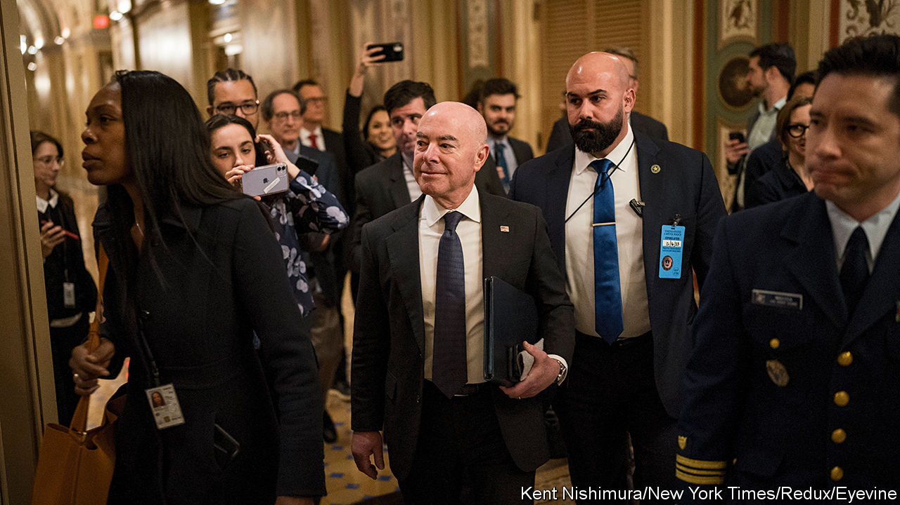

###### The insecure security secretary

# Why not impeach everyone? 

##### House Republicans are trying to impeach Alejandro Mayorkas, for no good reason 

 

> Feb 1st 2024 

WILLIAM BELKNAP is the only cabinet official in American history to have suffered the indignity of a congressional impeachment. In the case of Belknap, the secretary of war to Ulysses S. Grant, it was richly deserved: to maintain his reputation for enormous, raucous parties and well-dressed wives, the war secretary awarded trade monopolies at a military fort to a friend who gave him generous kickbacks. For “basely prostituting his high office to his lust for private gain”, the House of Representatives voted to impeach him in 1876.

Nearly 150 years later, Alejandro Mayorkas, the secretary of homeland security, may become the second cabinet official to be impeached—if Republicans were to have their way, that is. Compare the two charge sheets, and the travesty of the latter becomes clear. Mr Mayorkas does not stand accused of grand corruption or treason but of a political crime: he has overseen immigration policy.

It should be noted that there is no chance of Mr Mayorkas actually being ousted from office. Articles of impeachment must first be passed with a majority of the House, which Republicans might even struggle to do because they retain control by the barest of margins. Passing those articles would trigger the spectacle of a trial to be held in the Senate. And the chances of securing a conviction there, which would require a two-thirds majority and so at least 18 Democratic voters, are lower than the odds that Mexico would ever pay for the construction of a border wall. So, why bother at all? 

The southern border is indeed in a bad way, as Republicans point out. In December 2023 American immigration authorities reported more than 300,000 encounters with migrants—the most of any month on record. Those who arrive and claim asylum cannot be kept in custody because of a shortage of detention beds and immigration judges; many are released into the country with a court date years into the future, which is sometimes skipped. Even if the severity of the crisis is at its highest level, the problem of illegal migration over the US-Mexico border is decades old. Presidents like Dwight Eisenhower and Ronald Reagan struggled with it.

But in their articles of impeachment, the Republicans lay all of the blame at the feet of Mr Mayorkas. “In large part because of his unlawful conduct, millions of aliens have illegally entered the United States on an annual basis with many unlawfully remaining,” they accuse in their first article. The second article says he breached the public trust by testifying to Congress that the border was secure, when, they argue, he should have known that it was not.

On closer inspection, the allegations are even more flimsy than they first appear. One complaint is that Mr Mayorkas overturned the Migration Policy Protocols, put into place by President Donald Trump, requiring asylum-seekers to remain in Mexico while they waited for their cases to be considered. The complaint cites language from a federal appeals court that Mr Mayorkas appears to have ignored. That only looks damning because it omits the fact that the court ruling was appealed to the Supreme Court, which sanctioned the policy change.

Rock and parole

Another gripe is over the administration’s use of “parole authority”, which allows it to grant reprieve from deportation on a case-by-case basis. Republican arguments that this has been applied over-generously (by allowing in 30,000 Cubans, Haitians, Nicaraguans and Venezuelans each month) are certainly plausible. But complaints about governmental inaction do not usually rely on empirical evidence showing increased action. The articles of impeachment, by contrast, argue that Mr Mayorkas has not done enough to curtail the smuggling of fentanyl by pointing to the increasing amounts impounded by the authorities; that he is not doing enough to stop migrants by pointing to increased apprehensions at the border; and that he is not deporting enough illegal migrants by pointing to record-breaking deportation-case backlogs. At their core, the Republican allegations are about competence in office and the appropriate use of executive powers, which are usually addressed through court cases, not impeachment.

The irony is that House Republicans are pursuing this course of action when, on the other side of the Capitol, more serious Senate Republicans are trying to negotiate with Democrats to craft a bill that would alleviate the pressure on the Mexican border. Among the mooted provisions are limits on the president’s parole authority, an increase in the number of border-patrol officers and immigration judges, and tougher criteria for judging whether those seeking asylum actually have credible cases.

The bill matters for more than just the border: Democrats hope that a border deal would placate Republicans enough for them to agree to send more aid to Ukraine as part of a combined spending package. If accomplished, it would be a rare triumph of pragmatism over partisanship. Unsurprisingly, Mr Trump has taken to whipping against any forthcoming border compromise, following the cynical logic that border chaos is better for his election prospects than improvement. Pursuing an impeachment trial to protest about the border, in lieu of the legislation that might actually fix it, would be to prefer empty spectacle over governing. Alas, that seems an apt summary of the House Republicans’ mission statement. ■


