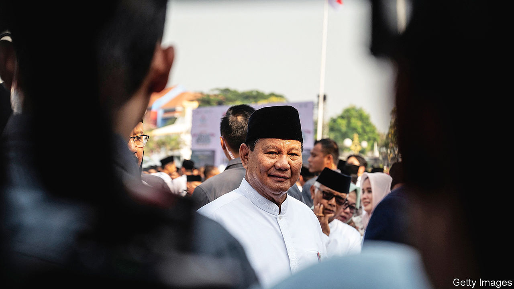
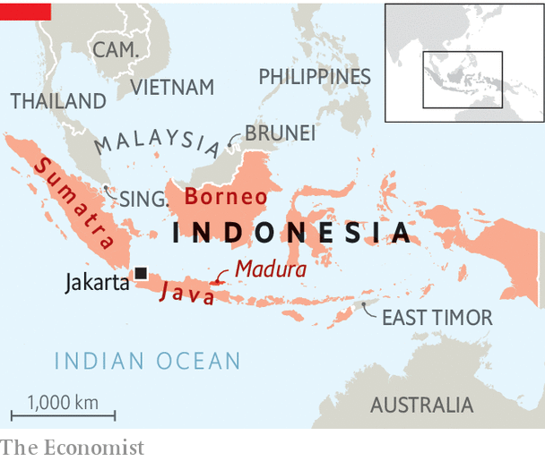
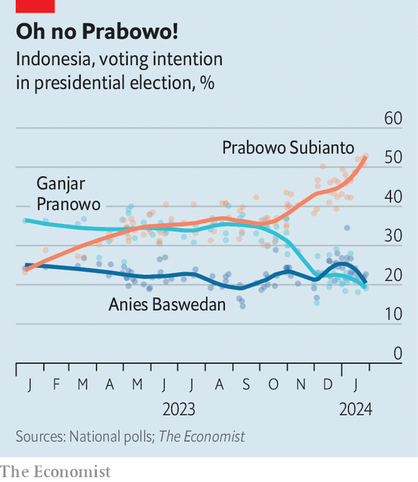

###### Indonesian politics

# A controversial general looks likely to be Indonesia’s next leader 

##### Prabowo Subianto looks unfit to govern the world’s third-largest democracy 

 

> Feb 8th 2024 

At first blush, it did not seem too alarming. At Asia’s leading security conference last year, held in a glitzy ballroom at the Shangri-La hotel in Singapore, Indonesia’s defence minister, Prabowo Subianto, proposed a peace plan for Ukraine. Clad in a western suit and traditional  cap, he then argued for an immediate ceasefire to establish a demilitarised buffer zone. Both Russia and Ukraine would withdraw 15km from their forward positions. The United Nations would send peacekeepers and organise a referendum to decide which country owned the disputed territory. China, a big investor in Indonesia in recent years, lauded Mr Prabowo’s vision. Ukraine’s defence minister labelled it “a Russian plan” and “strange”. 

The oddest part of Mr Prabowo’s speech was not that it appeared to constitute impromptu support for Vladimir Putin. It was that it contradicted the official policy of Indonesia, which had voted to denounce Russia’s invasion of Ukraine at the UN. Mr Prabowo, who is the favourite to win a presidential election on February 14th, had consulted neither the current president, Joko Widodo (“Jokowi”), nor Indonesia’s foreign ministry. For some Asia strategists, his outburst was a promise of volatile new leadership in the world’s fourth-most populous country.


The former general’s record is troubling. A former son-in-law of Suharto, a dictator toppled in 1998, Mr Prabowo stands accused of committing atrocities during his decades in the army—including, at the helm of its special forces, in Indonesia’s former territory of East Timor. He is also alleged to have ordered the kidnapping of more than 20 pro-democracy activists in 1998, of whom 13 remain missing. (He denies any wrongdoing.) He was at one time barred from entering America and Australia because of these allegations.

After losing the past two presidential elections to Jokowi, Mr Prabowo falsely claimed that the vote had been stolen. In 2019 eight people were killed after he urged his supporters to protest against the election result. He has also tried to abolish the direct election of regional leaders and has said Indonesia needs an authoritarian leader. This raises a more worrying question about Indonesia’s future under a probable Prabowo presidency. Will the world’s third-largest democracy continue the broadly successful rise of the post-Suharto period, or return to authoritarianism?

Mr Prabowo owes his strong footing in the race to support from Jokowi, who is extremely popular. The president’s eldest son, Gibran Rakabuming, is Mr Prabowo’s running-mate. There are rumours of a deal between Mr Prabowo and Jokowi that would allow the outgoing president to wield influence behind the scenes after his term ends in October. Jokowi’s popularity is based in part on his . During a decade in power he has presided over annual growth of 5%, liberalising reforms and a policy of resource nationalism that has helped develop a nickel-mining industry responsible for nearly half of global output. At the same time, he has weakened Indonesia’s nascent democratic institutions.

 


Last October the country’s constitutional court, whose chief justice is Jokowi’s brother-in-law, delivered a ruling that in effect made the president’s 36-year-old son an exception to a rule that bars anyone under the age of 40 from running for president or vice-president. Jokowi is also alleged to have suborned the once independent anti-corruption commission. He now faces mounting criticism that he is interfering in the election. Rival campaign teams accuse state agencies of arbitrarily cancelling their rallies and intimidating Jokowi’s critics. Prominent Indonesian academics say the president is showing disregard for democracy. 

If no candidate secures over 50% of the vote on February 14th, the election will go to a run-off in late June. That would allow the anti-Prabowo vote to unite, reducing the general’s chance of victory. Mr Prabowo’s two main opponents, Anies Baswedan, a former education minister and governor of Jakarta, and Ganjar Pranowo, a former governor of Central Java province, are both better qualified and more competent than he is. But their lacklustre campaigns have failed to convince many that a Prabowo presidency would be dangerous. According tos aggregate of recent opinion polls, Mr Prabowo currently has around 53% of the vote. Mr Anies, who was sacked from Jokowi’s cabinet, has 20% and Mr Ganjar, the candidate of Indonesia’s largest political party, 19%. 

TikTok politics

Indonesian elections tend to be decided by personality, not policy. Sure enough, Mr Prabowo’s team has revamped his image by posting short videos of the former general dancing goofily on TikTok, which has more subscribers in Indonesia than any country except America. Such gimmicks have helped divert younger voters, who mostly favour Mr Prabowo, from his unsavoury past. Many consider his military record a plus. Indonesia’s army is its most trusted public institution, surveys suggest.

 


It is unclear what Mr Prabowo would do with the power he has long sought. He has pledged to maintain Jokowi’s measures, including a nickel-centred industrial policy and a plan to relocate the capital from Jakarta to a site in the jungles of Borneo. But given his explosive temper and erratic behaviour, there is little reason to think Mr Prabowo would defer to Jokowi if elected. His other big ideas are mostly impractical or ruinously expensive. 

Mr Prabowo has said double-digit growth is possible. His team says it aims to deliver 6-7% annual growth, in order to prevent Indonesia falling into the middle-income trap. Yet its economy has not grown at 7% since 1996, before the Asian financial crisis. And Mr Prabowo has given few details on how he would make it grow faster. His stump speeches are packed with fiery nationalism. “Some would have us sell raw materials to foreigners at cheap prices. I say: all our wealth must undergo domestic downstream processing!” he recently declared, referring to a policy that forces foreign commodity firms to add value to their products in Indonesia.

Mr Prabowo also says he wants to lessen Indonesia’s reliance on imported food. As defence minister, he has overseen the destruction of thousands of acres of forest in a failed attempt to boost rice production. He says he will give free milk and lunch to all Indonesian schoolchildren to curb the malnourishment that affects one in five. This programme will cost around $83m a day, estimates a spokesman for Mr Prabowo, Burhanuddin Abdullah, a former governor of Indonesia’s central bank. Mr Prabowo’s rivals argue that policies to reduce stunting should instead be aimed at pregnant mothers and newborn babies, not school-age children. No candidate has said anything of significance on foreign policy, beyond attempting to woo the 9m Indonesian voters who work overseas, many of them as maids, nannies and labourers on building sites.

The election has had a couple of positives. Five televised candidate debates were each watched by around 100m people. The vote count is expected to be credible. And across the world’s biggest archipelago, voters appear to cherish their suffrage. On a recent day on the campaign trail, tens of thousands travelled, sometimes for hours, on foot, by motorbike or by lorry to catch a glimpse of Mr Anies canvassing support on the island of Madura in east Java. He has held over 20 open forums across Indonesia, known as  or “Challenge Anies”, in which voters are invited to fire impromptu questions at him.

Villagers in northern Sumatra questioned Mr Anies about land rights. Younger Indonesians wanted to know if he would legalise marijuana. This kind of campaigning is a break from the past, where politicians would pay dancers and musicians to entertain voters at rallies. It is also “a better way to compete”, says Mr Anies. It is rather hard to imagine this vision of a more serious Indonesian democracy being realised under Mr Prabowo. ■

