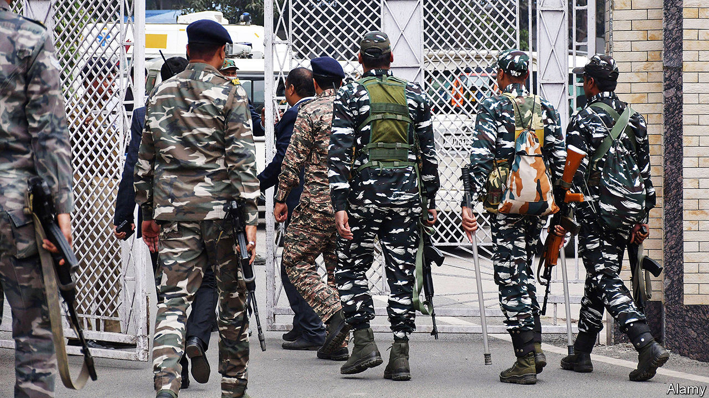

###### Rule of Modi

# Are India’s corruption police targeting Narendra Modi’s critics? 

##### Money-laundering raids, many on the opposition, have increased 27-fold in the past decade 

 

> Feb 5th 2024 

The Enforcement Directorate used to be a sleepy corner of India’s finance ministry. Mandated to investigate money-laundering and foreign-exchange violations, it rarely made headlines under the previous government, a coalition led by the Congress party, which ruled from 2004 to 2014. Its record on money-laundering—a big problem in India—was particularly lacklustre: it conducted only 112 raids and failed to achieve a single conviction.

Under , the ED (as it is known) has become one of India’s most feared agencies. Since he became prime minister in 2014 it has conducted more than 3,000 money-laundering raids and secured 54 convictions. Most controversially, especially in the run-up to a , it has targeted dozens of opposition politicians, including at least five party leaders—while largely steering clear of bigwigs in Mr Modi’s Bharatiya Janata Party (BJP). On January 31st ED officers arrested Hemant Soren, chief minister of the eastern state of Jharkhand, on suspicion of money-laundering. Mr Soren, who denies wrongdoing, leads one of the 27 parties in the main opposition alliance. 

Opposition leaders have characterised the ED’s activities as a malign effort by Mr Modi to stifle dissent and engineer his re-election. Mr Soren’s was the first arrest of a sitting chief minister in India’s history (although he had technically resigned a few hours earlier). He is also the first leader of the anti-BJP alliance to have been arrested. He may not be the last. The same day, the ED issued a fifth summons to a more powerful opposition leader, Arvind Kejriwal, who is Delhi’s chief minister and heads the Aam Aadmi party. He is wanted for questioning in another money-laundering case. Mr Kejriwal, whose deputy is already in jail awaiting trial in the case, has denied any wrongdoing and refused to comply. 

The ED’s targets also include senior figures in Congress, the BJP’s main national rival. Among them are Sonia Gandhi, the party’s former leader, and her son, Rahul. In a post on X (formerly Twitter) after Mr Soren’s arrest, Mr Gandhi claimed that the ED and other investigative agencies were being used to eliminate the opposition. “The BJP, itself steeped in corruption, is running a campaign to destroy democracy in its obsession with power,” he said.

The BJP claims to be tackling corruption that became endemic under Congress. BJP officials also accuse Congress of having used state bodies, especially the Central Bureau of Investigation (CBI), to harass opponents when it was in power. “Corruption is in their nature,” Amit Shah, the bjp home minister, said in December after tax raids on a Congress MP uncovered 2bn rupees ($24m) in cash. “Now I understand why a campaign was run against PM Modi that agencies are being misused.”

Graft was rife during Congress’s rule. And it sometimes misused investigative agencies—but to nothing like the degree seen under Mr Modi. Under the previous government, the proportion of cases against politicians that targeted the opposition was 54% for the ED and 60% for the CBI, according to an investigation by the newspaper. In Mr Modi’s first eight years in power, that figure rose to 95% for both agencies, it found. 

Graft investigators have targeted some BJP figures in the past decade, but no party leaders, cabinet members or chief ministers. They also dropped or eased probes into several opposition politicians after they defected to the BJP. As for Mr Modi’s claim to have cut corruption overall, activists and academics say low-level graft has declined, largely thanks to new digital payment and ID systems, which allow direct welfare payments, cutting out corrupt officials. But some say the BJP’s policy of pouring cash into infrastructure projects, often through well-connected firms, has increased opportunities for big-ticket graft.

It has also hindered proper oversight by haranguing India’s increasingly buttoned-up media outlets and NGOs, which have also been subjected to more graft and tax investigations. In a recent annual survey by Transparency International, a global corruption watchdog, India slipped eight places, to 93 out of 180 countries. Its score on a scale from 0 (highly corrupt) to 100 (very clean) dropped by one to 39.

That was too small a change to conclude whether the country had grown more or less corrupt, the watchdog said. But it noted a “further narrowing of civic space” ahead of the general election. ■


