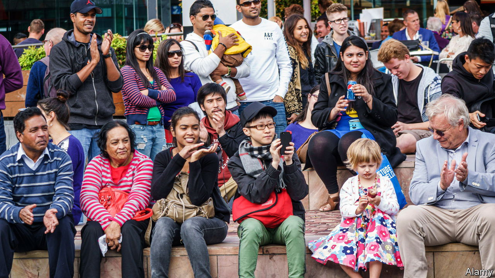

###### G’day, goodbye

# Australia’s enthusiasm for immigration is being tested 

##### The country is trying to slash net migration 

 

> Feb 8th 2024 

AUSTRALIA HAS long claimed to be the world’s most successful multicultural country. Immigrants have increased its population by more than a third this century, to over 26m. The promise of sunshine and well-paid work first drew European migrants; now more come from China and India. This has never triggered a major populist backlash: most Australians have welcomed the newcomers with open arms. But now their tolerance is being tested.

The cause is a massive recent influx. Net migration, a measure of immigrants minus emigrants, passed 500,000 in the year to July 2023. That was double the pre-pandemic level—and added more than the population of Canberra, Australia’s capital, to the national total. The huge increase has coincided with a housing crisis, which is being widely blamed on immigrants. The “social licence” for migration is fraying, admits the centre-left Labor government of Anthony Albanese. In December it pledged to halve the annual immigration rate over the next two years.

The social licence rests on a trade-off. For two decades both major parties have pushed border security as a means to stop asylum-seekers, or “boat people”, while letting in ever-more skilled workers and students. Net migration more than doubled between 2000 and 2019, fuelling some of the fastest rates of population growth in the OECD, a club mainly of rich countries. That fuelled a growth spurt—until a long covid-19 lockdown triggered a recession and left Australia short of workers.

After it threw open its borders in November 2021, the influx resumed. And Australians have started to grumble. They are not throwing up fences, exactly. In a survey last year 78% said immigration made their country stronger. But most of them would prefer less of it: two polls in December found that around 60% think the current intake is too high. The percentage of Australians who rank immigration as their biggest worry more than doubled, to 13%, between September and December, according to Freshwater Strategy, a pollster.

The cost of housing is a big reason. Property prices have soared despite high borrowing costs, and Australia faces a chronic shortage of rentals. A lack of building is the main cause, but both major parties concede that high immigration is exacerbating the problem. “We’ve got a generation of Australians who can’t even get into a rental…it is not the time to be running very large migration programmes,” said the home-affairs minister, Clare O’Neil.

Mr Albanese pledges to cut immigration to a “sustainable level”. His government plans to reduce net migration to a roughly pre-pandemic level of 235,000 by 2027. According to Abul Rizvi, a former deputy secretary of Australia’s Department of Immigration, this is the first time an Australian government has set such a target in spite of the obvious risk to growth. 

The cuts may be less drastic than they sound. Immigration was in line to fall anyway, as a backlog of pandemic-era applications is cleared. Still, the government promises a “crackdown”, particularly on visas for students, the biggest migrant cohort. The government says many are gaming the system by enrolling in dud courses.

Is a more populist debate brewing? That is unlikely, says Nick Biddle of the Australian National University. Australia’s skills-based migration system gives priority to people with the qualifications it needs. That lessens the usual griping about wage competition from low-skilled migrants. Politicians are also wary of alienating the third of Australians who were born outside the country. Both parties maintain that Australia is a “beautiful multicultural country”, as Ms O’Neil puts it. For now, this still sets Australia apart. ■

