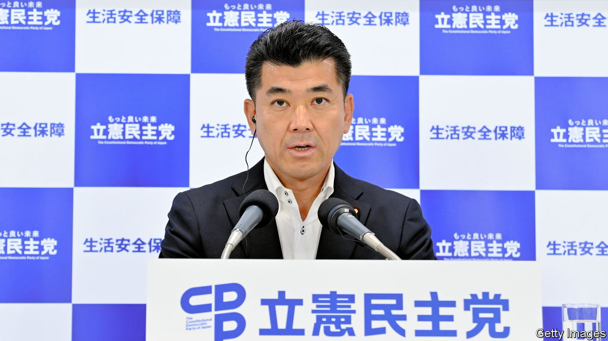

###### Force for change

# Izumi Kenta wants to shake up Japan’s opposition 

##### The centre-left leader tells The Economist his plan for a more serious politics 

 

> Feb 8th 2024 

IZUMI KENTA, the leader of Japan’s main opposition Constitutional Democratic Party (CDP), is itching for change. In an interview with , the self-declared progressive laments the country’s slow growth and demographic woes. The culprit, he reckons, is the conservative rule of the Liberal Democratic Party (LDP), which has endured for most of the past seven decades. “Old values have kept sucking the country’s vitality,” says Mr Izumi. “We want to change things.”

In theory, he has a rare opportunity. The LDP is beset by a . Its leader, Kishida Fumio, Japan’s prime minister, is very unpopular. Yet Mr Izumi’s party is struggling to take advantage. The CDP’s net approval rating is around 5% in most polls, while the LDP garners between 15% and 35%. This reflects the opposition party’s genesis. The party it emerged from in 2017, the Democratic Party of Japan (DPJ), had the misfortune to be in power when a massive tsunami hit in 2011. Many blamed the painful aftermath on DPJ incompetence, badly damaging the party’s reputation.

Some of the criticism was warranted. Having antagonised Japan’s powerful bureaucracy, the dpj was also unable to implement much of the reform it had promised. “The DPJ tried too hard to come up with an alternative system,” says Makihara Izuru of the University of Tokyo. Still, the degree to which the centre-left remains stained by this failure is hard to fathom.

Mr Izumi—who took the helm of the CDP in 2021—hopes to fix this weakness, in part by directing the party to adopt more “realistic” and popular policies. He took over from Edano Yukio, a former dpj secretary-general, who was especially associated with the party’s wretched spell in power. Most Japanese recall Mr Edano appearing on television in a blue jumpsuit following the tsunami and subsequent meltdown of the Fukushima nuclear power plant. Mr Izumi, who at 49 is young by the standard of Japanese politicians, represents an opportunity to reset. Yet, having also served in the DPJ administration, he still has his work cut out to reassure sceptical voters that his party is fit to govern.

Born of an inveterate opposition party, the CDP is often accused of lacking a positive vision. Mr Izumi, who likens his party to the Democrats in America and the Labour Party in Britain, does have ideas. They include socially liberal policies such as legalising gay marriage and allowing married couples to use different surnames, which a majority of the public supports. Yet Mr Izumi is struggling to get much of a spotlight on his party. He admits it lacks social-media savvy, yet also expresses frustration with how fixated the Japanese media are on the ruling party. Many political scientists support that analysis. “The media are so accepting of the idea that the LDP is the only game in town,” says Nakano Koichi of Sophia University.

Mr Izumi warrants more attention, if only for a change that he is already bringing to Japanese politics. Centre-left parties such as the cdp have traditionally taken a more sceptical view of Japan’s alliance with America and clung to the country’s post-war pacifist identity. Thus the ill-fated DPJ government—“for the sake of presenting a grand, alternative vision”, as Mr Izumi puts it—sought to moderate the LDP’s more hawkish security policies, alarming America. By contrast, he supports Mr Kishida’s effort to bolster defence. This echoes public opinion, which has become more security-minded since Russia’s invasion of Ukraine in 2022. 

Mr Izumi has also shown a willingness to revise the centre-left’s long-standing opposition to . Besides being sensible in itself, this is also in step with public opinion. The meltdown at Fukushima caused a furious anti-nuclear backlash that led to the government shutting down nuclear plants across Japan. But high energy prices have weakened the anti-nuclear lobby; and without nuclear power Japan will struggle to achieve its decarbonisation goals. Mr Izumi has shown measured support for restarting nuclear power stations. He still has much to do to revive the centre-left opposition. But the pragmatism he is demonstrating makes it seem possible. ■

