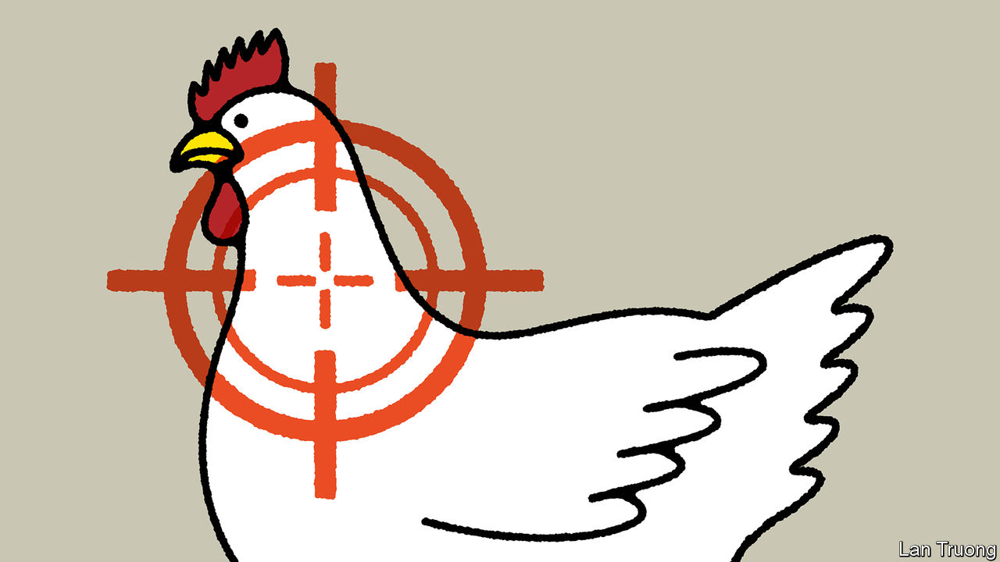

###### Banyan

# Singapore cracks down on Chinese influence 

##### The city-state wields its foreign-interference law for the first time 

 

> Feb 8th 2024 

“FESTIVE FEVER” is how the Singapore Chinese Cultural Centre describes the national mood in the run-up to Chinese New Year on February 10th. A different fever troubles the government of Singapore: how to deal with China’s allegedly extensive influence operations in the city-state. This month a sweeping new law against foreign interference was invoked for the first time, against a Hong Kong-born Singaporean, Philip Chan. 

Shadowy Chinese operations are not a new development. In 2018 Huang Jing, an academic at the Lee Kuan Yew school at the National University of Singapore, was expelled from the country for his ties to China’s security ministry. And misinformation and propaganda has long coursed through Singaporean social media. There are laws in place to regulate that. But the Foreign Interference (Countermeasures) Act, passed in 2021 and known as FICA, grants the home minister, K. Shanmugam, new powers to investigate individuals suspected of engaging in information campaigns by a hostile state. Mr Chan, the government declared, “has shown susceptibility to be influenced by foreign actors and willingness to advance their interests.”

Mr Chan is a property investor with interests in both Singapore and Hong Kong. He is forever popping up in photos of dignitaries visiting business associations. There is no harm in that. Nor is there in crooning a duet with a Singaporean minister at a charity event, as he has also been seen to be doing.

Mr Chan is however a member of the Chinese People’s Political Consultative Conference (CPPCC), an organ of the Chinese Communist Party. He appears to have crossed a line by trumpeting China’s interests. Last year, in Beijing, he declared that the Chinese diaspora was duty-bound to “tell China’s story well”. He added that “if you want to have a future, you must stand with the country that represents the future.” Similar messaging comes through in Mr Chan’s various writings in , Singapore’s Chinese-language daily. 

Not surprisingly, this has annoyed Mr Shanmugam and his colleagues. They are loth to see their tiny if prosperous state bend to the will of the regional hegemon. Yet Xi Jinping, China’s supreme ruler, has instructed the Communist Party to recruit ethnic-Chinese nationals of other countries in a quest to build international support and stymie political enemies. In 2018 responsibility for relations with the Chinese diaspora was handed to the same united front department that oversees the CPPCC. In South-East Asia above all, Chinese embassies and state-security organs reach out to ethnic-Chinese businessmen, clan associations and grassroots organisations. Mr Xi’s approach confers primacy to blood rather than to citizenship: no matter how long ago their forebears left China, ethnic Chinese are considered to have a duty to their ancestral land.

Distinguishing little between the Chinese state, Chinese culture and Chinese ethnicity is bound to sow questions about the loyalty and identity of the tens of millions of ethnic-Chinese citizens of South-East Asian countries. This causes especially serious worries for Singapore. It is the region’s only majority-Chinese state, with ethnic Malays, Indians and others in the minority. It is a rare state founded on multiracial principles. Racial identities are celebrated but racial harmony is demanded and policed.

Chinese interference, as Singapore’s ruling party sees it, poses a threat to the very idea of Singapore because it challenges that multiracial compact. No surprise, then, that the Singapore Chinese Cultural Centre, which contains a cornucopia of interactive exhibits, emphasises both the uniquely local dimensions of Chinese culture and the paramount importance of loyalty to Singapore. It was set up in 2017 after the Chinese embassy sponsored a cultural centre of its own.

Yet questions arise about the government’s approach to Mr Chan, notes Ian Chong of the National University of Singapore. What measures will be taken against him? Or is the point to scare people away from dealing with him (he has already resigned some of his association positions)? Or is he a case, in Chinese parlance, of killing the chicken to scare the monkeys—that is, more significant figures inclined to be in cahoots with China? More influential Singaporean businessfolk than Mr Chan are members of the CPPCC. Nobody has suggested they be Fica-ed. Come to that, Singapore has not named China as the offending country in Mr Chan’s case. China has a way of making everyone chicken.


