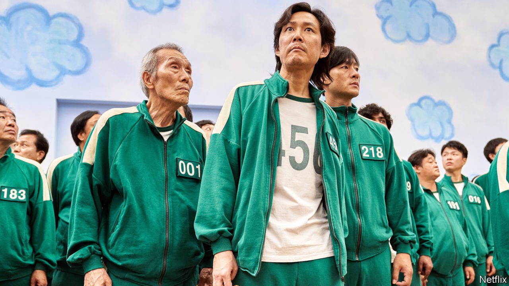

###### Pay the writers

# South Korea’s writers and directors play Squid Game 

##### The people behind the country’s TV and film boom are not profiting from it 

 

> Feb 7th 2024 

In “Squid Game”, a South Korean TV mega-hit from 2021, 456 desperate contestants compete in a series of deadly challenges. A prize of 45.6bn won ($34m) awaits the sole survivor. Working in the country’s entertainment industry can feel similarly rapacious. Scriptwriters and directors fight feverishly against long odds to get their projects made. But in contrast to “Squid Game”, success is unlikely to be lucrative for them.

Shows like “Squid Game”, which became Netflix’s most popular offering and is said to have netted the company almost $900m, have earned the South Korean entertainment industry global accolades. Yet Hwang Dong-hyuk, its creator, says the show made him only enough “to put food on the table”. Yoon Je-kyoon, head of the Directors Guild of Korea, says its members earn on average 18m won a year, while writers make only about 10m. The guild, and 24 other bodies that represent South Korean creatives, are lobbying for changes to the law to ensure that they are better paid.

Last year America’s creative industries were paralysed by weeks-long strikes by writers over the reduced royalties, or residuals, that streaming services pay compared with television networks. South Korean creatives often get none at all. They are typically hired by a production house for a one-off fee, for which they forgo rights to any future profits from their work. Only established stars of the industry can generally insist on a better deal.

The relative decline of cinema and television companies has made that negotiation harder. Writers’ bargaining power was underpinned by box-office numbers and TV ratings. By contrast, creatives say, streaming services release less detailed viewership numbers. And they are increasingly the go-to source of money for big-budget productions in South Korea. In May Netflix, which claims to pay “fair, highly competitive rates”, promised to invest $2.5bn in South Korean content. Disney+ said in September it was hoping to “gradually increase” its spending in the country.

The strikes in America won writers and directors a better deal. That approach is unlikely to work in South Korea, argues Kim Byung-in, head of the Screenwriters Guild of Korea. Not only does the industry lack Hollywood’s century-long union history, but South Korea’s complex labour laws and the fact that creatives tend to be freelancers rather than employees make striking difficult. 

South Korean creatives are therefore fighting to change the country’s copyright law, to include a “right to remuneration”. This would guarantee them a payout from the end-user, such as a broadcaster or streaming company, if their creations are successful. Several amendments are being considered in South Korea’s parliament. Many creatives hope Yu In-chon, a former actor who became minister for culture in October, will back one of them.

There is opposition. The Media Platform Alliance for Copyrights Issues, an outfit that represents broadcasters and streamers, says the change would cripple the industry. Yet if pay doesn’t increase, South Korean TV and cinema “could all vanish like fog”, says Mr Kim. He worries that young storytellers could shift to better-paying media, such as webtoons.■

