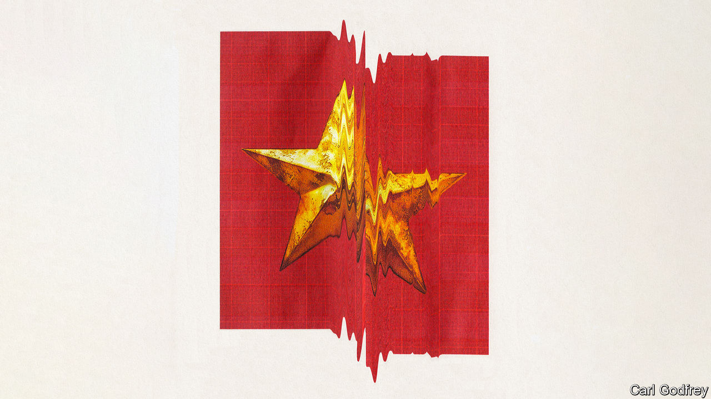
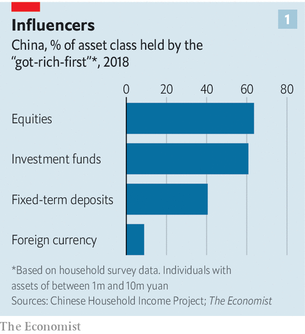
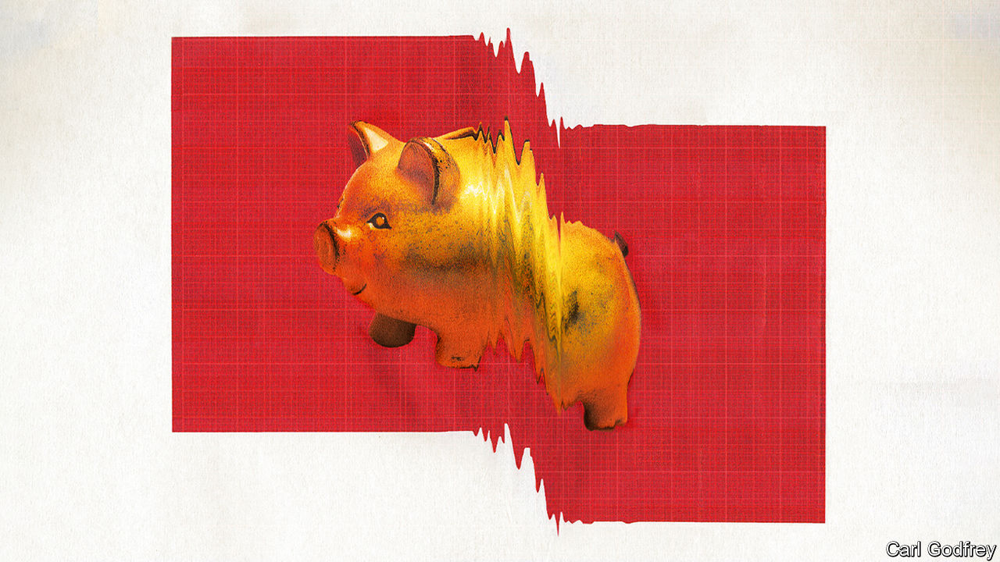
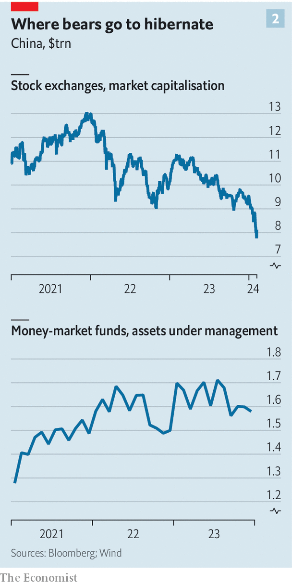

###### Dissipating dreams

# China’s well-to-do are under assault from every side 

##### Their agonies at the hands of markets and the state will reshape the Chinese economy 

 

> Feb 8th 2024 

It was a year ago that the woman who asked to be referred to as Xue Li entered the minefield, although she did not know it at the time. It was only when a mine detonated that she realised the risk she had been running—and by then it was too late.

Chinese call an investment that has gone bad a “landmine explosion”. In Ms Xue’s case, the blast came from a wealth-management product that had promised an annual return of about 8%. It had been recommended by a friend and was sold by Hywin, a big firm based in Shanghai but listed in both Hong Kong and New York. She put in 300,000 yuan ($42,000) last February and a further 500,000 a few months later. In December, however, it became clear that the firm was struggling to meet its obligations. It is uncertain how much of her original investment, if any, Ms Xue will ever see again. 

Across China hundreds of thousands of the well-to-do have suffered landmine injuries in recent months. Zhongzhi, an investment firm which went bust in December, owes its 150,000 clients $36bn. And explosions are not confined to wealth-management firms. By far the most common investment in China is property, and property values have been falling for almost three years. The stockmarket, too, is sliding: the Shanghai Composite, one of the most prominent indices, has dropped by over 20% since its peak in 2021. And whereas the government has in the past stepped in to help investors hit by plunging asset prices, this time it shows little inclination for a bail-out. Ms Xue will have to try to stanch the bleeding on her own.

China publishes almost no official data about the distribution of wealth, perhaps for fear of revealing just how unequal it is. But  has analysed nationwide surveys from 2018 and 2020 that asked participants about their income and investments, weighting the responses to reflect China’s demography. That has yielded a rough breakdown of who owns most of the financial assets that are losing value so fast, and so allowed us to infer what the swooning markets might mean for China’s economy and society.

Year of the drubbing

A huge share of the country’s wealth, it turns out, is in the hands of people like Ms Xue. The drubbing the markets have been giving them, and the government’s apparent indifference, is reshaping their investment preferences, in all likelihood for years to come. That, in turn, will impede the authorities’ plans to develop the financial system and thus slow China’s future growth. Ms Xue and investors like her will suffer the most, but China’s economy will also end up scarred by the detonations. 

 


The survey data suggest that about 50% of China’s wealth is in the hands of the 113m or so people with a net worth of 1m-10m yuan. This cohort—just 8% of the population—has even more influence over financial markets than their wealth would suggest. They own 64% of all publicly traded shares, for instance, and 61% of investment funds (see chart 1).

The group are the main beneficiaries of China’s 40-odd years of booming growth. Born in the 1960s, 1970s and early 1980s, they were some of the first to return to university after schools were closed during the Cultural Revolution. They were the first group to start small, private businesses. When the Shanghai stock exchange opened in 1990, they were among the first retail investors on the scene. They also propelled China’s property market since the first mortgage was issued by a state bank in 1986. Many will have cashed in on the privatisation of housing in the 1990s, buying flats for meagre sums that are now worth a fortune. They have experienced a miraculous shift in living standards over their working lives, from communal kitchens to holiday homes. Deng Xiaoping declared in the late 1970s that China would reject Maoism and “let some people get rich first”, and these are the people who did. 

Ms Xue appears to be a typical member of the “got-rich-first” group. She is a Beijinger in her late 40s, eyeing an early retirement after 25 years in advertising. She has saved and invested widely. In addition to the detonated wealth-management product, she owns a residential investment property and some commercial property that she rents out. About 20% of her savings are in the stockmarket. All of these investments are now losing value. It is not obvious where to turn. China’s strict capital controls make it difficult and prohibitively expensive to move money abroad; the closest she has come to that is an insurance policy from Macau, a “special administrative region” with different financial regulations and its own currency. Ms Xue’s only other form of diversification has been to stash away some gold.

For China’s wealthy, the present market turmoil is unprecedented and disorienting. Property prices had risen steadily for decades, with only a tiny blip in 2008. Although the stockmarket has been more volatile, the state has typically intervened to prevent big routs. Investors in more esoteric wealth-management products have also benefited from bail-outs when things went wrong, while receiving high yields in the meantime. A recent survey of affluent Chinese by Charles Schwab, an American asset manager, found that more than half expected 20-40% annual returns.

Dragon mire

Such expectations are looking ever less plausible. During Xi Jinping’s first term as China’s leader, in 2013-18, the average annual growth in personal income from investments was 10.8%. That fell during Mr Xi’s second term to 7%. Over the past two years it has sunk below 5%.

In part, this reflects Mr Xi’s determination to prevent bubbles and thus make the financial system more stable. To that end, he has tried to dispel the assumption that the state will come to the rescue of any struggling financial firm. In 2018, for example, he instigated a crackdown on online-lending platforms, wiping out an industry with 1trn yuan in outstanding loans. That was part of a broader campaign to restrict lending outside banks, which has shrunk by more than half since 2016.

The authorities still seem keen to shield the poor from turmoil in the financial system. This year, for instance, the central government will attempt to merge more than 2,000 rural banks with more than $6trn in assets, to strengthen institutions catering mainly to people on the lowest rung of China’s economic ladder. But the rich are a different story. When several small banks collapsed in 2022, deposits in excess of 500,000 yuan were not reimbursed by the state. By the same token, as property developers have gone bust the state has dragged its feet about rescuing those who paid for apartments that were never built, many of whom are relatively affluent. Wealthier investors, the logic runs, can afford to absorb the losses and should understand the risks.

But the risks are often opaque, and different investments more closely related than they at first appear. A search for “landmine investment” on Chinese social media reveals endless posts about trusts and other wealth-management products. These typically funnel cash from China’s rich to risky borrowers willing to pay high interest rates. The trust industry alone has raised $2.9trn from 1.3m people and companies. About 30% of its loans are used to buy bonds, equities and investment funds. Another quarter is lending to conventional businesses. More than 7% has gone to property developers, almost all of whom are on the ropes.

Wang Yong’s parents, who are got-rich-first types, were assured they were not investing in property when they bought a trust product last year. The family lives in a prosperous coastal port city. Mr Wang’s father has long invested in stocks. His mother in recent years has dabbled in wealth-management products, often taking the recommendations of an adviser at an asset-management company. Last year she went big, buying a 3m yuan trust product issued by a state-owned industrial enterprise. She later discovered that her money had been lent to a property developer that had defaulted. The state firm said the problem would be resolved in 60 days. That deadline came and went in early January. That’s when Mr Wang (a pseudonym) began posting complaints on social media. 

Tens of thousands are doing the same. Trust defaults are rising at an alarming rate. The product Mr Wang bought was issued by a firm with about 740bn yuan ($100bn) in assets. Many other trust firms are expected to miss payments in the coming months. The government has so far refused to bail them out. Most clients have no way to recoup their money. Lawyers tend to advise that lawsuits are futile.

Property has also become a landmine for many investors. For years Chinese media celebrated the “explosive expansion” of urban apartment prices and urged people to cash in. Ms Xu, a finance executive in her 50s who did not want her full name published, made sure that she did. She moved to Shanghai 20 years ago but often returns to her hometown inland, where she bought two investment flats. (Her parents live in one of them.) By 2021 their value had more than doubled. Last year, as the downturn deepened, she put both flats on the market in the hope of realising some gains before prices fell further. But she has not been able to sell them. Developers have cut the prices of new flats in her city by more than 10%. Potential buyers are holding back in expectation of further drops. She fears all her gains will be wiped out.

Half of China’s housing wealth belongs to the got-rich-first. There are no nationwide data on house prices and the official figures for individual cities seem to understate falling prices. The government’s numbers claim that prices have barely budged in Shanghai. Local economists, in contrast, reckon they have crashed by 20-30% in some central districts and could fall further in 2024. People in smaller cities talk of 30-40% “discounts” on new flats. 

Chinese spent about 16.3trn yuan buying homes in 2021. Analysts believe that up until that year about 30% of residential property was purchased as an investment, rather than to live in. That means punters pumped some 5trn yuan into investment properties at the top of the market and will have lost a big part of their savings.

 


Again, the government does not seem too concerned. The central bank declined to cut rates in January, despite months of deflation. The authorities have long wanted to quell speculation in property and prevent bubbles forming. They worry that too much of China’s household wealth—some 80%—is concentrated in housing, compared with about 30% in America, for example. There is little systemic risk: banks are well capitalised and mortgages form a relatively small share of their assets. Local governments, meanwhile, see a chance to acquire lots of apartments on the cheap, to be used as low-income housing.

But this blasé view disregards the gloom that is spreading fast among the got-rich-first. On top of everything else, many are seeing their wages fall. About a third of white-collar workers say their salaries were cut last year, the highest proportion for several years, according to Zhaopin, a job-search firm. Many senior bankers’ pay has been slashed by 30%, one claims, as part of Mr Xi’s push to rid the financial industry of Western-style extravagance. Wage growth in the private sector slowed to just 3.7% in 2022, down from double digits just a few years ago, the National Bureau of Statistics reports.

Financial reversals among the rich tend to reverberate through the economy. In an article entitled “My middle-class dream died in wealth management”, published late last year in a local newspaper, a 40-year-old woman named Zhou Ning described how she had lost millions of yuan to landmines. She explained how she has gone from holidaying in Europe and America to asking relatives for money. She has been forced to sell her luxury handbags and find part-time work. She can no longer pay for her mother-in-law’s cancer treatment. She has moved her child from a fancy international kindergarten to one with nearly triple the number of pupils.

As their income declines and their assets atrophy, the got-rich-first are becoming more cautious about spending. This “negative wealth effect” is hurting the economy. Oxford Economics, a research firm, estimates that household savings jumped to 32.4% of disposable income in the last quarter of 2023. Excess savings that could be used to consume or invest probably hit around 4trn yuan, or 3.2% of GDP.

 


As they become more cautious, the got-rich-first are reshaping China’s markets. An executive at one of China’s biggest asset-management firms says the collapse of Zhongzhi has been catastrophic for his industry. Clients used to grill him about the returns products would earn, he says; “Now they want proof we’re not a scam.” Mutual funds, which invest in stocks and are hard to redeem, saw their smallest inflows in a decade last year. Money-market funds, which can be sold instantly, grew from 8.1trn yuan in 2020 to 12.3trn in July (see chart 2).

It is into safe and liquid assets that China’s wealth is moving like never before, says Philip Leung of Bain, a consulting firm. Fixed-term deposits at banks, one of the safest investments available, grew faster last year than at any point since they were introduced in 2015. By the same token, the few funds that are allowed to invest abroad grew fourfold to 400bn yuan in assets under management between 2020 and last July. And sales of insurance policies like Ms Xue’s reportedly soared last year in Macau and Hong Kong, another special administrative region with its own currency and financial regulation.

All this will have a baleful effect on the financial system and the broader economy. Retail investors’ hitherto growing interest in stocks, bonds and investment funds, which the government had hoped would reduce Chinese savers’ fixation with property, has reversed. In the long run, that will reduce the flow of capital to business. The got-rich-first will also be more cautious about investing in their own businesses. Li Wei of Cheung Kong Graduate School of Business (CKGSB) in Beijing says entrepreneurs born in the 1960s and 1970s have been the driving force of company formation and wealth creation for decades. But a survey of business confidence conducted by CKGSB has found declining expectations for profits for seven consecutive months—a first in the survey’s 12-year history, excluding the pandemic. 

The landmines are also creating protesters among a previously apolitical group. The got-rich-first tended to look favourably on the government, which helped them to so massively improve their lot over the years. But Ms Xue and Mr Wang, at least, have been transformed into activists, hoping to bring attention to their causes. After posting a video on social media about her landmine injury, Ms Xue began receiving messages from people in different cities who had lost money on the same product. She has urged them to go to the police. She has also led small groups to the offices of Hywin in Beijing. Mr Wang, too, has linked up with fellow investors. They have visited the bank branches in their cities to complain. This appears to be a growing trend among wealthy Chinese who have experienced financial losses.  has spoken to several well-off investors over the past two years who have taken to the streets and even clashed with police in the hopes of spurring the authorities to action.

None of these efforts has been successful. Ms Xue’s visits to the police have resulted only in a warning not to “incite” others to complain. Mr Xi is keen to make financial markets more stable, but he does not want the Communist Party to be blamed when they malfunction. Protesters are usually safe if they stick to complaining about deadbeat firms, but if their actions could be construed as criticism of the government, they risk detention. 

Dragon’s denigrators

Even if most got-rich-first keep quiet, however, the current turmoil is unwinding decades of goodwill between the government and its most productive citizens. Whereas previously China’s thriving strivers and the authorities appeared to be on the same side, often in contrast to pampered young people, the state now appears indifferent if not hostile to the problems of the well-to-do. The got-rich-first, says an investment manager, “are just starting to realise that they have become the enemy”. That is a shift that will have grim consequences not just for them, but for all of China. ■

