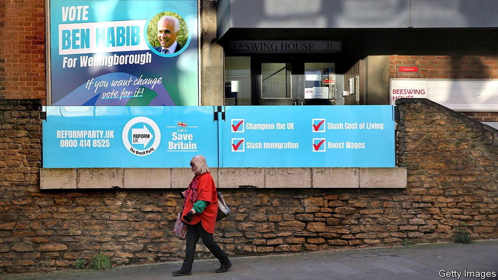

###### Eyes right

# A tiny right-wing party tries to menace Britain’s Conservatives 

##### Reform UK’s best opportunity yet arrives on February 15th 

 

> Feb 8th 2024 

“We need to send these monkeys a very significant shock,” says Ben Habib, Reform uk’s candidate in the Wellingborough by-election. It is doubtful if anybody who has come to hear him speak, in a dimly lit Baptist church, truly believes Mr Habib will win the election on February 15th. But he could shock the monkeys (that is, the government) all the same. 

Once a shoemaking powerhouse, Wellingborough, a town in Northamptonshire, now contains barbers, eastern European food stores and a clutch of post-war buildings that one architectural historian dismissed as “drab cheap stuff”. In short, it looks like many English towns. And Wellingborough is also like other English towns in its Conservatism. The outgoing Tory mp, Peter Bone, won 62% of the vote in the 2019 general election, against just 26% for his Labour opponent. 

If Labour manages to snatch the seat it will be upsetting for the Tories, but not hugely surprising. The by-election is taking place because an independent panel found that Mr Bone had bullied and exposed himself to a member of his staff (Mr Bone says the claims against him are false). That triggered a successful  in the constituency, which, in effect, gave Labour a weeks-long head start in the ensuing by-election. The party is fighting hard to win it, with a crack unit of activists and mps. The Conservatives, meanwhile, have made the puzzling decision to put up Helen Harrison, a councillor and Mr Bone’s partner, as their candidate. They have made a sleazy situation appear sleazier. 

Much worse for the Tories would be a Labour victory accompanied by a surge in votes for Reform UK. The Reform party is a peculiar outfit. It was the Brexit Party until Brexit happened; then it opposed covid-19 lockdowns, which soon ended. Now it is a generic radical-right party, which contends that Brexit has not been hard enough. By far its most famous figure is Nigel Farage, a Eurosceptic gadfly who tormented the Conservative Party a decade ago and pushed the government into holding the referendum on eu membership in 2016. But Mr Farage is busy with a tv-presenting job these days and does not trouble himself with by-elections in the Midlands. 

Reform is a populist party, but not so far a popular one. In its pomp, in 2014, the Farage-led United Kingdom Independence Party (UKIP) took 38% of the vote in five by-elections, beating the Conservative Party in all but one of them. In contrast Reform uk’s best recent performance was in Tamworth, in October, where it took just 5% of the vote. The party seems to have grown stronger since then: ’s  puts Reform on 11%, and on 17% among people who voted Conservative in the 2019 general election. But it will not panic the Conservative Party until it manages to win a good number of actual votes. 

The Wellingborough by-election, one of two on the same day (the other is in Kingswood, another Tory-held seat in south Gloucestershire), is an ideal opportunity for Reform to show it can menace the Conservative Party on its right flank. Wellingborough is Brexity—62% of voters in the local authority voted “Leave” in 2016—and there are lots of disgruntled Tories to pick off. Ms Harrison seems to take the threat from Reform seriously. In a radio hustings held on February 1st, she answered a question about immigration by saying that she agreed with much of what Mr Habib had just said. A request for the candidates to reveal an interesting fact about themselves had the others talking about their prowess in boxing, gymnastics and stand-up comedy. Ms Harrison replied that she had co-founded a Brexit group. 

If the Reform party fails to break through in Wellingborough, however, it may have to rethink its pitch. Whereas ukip was above all a Eurosceptic, anti-immigration party, Reform is searingly right-wing on many issues. That limits its appeal. Mr Habib is for slashing taxes and regulations and against woke teachers, confusing gender notions and net-zero policies. “Some people may find it a bit esoteric,” he tells the crowd in the Baptist church, before launching into a discourse on Northern Ireland’s constitutional place in the United Kingdom. The crowd’s polite reaction suggests it does indeed find such talk esoteric. It cheers up when Mr Habib rails against rampant immigration.■


