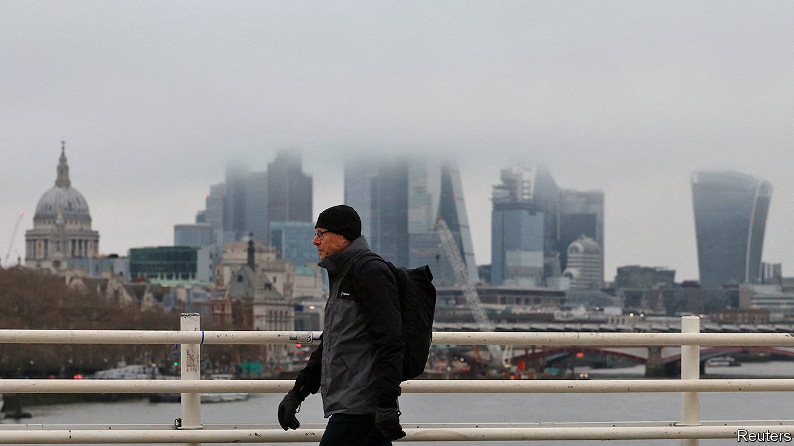
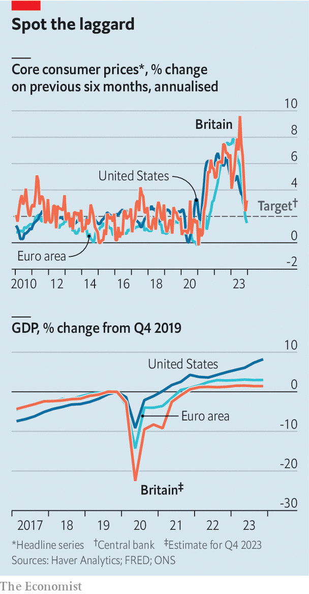

###### Not so soft

# Britain’s economy will need rate cuts sooner rather than later 

##### Inflation is coming down but worries about growth rise 

 

> Feb 8th 2024 

Rate-setters at the Bank of England (BoE) are an unusually rowdy bunch, at least in public. At the Federal Reserve, America’s central bank, virtually all its recent monetary-policy decisions have been unanimous. That has not happened at the BoE since interest rates began rising in late 2021. At their most recent meeting, on February 1st, a majority of the nine-member monetary-policy committee (MPC) opted to hold interest rates at 5.25%. But individual votes were cast to raise rates, to keep them flat and to cut them—the first such three-way split since the financial crisis. 

Despite the disagreements, the argument is moving in favour of the doves. No longer an , Britain continues to stand out for problematically weak growth. Elsewhere in the rich world, and to the puzzlement of many economists, it hasn’t taken much economic pain to bring inflation down. Britain looks less fortunate. As a result the case for starting to cut interest rates soon, if not quite yet, looks stronger than in just about any other big rich economy.

Until recently, inflation had been Britain’s primary macroeconomic worry. “Core” inflation, which excludes volatile categories such as food and energy, hit a peak of 7.1% year on year last May, months after declines had begun in most other advanced economies. The policy prescription was clear: raise rates.

 


The medicine appears to be working. Year-on-year inflation did rebound slightly in December, to 4%, but much of that rise came from an upswing in flight and hotel prices that is unlikely to be repeated. By some measures inflation is now within touching distance of the BoE’s 2% target (for instance, by calculating inflation on a six-month basis, a faster-moving measure than the 12-month change that is more commonly used; see top chart). 

A continued slowdown looks likely for several reasons. First, the biggest supply-side ructions of the past few years have receded: European natural-gas prices are back near pre-pandemic levels and global shipping backlogs have eased (recent disturbances in the Red Sea aside). Second, financial markets in Britain have remained tame, avoiding the blowout exuberance that has prompted some concern in America about re-accelerating inflation. The S&amp;P 500 index of American companies has gained almost 20% since November; the FTSE 100, its British equivalent, is up by around 4% over the same period.

But the most consequential reason for inflation’s decline is also the least welcome: British growth remains extremely weak. Britain’s GDP has risen by around 1.5% since 2019, half the figure for the euro area over the same period and a fifth that for America (see bottom chart). Discussion of the country’s  often focuses on structural woes such as lagging productivity growth and underinvestment. Those problems have not gone away. But the evidence suggests that a cyclical economic downturn is also under way. 

The data are admittedly more messy than usual; the Office for National Statistics freely admits that the reliability of economic numbers has worsened since the pandemic as response rates to its  have fallen. But look closely, and a pattern of ongoing weakness emerges. In December inflation-adjusted retail sales hit their lowest level since the height of the pandemic. Industrial production has fallen in recent months; job vacancies continue to decline. The BoE’s forecasters have pencilled in zero GDP growth in the first three months of this year. Of the 61 forecasters polled by Bloomberg, a data provider, not one has a projection higher than 1% for 2024; the average is just 0.4%.

The remedies to Britain’s structural growth problems tend to be slow-acting, complex and elusive. Navigating a cyclical downturn is better-trodden economic territory. The classic solution would be to cut interest rates, and to do so in excess of the cuts necessitated by falling inflation. That moment has not quite arrived. Inflation is still uncomfortably high. The budget in March may see a jolt of fiscal stimulus from pre-election tax giveaways. 

Monetary easing would be a much more prudent form of stimulus. Only one MPC member, Swati Dhingra, voted in favour of rate cuts on February 1st. An outbreak of unanimity seems unlikely in the near future. But it may not take too many meetings for Dr Dhingra to be in the majority. ■


