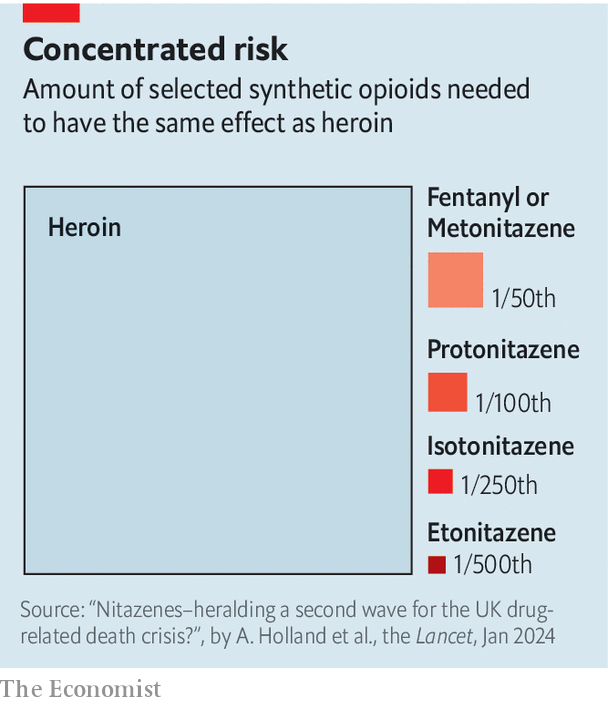

###### A pill wind

# How Britain lost its war on drugs 

##### Blame new synthetic opioids, inadequate funding and a punitive attitude 

 

> Feb 7th 2024 

As a general practitioner (gp) in a deprived inner-city neighbourhood of Birmingham, Judith Yates had a close-up view of the evolution of Britain’s illegal drugs market. In the 1980s some of her poorest patients became addicted to Afghan heroin as it flooded the market. In the 1990s they made crack pipes from Coca-Cola cans and asthma inhalers. Some recovered. Others went in and out of prison, where they often became addicted to other drugs. Several died.

In 2010, frustrated by how little ground the government was making in its war on drugs, Dr Yates started visiting the local coroner’s office to collect information on drug deaths. “I wanted to look for patterns, see if we could prevent people dying,” she said. What she found alarmed her. Drug deaths were increasing every year. And opioids were playing a big role.

 


In 2022 Dr Yates (by then retired but continuing her investigations) spotted the name of a drug on the coroner’s reports that she had not seen before: n-pyrrolidino etonitazene. This is one of a class of new synthetic opioids known as nitazenes which are at least as powerful as fentanyl (another synthetic opioid that is itself up to 50 times more powerful than heroin) and often many times more so (see chart). 

The drug had been found in three young men who had died, two students and a businessman—quite different sorts of drug users from those Dr Yates was used to seeing in coroners’ reports. They had bought what appeared to be pharmaceutical-grade oxycodone (painkiller) pills online. “They would have thought they were self-medicating to reduce the stresses of life,” she says. “They certainly did not expect to die.” 

Dr Yates’s experience is a microcosm of a wider crisis. Drug deaths in England and Wales have risen every year since 2012. In 2022, the most recent year for which there are data, the figure was 4,907, according to the Office for National Statistics (ons); 89% higher than in 2012. In that period some features of drug deaths have remained steady. Most victims are male (see chart). The north-east has the highest death rate. (Scotland, which is subject to the same laws but where drug deaths are counted separately, has one of the highest rates in Europe.) And the same generation—people born in the 1970s—are the likeliest to die.

 


The vulnerability of this cohort is explained in part because in the last two decades of the 20th century more young people started using hard drugs, chiefly heroin and cocaine. These do more damage to the body as it ages. Deaths caused by cocaine, which has become increasingly popular as it has become cheaper, rose to 857 in 2022 from 112 in 2011. Drug-induced deaths may also be rising because it has become more common to take more than one substance at a time, which is likelier to be fatal. 

But the most worrying part of the picture involves the consumption of synthetic opioids. Britain, like most of Europe, has so far sidestepped the  last year alone. Because of its nationalised, non-profit-driven health-care system (in which doctors are generally responsible about prescribing opioids), it is unlikely to ever develop a problem as big as America’s.

Yet experts worry that an opioid crisis may nonetheless be looming because of changes to the global drugs trade. Most heroin in Europe comes from Afghanistan, where in 2021 the Taliban announced a ban on opium, a gum produced from poppies from which heroin is manufactured. Two missed poppy harvests later, the market for synthetic opioids such as nitazenes—which are relatively easy and cheap to manufacture (in China, it is thought) and then post—is said to be booming.

No one knows how many people in Britain have been killed by nitazenes. They have been detected in several dozen cases but are not always tested for. Meg Jones, director of Cranstoun, a charity, says nitazenes are being cut into many different sorts of drugs, often accidentally (because they are cut and packed on the same surface). In November the Home Office said it was decreeing 15 new drugs to be “class A”, the most dangerous sort. Most of them are nitazene compounds. 

Britain is singularly unprepared for an opioid crisis. Funding cuts in the 2010s have devastated drug-treatment programmes. In the second part of an independent, government-commissioned review into drugs published in 2021, Professor Carol Black, a doctor and academic, said that “funding cuts have left treatment and recovery services on their knees.” The workforce was “depleted, especially of professionally qualified people, and demoralised”. “The current situation is intolerable,” she said.

The government has acknowledged that more investment in such services is needed. Yet it needs to do a lot more than restore what it has squandered. Since Britain passed the Drugs Misuse Act 1971, which criminalises possession of illicit drugs, it has taken a moralistic, punitive attitude to drug use that has achieved little.

Britain remains one of the few countries in Europe that does not have safe drug-consumption rooms (though one is due to  soon). That is because to run one could mean being charged with a crime. Research suggests such places do not increase drug use but help users enrol in other treatment. They are, moreover, a low-cost intervention, requiring little more than a room, a health-care worker and a supply of overdose medications. Yet Rishi Sunak, the prime minister, has said they “condone use of drugs”.

There has been some progress. Police forces increasingly carry naloxone, an opioid antidote. Once only available in injectable form, it is now available as a nasal spray. Officers prefer using this to giving drug addicts cpr. (Multiple doses may be needed to save someone who has taken nitazenes.) Last month The Loop, a charity, opened the first Home Office-licensed drug-testing site, in Bristol. It will allow users to submit samples of illegal drugs; if there are concerns about the potency and purity of substances, local authorities can send public-health alerts and the buyer can be offered advice and treatment. More such centres are crucial. 

In a rapidly evolving drug market information is power, says Dr Yates. She would, for instance, like the government to find a way to hasten the dissemination of information about drug deaths, which are usually certified by coroners. The ons says that record delays in inquests mean 64% of deaths that were registered in 2022 actually occurred in previous years. If Britain does have an opioid crisis, it may not find out before it is too late. ■


