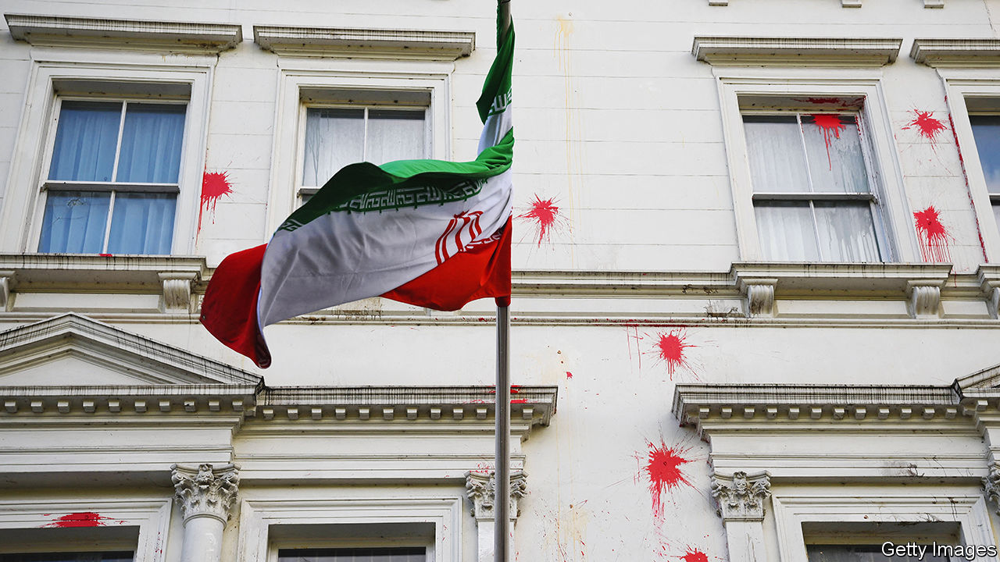

###### Death to Britain, but not just yet

# Iran is targeting its opponents in Britain 

##### Iran’s regime sees London as both hunting ground and playground 

 

> Feb 8th 2024 

IN 1987 Amirhussein Amir-Parviz, a former cabinet minister in the Shah of Iran’s government, was sitting in his car in London. Mr Amir-Parviz led a group opposed to the Islamic regime which had taken power in Tehran in 1979. When a bomb under his seat exploded, Mr Amir-Parviz escaped. He was just one among scores of people targeted by Iranian agents across Europe in the 1980s and 1990s. Now, it seems, the bad old days are back.

Britain has identified at least 15 credible threats by Iran to kill Britons or British residents since the start of 2022 alone. On January 29th the government imposed new sanctions on members of an Islamic Revolutionary Guard Corps (IRGC) unit that had tried to assassinate two presenters at Iran International, a Britain-based TV station. It is “quite an unprecedented time”, says a British government official who works on Iran. “We are at the peak level of Iranian state activity globally since 1979.” 

 has a long record of foreign skulduggery. But such activity has revived dramatically in recent years. In September 2022 the death of Mahsa Amini, a young Kurdish-Iranian woman who had been arrested for flouting the mandatory hijab law, prompted huge protests across Iran. The regime, spooked and vulnerable, went after what it saw as subversives abroad. London, the centre of a loose network of activists and dissidents that constitutes Iran’s opposition in exile, is a big target—even more so now, after the war in Gaza and British participation in attacks on .

The most prominent quarry has been Farsi-language broadcasters like Iran International and BBC Persian. In February 2023 Iran International was forced temporarily to abandon its operations in Britain citing the threat from Iran, which had declared it a terrorist organisation in the wake of its reporting about the death of Amini. In December a Chechen-Austrian man was sentenced to more than three years in jail for collecting information about the channel’s former offices. 

No one has been physically harmed so far. “If they wanted to kill people they could have done it,” says a former British diplomat. But scare people they have. All the Farsi-speaking journalists in London contacted by  said they or their families in Iran had been intimidated. One had been moved to a safe house after men on a motorbike had shouted death threats at his wife along with the address where she lived. Some had resigned. 

New security laws to tackle foreign spying on British soil came into effect late last year. All the journalists we spoke to had received visits by counter-terrorism police advising them to change their daily routines and to avoid visiting countries near Iran, including Turkey and the UAE. Some had received panic alarms. But all fear the police are overstretched. When one called an emergency number no one answered. 

Whereas Russia’s modus operandi has been to dispatch (often hapless) intelligence officers to bump off people abroad, Iran has rarely used its own spies for this sort of “wet work”. Instead it uses a motley crew of organised criminal networks, which are allowed to get on with drug trafficking in Iran in exchange for doing jobs for the Ministry of Intelligence and Security, Iran’s spy agency. A drugs smuggler and a member of the Hells Angels were among those indicted in America last month for plotting to kill Iranian dissidents there. Occasionally, Iran has resorted to unwitting private investigators to watch dissidents; it also recruits non-Iranian Shias, often of Afghan, Pakistani and Iraqi origin.

It stirs the pot in other ways, too. The theocratic regime has a network of mosques, religious colleges, schools and  (prayer halls) across Britain, which owe their allegiance to Iran’s supreme leader, Ayatollah Ali Khamenei. The Islamic Centre of England, a charity in London formally headed by Mr Khamenei’s representative in Britain, was given a warning by the Charity Commission after it held events in 2020 which eulogised Qassem Suleimani, an IRGC general who was assassinated by America that year. 

More recently the BBC has unearthed incidents where IRGC commanders gave virtual speeches to British students, on one occasion urging them to “bring an end to the life of the oppressors and occupiers, Zionists and Jews across the world”. As Iran’s government grows more insular and paranoid, the threats could worsen. Iran’s regime is “overwhelmingly occupied with succession planning” for the ailing Mr Khamenei, says Ali Ansari of the University of St Andrews, as factions vie for control. 

Iran’s activities in Britain extend to business, too. Iranian academics in Britain with close regime ties have set up companies in such fields as oil and gold trading, mining and marketing. Much of that is probably legitimate under British law. Still, on February 5th the  reported that the Petrochemical Commercial Company, sanctioned by America for allegedly raising hundreds of millions of dollars for the IRGC, secretly owned front companies in Britain that have had bank accounts with Lloyds and Santander. 

Several regime figures, including Mr Khamenei, have relatives in Britain. Well-connected oligarchs and clerics send their children to London on visa schemes for investors (a practice defended by some British officials because it helps recruit informants). While Iranian security forces were suppressing the protests of 2022, one of the , the children of Iran’s elite, was filmed in evening dress dancing at a party in London. Not a veil was in sight. “They say death to America and Britain,” says an Iranian dissident in the city, “and they love living in America and Britain.” ■


