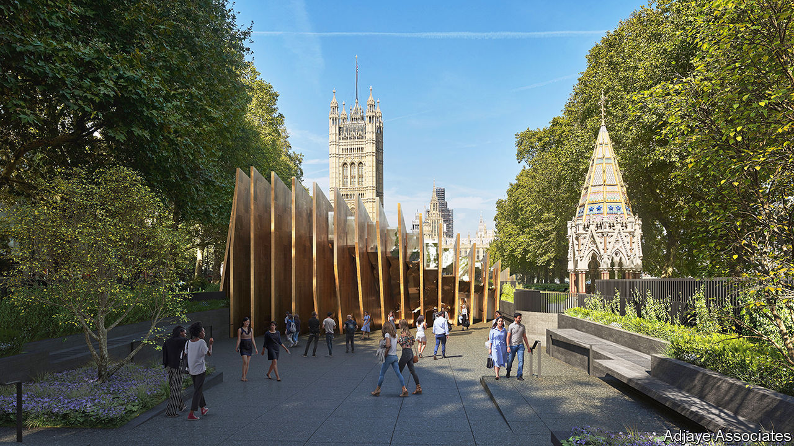

###### Remembrance row

# The controversy over Britain’s planned Holocaust memorial 

##### Wrong place, wrong design 

 

> Feb 3rd 2024 

BUILDING A MEMORIAL to the victims of the Holocaust is something Britain might be expected to do quite well. Its cities are endowed with many magnificent monuments, after all. Yet nearly a decade after the government drew up  and learning centre in central London, the project is beset by rancour and delay. In January, at a hearing of a parliamentary committee to consider the plan, Ruth Deech, a cross-bench peer in the House of Lords, asked why the government was “so determined to push this project through when it has alienated so many people, it adds nothing, costs a fortune?”

The main problem is the proposed site for the memorial. In 2016, after a public consultation, the government settled on Victoria Tower Gardens, a small park next to Parliament and the Thames. But a law dating from 1900 prohibits the park from being used as anything other than a public garden. Planning permission for a memorial was granted in 2021, but the High Court quashed it the following year. In 2023 the government introduced a bill that would repeal the prohibition. 

The memorial’s design has also attracted opposition. Rectangular and bronze, it is dominated by 23 large fins, the gaps between them representing the 22 countries in which Jewish communities were destroyed by the Holocaust. Critics, many of them Jewish, have been rude about the design, likening it variously to a toaster and a shoe box. (The lead architect, Sir David Adjaye, has withdrawn from the project following claims of sexual misconduct, which he has denied.)

It is possible for disliked designs subsequently to become popular. Yet the size of the planned memorial is undoubtedly a problem. It would overshadow a smaller Victorian one that recalls the end of slavery in the British empire. unesco says it would spoil the park’s views, which include the House of Lords. (The learning centre would be below ground.)

Some believe that the project verges on the jingoistic. Sir Richard Evans, a historian, told the committee that the site had been “justified on the grounds that it symbolises the importance of British values and parliamentary democracy as a bulwark against genocide”. This he found “rather misleading”. History is muddier. Britain, for example, had “placed many obstacles in the way of Jews who tried to escape from Nazi Germany”. Sir Richard worried that the memorial might “encourage complacency and self-satisfaction”.

In recent months, warnings that it could also constitute a security threat have grown louder. Since October, when Israel began bombarding Gaza, there have been regular pro-Palestinian marches through London. Reports of antisemitism have also been rising. Some worry that the memorial could become a focus for such prejudice. 

Some people believe a much smaller figurative memorial in Victoria Tower Gardens would be fine. Given the widespread levels of  the government might be better off focusing on education, especially online. Others still question whether Britain needs a new anything. They point to the permanent Holocaust exhibition at the Imperial War Museum. It is less than a mile from Victoria Tower Gardens, and superb. ■


