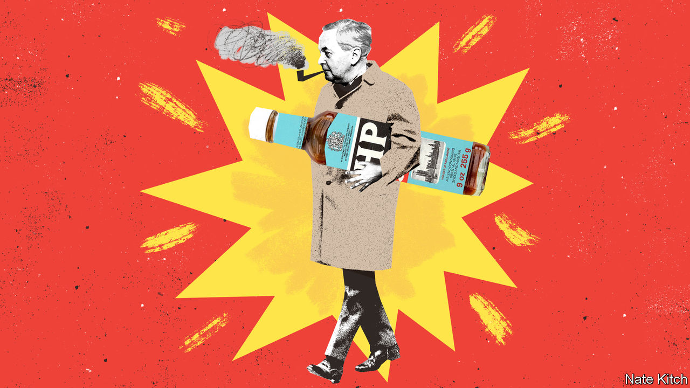

###### Bagehot

# The former prime minister who fascinates the Labour Party 

##### Starmerites are studying a neglected former leader 

 

> Feb 8th 2024 

SIR KEIR STARMER sometimes says that he must emulate all three previous leaders of the Labour Party to win governing majorities. He has to revive a battered country like Clement Attlee (who was prime minister in 1945-51), modernise the economy like Harold Wilson (1964-70, 1974-76) and fix public services like Sir Tony Blair (1997-2007). The second of this trio particularly fascinates the party. Sir Keir flecks his speeches with Wilson-era clichés (“white heat” and “the pound in your pocket”). Rachel Reeves, the shadow chancellor, is an admirer, as is Nick Thomas-Symonds, a shadow minister and author of a well-reviewed Wilson biography.

Wilson left office tainted by sleaze and fixated by alleged MI5 plots against him. Labour’s left reviled him as a schemer, the party’s right as a relic who had failed to modernise Britain’s economy or tame the unions. He has undergone a resurrection in part due to Labour’s chronic nostalgia, and in part because it is tired of losing and Wilson was a winner (“the sine qua non of a successful leader,” notes Mr Thomas-Symonds). The dates of his election victories are used by some in the party as shorthand for possible outcomes this year: a “’64” (a tiny majority), a “’66” (a big majority) or a “’74” (a hung parliament followed by a majority in another election called soon after). But the Wilson renaissance is also because his era has strong parallels with Labour’s position today. 

Sir Keir, born two years before Wilson entered Downing Street, has followed a similar course. Both are workaholics from lower-middle-class families: Wilson’s father was an industrial chemist, Sir Keir’s a toolmaker. Wilson aligned himself with the leftist Aneurin Bevan, before becoming the Labour leader by tacking to the centre. Sir Keir, with a similar methodical ambition, served under Jeremy Corbyn before moving rightwards. Both marry high-mindedness with low cunning. “This party is a moral crusade or it is nothing,” said Wilson of Labour. “He never much believed in ideology; he was an operator,” said Roy Jenkins, his home secretary. Both shed a stiff, academic bearing for an everyman routine; a pipe, a mackintosh and a bottle of HP sauce were Wilson’s props.

Sir Keir will campaign like Wilson. In 1964, as today, Labour attacked “13 wasted years” of economic mismanagement and stagnation (in fact, real income growth has been far worse this time round). Sixties Britain was suffused with a declinist anxiety, which Sir Keir has revived. Britain is slipping so far behind its peers, he says, that the young will soon look for work in Poland. 

Sir Keir has also revived the rhetoric of class and meritocracy that Wilson turned into a cudgel. The root of Britain’s economic woes, said Wilson, was that the cabinet and boardrooms were stuffed with aristocratic duffers whose “grouse-moor conception of national leadership” was unfit for the jet age; Britain needed scientifically minded go-getters. (Sir Keir, who talks of a “class ceiling”, switches grouse moor for Rishi Sunak’s helicopter.) The answer was the expansion of comprehensive schooling and universities, which some in the shadow cabinet regard as Labour’s greatest achievement. The foe of the “old school tie” would doubtless have cheered Ms Reeves’s plan to levy VAT on private schools.

The shadow chancellor’s economic agenda has a Wilsonesque edge. His “national plan”, announced in 1965, promised to lift growth to 3.8% a year in order to stave off a currency crisis, fix regional imbalances and fund the swelling welfare state. Her growth “mission” targets the highest per-person increase in GDP in the G7. They share a vision of an active Whitehall working hand-in-glove with businesses and the unions to steer investment to productive ends. Like Wilson, the party’s leadership today admires glossy manufacturing over services, wants a spree of housebuilding and preaches dull reform over . 

David Edgerton, a historian, argues that Sir Keir’s ambition to remake capitalism pales compared with Wilson’s. But there are still important things for Labour to learn from his premierships. Wilson’s national plan was immediately undermined by pressure on sterling and the deflationary policies needed to support it. Wilson resisted devaluing the pound until 1967, harming his authority in the process. That left him too weak to pass trade-union reforms. At the time of writing, Sir Keir was expected to scrap a plan to spend £28bn ($35bn) per year on green energy after months of dithering over its affordability given the state of the public finances. If so, he has belatedly learned one lesson from Wilson: Labour must act faster to acknowledge hard realities. 

A second lesson concerns the Treasury. Wilson tried to bypass its short-term instincts (“very, very skilled chaps in more or less stopping you doing anything”) by setting up a rival Department for Economic Affairs to run industrial planning. It was short-lived. The party today doesn’t plan to break up the Treasury; Ms Reeves is shaping up to be an imperial chancellor. But it needs to figure out how to strengthen the centre of government so that its “missions” of long-term reform aren’t strangled by bean-counting. 

He who rejects change is the architect of decay

The third lesson is that centre-left leaders can create the space for radical social reforms if they themselves hew to bread-and-butter concerns. Wilson oversaw a dizzying legal revolution: the abolition of capital punishment, the legalisation of homosexuality and abortion, the end of theatre censorship, and the passage of race- and sex-equality laws. Yet Wilson left the heavy lifting on such issues to Jenkins and others. He told his speechwriters to stick to working-class concerns: “I don’t want too many of those Guardian-isms, Environmentalism, Genderism etc.” 

Sir Keir’s speeches are blue-collar, yet he also shows glimmers of radicalism: he has indicated that he would welcome the decriminalisation of euthanasia should a private members’ bill be brought. Ben Pimlott’s biography of Wilson, published in 1992, affords his social reforms only passing mention over 700 pages. A leader can achieve a lot if they don’t care who gets the credit. ■


