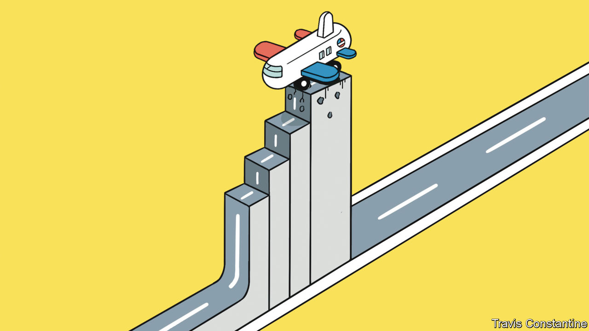
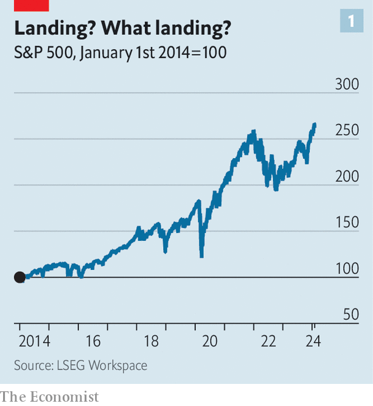
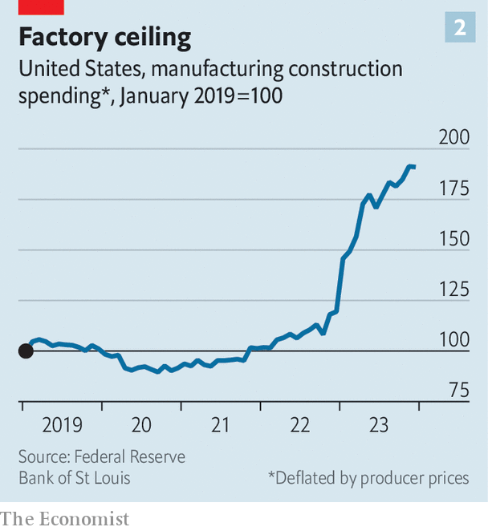

###### Discomfort level

# America’s economy is booming. So why are bosses worried? 

##### Three of the forces that propped up profits may now be weakening 

 

> Feb 4th 2024 

America’s stockmarket is on a tear. Over the past three months the S&amp;p 500 index of large companies has soared by nearly 15%, reaching a record high (see chart 1). Recent economic data support investors’ optimism. On February 2nd statisticians reported that 353,000 jobs were created in January, far more than expected. The economy grew by a healthy 3.3% (at an annual rate) in the final quarter of 2023. Despite that, inflation slowed to 2.6% on the Federal Reserve’s preferred measure, not far off its 2% target. Investors are now betting that by the end of the year the Fed will lower its benchmark interest rate from its current range of between 5.25% and 5.5% to below 4%, putting a rocket booster under America’s economy—and with it America Inc.

 


This wager is not, however, by any means sure-fire. On January 31st Jerome Powell, chairman of the Fed, scuppered hopes of an imminent rate cut, arguing inflation was “still too high”. As cheap pandemic-era debts begin to mature, the interest bill on America’s $21trn pile of non-financial corporate debt will continue to creep upwards. Profits are more or less stagnant. In the final quarter of last year, which S&amp;P 500 firms are currently reporting, they grew by a modest 1.6% year on year. What is more, three of the forces that propped up profits may now be weakening. 

One source of concern is America’s consumers. Some of the fuel that had sent consumption soaring, confounding expectations of a recession in 2023, is running out. The excess savings accrued by shoppers during the pandemic, thanks in part to government stimulus cheques, have now largely been spent, according to a recent paper by Francois de Soyres and co-authors from the Fed. Default rates on credit cards have been steadily rising. Student loan repayments, which resumed last October after the Supreme Court quashed a pandemic-era moratorium, are adding to pressure on pocketbooks.

As a result, pedlars of discretionary goods are bracing for tough times. On January 23rd Wayfair, an e-emporium for furniture, announced it would lay off 13% of staff in response to “persistent category weakness”, just weeks after its boss sent an inspiring Christmas memo to staff extolling the joys of “working long hours” and “blending work and life”. On January 25th Levi Strauss, maker of America’s favourite jeans, said it expected its revenue to grow between 1% and 3% this year, below what analysts had anticipated, and announced it would fire 10% to 15% of its workforce. On January 30th Whirlpool, a maker of home appliances, said it expected like-for-like sales to be flat in 2024.

That same day Mary Barra, boss of General Motors, America’s biggest carmaker, cheerily predicted that the number of cars sold in America would rise by 3% this year—not bad, but well below last year’s 12% increase. And prices are expected to fall to bolster demand, squeezing margins just as car firms are digesting higher costs from a new wage deal won by their unionised workers late last year. American consumers are also switching more slowly to pricier ) than carmakers had anticipated. On January 24th Tesla, America’s EV champion, warned that its growth “may be notably lower” this year. Its shares plunged by 12% in response, wiping $80bn from its market value.

Even sellers of consumer staples are signalling caution. Over the past two years makers of packaged food and home essentials have managed to protect profits from rising costs by jacking up prices without crushing demand. That strategy now looks to be running out of road. On January 26th Colgate-Palmolive, a purveyor of toothpastes, said it expected sales to grow between 1% and 4% this year, down from 8% last year. On January 30th Mondelez, a confectioner, estimated revenue growth for 2024 of 3-5%, down from 14% in 2023.

A second worry for some companies is the health of consumers in China. A collapse in the country’s property sector has weighed on consumer sentiment. In December Nike’s share price plunged after it reported slowing sales growth in China as a result of “increased macro headwinds”. An order by a Hong Kong court on January 29th compelling Evergrande, once China’s biggest property developer, to  could further dampen the mood. The next day Laxman Narasimhan, boss of Starbucks, an American coffee chain, warned that “a more cautious consumer” in China was weighing on its growth. Although Apple, the iPhone-maker, managed to notch up year-on-year 2% growth in the final quarter of last year, its sales in China slumped by 13%. On February 5th Estée Lauder, a perfumer, said it would slash 3,000 jobs owing in part to weak Chinese demand. For Western firms, stiffening local competition is adding to their woes.

 


Back at home, America’s manufacturing boom may be slowing—a third source of concern. In the first half of last year monthly factory construction in America surged by 17%, adjusting for inflation. In the second half this growth slowed to 8% (see chart 2). TSMC, a Taiwanese chipmaker, announced last month that it would delay the opening of a second chip factory in Arizona by one or two years. It had already delayed the first in July. On February 1st it was reported that Intel, an American chip manufacturer, would delay the opening of a factory in Ohio. That may be because subsidies promised by Joe Biden’s administration have been slow to materialise. Of the $52bn designated in the CHIPS Act for supporting domestic chipmaking, only a small fraction has been allocated. American car firms are also postponing investments in EV production in response to disappointing demand. That could weigh on the factory builders and suppliers that have benefited from the boom.

One area of activity that shows no sign of slowing down is  (AI). Amazon, Alphabet and Microsoft—America’s cloud-computing triumvirate—reported year-on-year growth in their cloud divisions of 13%, 26% and 30% in the latest quarter, powered in part by increasing demand from customers for the computationally hungry technology. All three told investors that their lofty ambitions for AI would lead them to raise capital spending in 2024. On February 1st Meta, which too harbours AI ambitions, reported blockbuster earnings and said it would spend up to $37bn this year, a lot of it on data centres to host AI models. In contrast to its previous splurge, on its unloved virtual-reality metaverse, investors lapped it up—as they did news that the company would buy back more shares and pay out its first-ever dividend. The next day Meta’s market value soared by $200bn, to $1.2trn, the biggest one-day jump in Wall Street history. 

It may be some time, however, before the rest of corporate America sees a boost to the bottom line from AI. According to a recent survey by BCG, a consultancy, only 5% of companies are doing nothing whatsoever with the technology. But 71% are merely “pursuing limited experimentation and small-scale pilots”. As America Inc runs low on other fuel, many more such pilots may be needed to ensure a smooth journey ahead. ■


