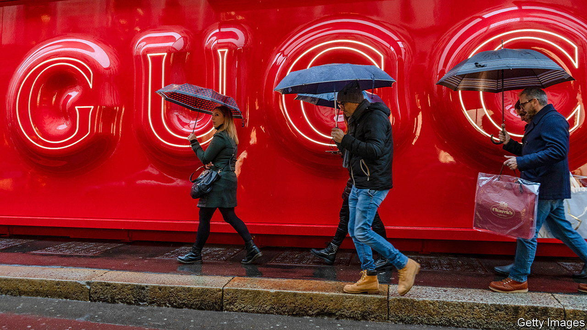

###### Bittersweet life

# Can Giorgia Meloni reinvigorate Italia SpA? 

##### Why Italian companies find it so hard to grow 

 

> Feb 8th 2024 

Prominently displayed at a bookshop at Linate airport in Milan is the cover of o (When we were the masters of the world). The book about the Roman empire has been on the bestseller list since it was published in September. It reflects Italians’ nostalgic longing for their now rather ancient glory. They could take solace from the fact that many Italian brands are still masters of the world: think fast cars (Ferrari, Maserati, Lamborghini), elegant motorcycles (Ducati, Vespa), beautiful clothes (Gucci, Prada, Zegna) and accessories to go with them (Fendi, Bottega Veneta). 

Except that few of Italy’s coveted marques and labels these days—including all of those listed above—are fully Italian. Many are either incorporated abroad, listed elsewhere or owned by foreigners. And taken together, they lag behind those from other big European countries in terms of value. Italy’s 30 biggest brands are collectively worth just a third of Germany’s top 30 and a quarter of France’s, according to Kantar, a research firm. 

Uffa!

Corporate Italy more broadly likewise punches below the country’s signature braggadocio. The entire Italian stockmarket is worth less than €800bn ($860bn), barely twice the market capitalisation of LVMH, the French owner of several Italian luxury brands (including Fendi). The Milan bourse is smaller than those in Paris and Frankfurt relative to each country’s GDP (see chart 1). In the past ten years it has underperformed them, too (see chart 2). Just five of the world’s 500 biggest companies by revenue hail from Italy, down from 13 in 1997; 136 are American, 30 are German and 23 are French. Even Spain, whose economy is a third smaller than Italy’s, has 11 firms on the list. “Italians are world-class at creating companies but they are not good at managing and growing them,” says Stefano Caselli, dean of the Bocconi School of Management in Milan. 

 


This irks Italy’s prime minister. Giorgia Meloni. Her right-wing government wants to recreate Italian champions in industries from cars and energy to food and fashion. On February 6th it pushed a capital-markets bill through the lower house of parliament. It is meant to lure more listings to the Milan stock exchange, pre-empt hostile takeovers and prevent big companies from incorporating in places like the Netherlands (corporate home to Ferrari, whose biggest shareholder, Exor, also part-owns ’s parent company). 

The bill’s advocates argue it would remove a big obstacle to the creation of corporate behemoths—Italy’s shallow capital markets. Critics warn it may have the opposite effect. Fully 95% of shareholders in Italian listed firms are foreign, says Dario Trevisan, a lawyer who represents institutional investors. And the foreigners fear that the bill favours Italians, by allowing public companies to grant long-term shareholders, who tend to be domestic, shares with outsize voting rights and, if their stake is more than 9%, the ability to veto some board appointments. 

 


Italian business could certainly do with a deeper pool of capital. In its absence, many companies have no choice but to rely on bank loans to finance their growth. This is also true in other European countries, including Germany. What distinguishes Italy is that many of its bosses actually prefer borrowing from lenders to sharing power with other equity holders, says Andrea Alemanno of Ipsos, a research firm in Milan. Like Julius Caesar, Mr Alemanno remarks poetically, they would rather be first in a barbarian village than second in Rome. All too often, the result is that companies take on too much debt and go bust or get taken over by the government. 

The alternative is to stay small. Italy has 4.3m companies with fewer than 250 employees. That is a third more than Germany, an economy twice the size that is home to the world-famous  of small and medium-sized businesses. Such firms are responsible for 80% of employment and 70% of value-added in Italy, compared with, respectively, 56% and 43% in Germany. Around 95% of them have fewer than ten employees. These microenterprises, which tend to be far less productive than larger companies, employ roughly one in two Italian workers.

“We have a strong layer of companies with 100 to 500 employees, but beyond that it gets very thin,” admits Corrado Passera, a former economy minister who runs Illimity, a bank specialised in lending to small and medium-sized Italian firms. He and his family are nevertheless big believers in  and its spirit of enterprise. His wife built a network of veterinary clinics and his son founded a hotel business. 

Setting up a company in Italy is both fun and easy, insists Mr Passera, especially if you are a technology entrepreneur. In 2012 the government in which he served passed the Startup Act, packed with incentives aimed at nurturing innovative tech firms. Businesses which qualify are exempt from fees for online incorporation, as well as some duties and taxes, and can take advantage of expedited visa procedures for their international staff and tax incentives for their investors.

Mr Passera’s high spirits notwithstanding, Italy has yet to create a  to rival equivalents elsewhere in Europe, let alone the American original Italy has the world’s tenth-biggest economy but ranks outside the top 20 even among European countries in terms of investment in startups, according to Sifted, an online publication that tracks such things. It has produced just two unlisted tech firms valued at $1bn or more (both in fintech). With luck, it may breed another one soon. Bending Spoons, which helps clients design apps, has so far raised over $500m, according to PitchBook, a data provider. But even that would leave it behind Spain, which boasts four such “unicorns”. Germany has 33 and France 24. 

Other promising Italian startups, like many of those beloved Italian brands, are seeking their fortune abroad. Newcleo, founded by three Italians, is developing novel lead-cooled nuclear reactors. It has so far raised €400m ($430m). Its research-and-development centre is located in Turin. But its headquarters are in London. That is because after a referendum in 1987 Italy phased out nuclear energy, which means no demand for its products in its home market. Ms Meloni might try to phase it back in as part of its clean-energy transition. Then again, she might not—decisiveness isn’t Italian governments’ forte.

A heavy regulatory burden and legislative uncertainty are a problem not just for atomic startups. All of Italy’s businesses struggle with the same challenges, says Andrea Bonomi, chairman of Investindustrial, a private-equity firm based in London and focused on Italian companies. If Ms Meloni wants Italia SpA to thrive, that is where she should focus her attention. ■


