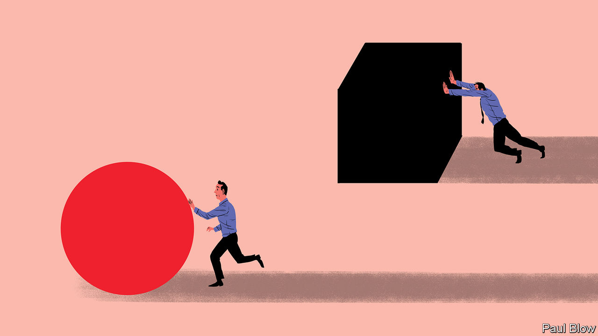

###### Bartleby

# Fairness: the hidden currency of the workplace 

##### It animates bosses, employees and customers alike 

 

> Feb 8th 2024 

Some videos are almost certain to go viral: wild animals that pilfer food from unsuspecting families, cars that career through the windows of crowded cafés, pilots trying to land planes in high winds. Some are less obvious candidates to ricochet around the internet. Take, for example, the case of Brittany Pietsch, whose recording of a call in which she is laid off from a tech firm called Cloudflare went viral last month. 

The recording lasts nine minutes, shows no one save Ms Pietsch and involves words like “performance-improvement plan”. Despite these unpromising ingredients, it makes public a moment of human drama that could occur to almost any employee. It also tugs at a fundamental human instinct. Whatever the rights and wrongs of Ms Pietsch’s dismissal, the manner in which she was fired, in a summary call with two people she had never met before and for reasons that are never properly explained, seems unfair. And few things matter more to people than fairness.

In experiments where one person decides how to allocate a pot of money with another, recipients will routinely reject an offer if they feel they are being given too little, even if that means neither party gets any cash. A fair share matters more than free money. Equity matters in non-financial life, too. A study conducted in 2012 by Nicholas Wright of University College London deliberately made some participants thirsty by hooking them up to a saline drip; they would still reject offers of water from fellow participants if they felt they were being offered too little. 

Given how much weight humans place on fairness, it makes sense that managers should think about it, too. For questions of fairness arise almost everywhere in the workplace—not just when people lose their jobs but also in who gets hired, who gets the credit when things go well and who has that really nice desk right by the window. 

Fairness is not just a preoccupation of workers. Last month a judge in Delaware ruled against Elon Musk’s eye-watering compensation package at Tesla on the ground that it was unfair to shareholders. A recent study into CEO compensation by Alex Edmans of London Business School and his co-authors found that bosses care about fairness, too. Money is not just about what it can buy; CEOs think it is only right to be rewarded for better performance, and to be paid in line with their peers. A sense of fairness can be responsible for driving up bosses’ pay and fuelling anger about it at the same time. 

Customers value fairness, too, not least when it comes to pricing. Consumers instinctively recoil at the idea of prices rising in response to surging demand, whether for Uber fares on a busy night, face masks in a pandemic or snow shovels the night after a big storm. Such views are deeply ingrained. A recent paper by Casey Klofstad and Joseph Uscinski of the University of Miami asked Floridians for their views of anti-price-gouging legislation that would prevent shops from raising prices after a hurricane. Even when told that economists and other experts believe that mandatory price ceilings would exacerbate shortages and lead to store closures, respondents supported the law. (Depending on your point of view, this either proves that the public is irrational or that economists are not human.) 

More often, opinions differ. The covid-19 pandemic, for example, drew a new dividing line between people who can and do regularly work at home, and those who have to come into offices and workplaces because of the nature of their jobs. For many, this rectifies old unfairnesses: the option of working from home enables single parents to combine child care and their jobs more easily. For others, it reinforces existing inequities: poorer, lower-skilled workers are disproportionately likely to be the ones without a choice about where to work. 

This combination of salience and subjectivity makes fairness a tricky area for managers to navigate, but not an impossible one. No hiring decision will feel fair if qualified employees do not even know that there is a job going; a survey of 3,000 jobseekers by Gartner, a research firm, in 2021 found that half of them were not aware of internal career opportunities. No lay-off will feel fair if it is too impersonal; Cloudflare’s CEO agreed that Ms Pietsch’s manager should have been on the call in which she was fired. Even if people differ over what counts as the right outcome, they can usually agree on what makes for a fair process. That is more than half the battle.■


