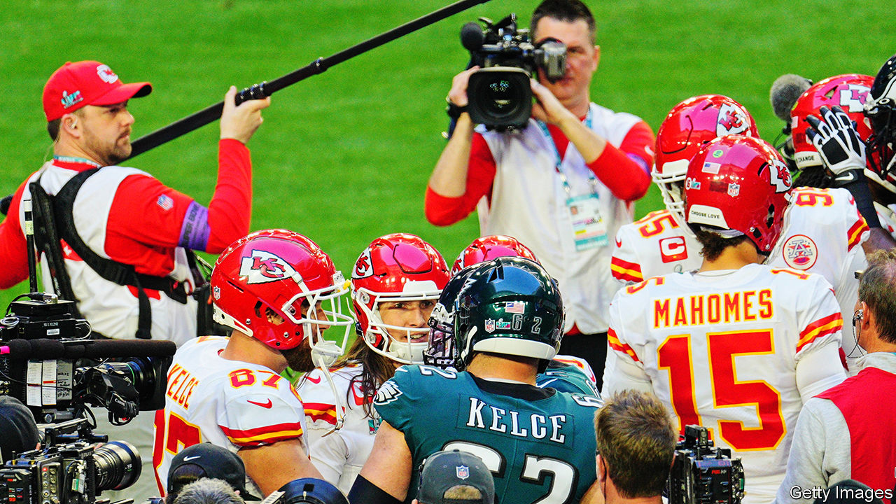
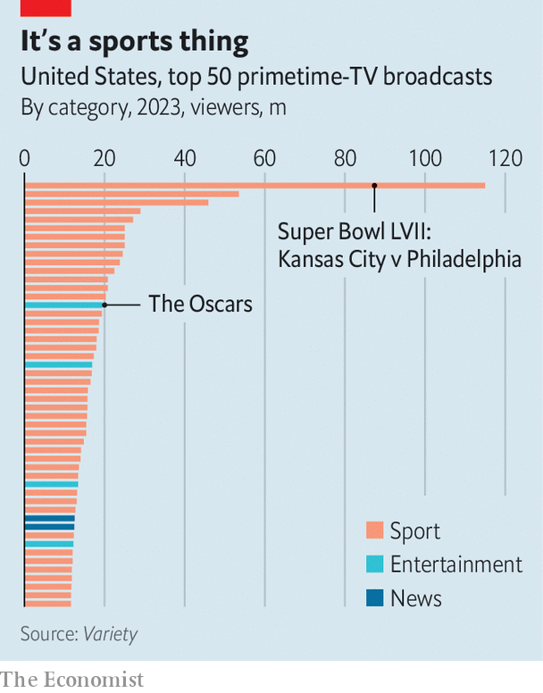

###### Team players

# Media companies club together for a joint sport-streamer 

##### Disney, Fox and Warner Bros Discovery have a new game plan 

 

> Feb 8th 2024 

MORE THAN 100m Americans will tune in on February 11th to the Super Bowl, the biggest event in the country’s sporting calendar—and in its television schedules. In 2023 the audience for the football game (the American sort) was more than double that of the next-most watched broadcast that year. Although much TV viewing has migrated to streaming platforms, when Americans want to watch sport, old-school “linear” TV is where they go.

Is that about to change? On February 6th three of America’s biggest sports programmers—Disney (home of the ESPN sport network), Fox and Warner Bros Discovery (WBD)—unveiled a plan to bring their most valuable content to a new platform. The as-yet-unnamed streamer will launch this autumn, showing everything from American football to the tennis at Wimbledon. If it succeeds it could be a game changer for the media business.

 


Most other kinds of TV have already shifted online. Last year streaming accounted for more minutes of viewing in America than either broadcast or cable TV, according to Nielsen, a ratings firm. Sport is the exception. Although big tech has added sport to its menu—Amazon and YouTube have bought rights to American football, Apple has dabbled in proper football and Netflix is about to grapple with wrestling—true sport fans still need to shell out for cable. The audiences are vast: 44 of America’s 50 most-watched broadcasts last year were sport (see chart).

The new service would be the biggest sporting bet made on streaming. The total value of sports rights on the platform—golf, NASCAR, hockey and much else—will be about $16bn a year, reckons Bernstein, a broker. In all, the content slate will encompass about 55% of American sports rights by value, says Citigroup, a bank.

Some wonder if the new contender will ever make it to the starting line. Antitrust regulators may object to three sports-content giants clubbing together. And joint ventures can be unwieldy. Many are already comparing the new streamer to Hulu, an early platform launched in 2007 by Fox and NBC to counter the threat posed by YouTube. Its shared ownership slowed it down, put a brake on investment and earned it the nickname “ClownCo”. The new sporting venture risks being “ClownCo 2.0”, says Brian Wieser of Madison and Wall, an advertising consultancy.

Success may depend on price. LightShed Partners, a research firm, predicts that a subscription will start at $35 a month (plus a generous helping of ads), less than half the cost of a comprehensive sport package on cable. Sport addicts may consider the offering insufficient. But casual fans may be tempted to ditch cable at last, hastening the decline of cable and satellite firms, which have already lost half their American subscribers in the past decade. 

What is in it for Disney, WBD and Fox? They stand to lose out at first, as the juicy cable market shrinks. But the target market is streaming-only households that have never had cable, Lachlan Murdoch, Fox’s boss, told investors on February 7th. And by giving viewers a streaming bundle including sport, they could cut customer churn. People can easily cancel their Disney+ subscription after bingeing the latest “Star Wars” spin-off (some 5% do so every month). But they cannot binge a football season. And when that ends, it will be time for basketball, then baseball and so on.

Joining forces may also improve the trio’s bargaining power relative to sports leagues. The competition for sports rights is intense as new bidders such as big tech pile in. If Disney, WBD and Fox bid jointly, they could rein in the price inflation that leagues now demand. For companies left out of the initiative, its successful launch would represent their “worst nightmare”, argues LightShed Partners. Firms like Paramount and NBCUniversal may find it harder to lure viewers to their own sport-streaming initiatives, even as the decline of the cable market, which is where they still make most of their money, speeds up. Time for a new game plan. ■


