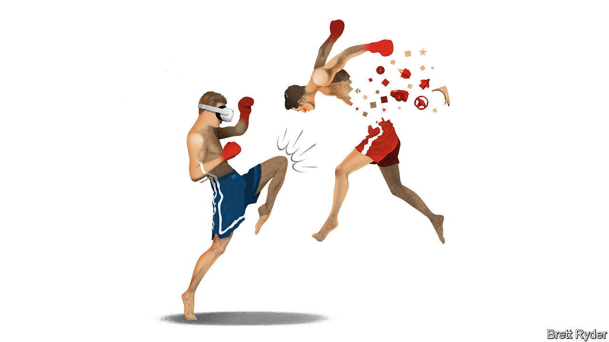

###### Schumpeter

# Musk v Zuckerberg: who’s winning? 

##### One burned billions, the other has earned them 

 

> Feb 6th 2024 

The playground rivalry between  and  dates back years—and in who-is-cooler-than-whom terms, Mr Musk usually wins easily. As an innovator, Mr Zuckerberg, co-founder of Facebook and boss of Meta, a social-media giant, has often been dismissed as a geeky dilettante in a hoodie. He has never received the Promethean kudos Mr Musk has for turning Tesla into a stallion of electric vehicles (EVs) and SpaceX into a rocket sensation. Mr Zuckerberg is notorious for his motto “move fast and break things”, which may have helped Facebook conquer the world but gave licence to critics to cast it as a social menace. Mr Musk is revered as a rule-breaker, plays up his bad-boy image and mostly gets away with it. 

Such was the tenor of their relationship when Mr Musk proposed a cage match with Mr Zuckerberg in June last year just before Meta launched a short-messaging app, Threads, to compete with Mr Musk’s Twitter (now X). Forget the physical fight that never happened. In business terms, even then Mr Musk had the upper hand. He was the richest man on Earth. Tesla’s market value, though falling, was higher than Meta’s. Its revenues were growing faster. Yet since then, he could not have kicked himself harder in the teeth. In the past few weeks Tesla has shocked investors with a horror-show earnings presentation. Mr Musk’s $56bn pay package from 2018 was rescinded by a judge, which has slashed his net worth. From America to China, his EVs have suffered recalls. 

Mr Zuckerberg, meanwhile, is punching the air. On February 1st Meta released earnings showing a staggering rise in sales and margins. Its market value has reached $1.2trn, exactly the level Tesla achieved at its peak in 2021, and more than twice what the EV-maker is worth now. To be sure, short-term measures of financial performance are not everything. But look at longer-term factors, such as the way both men run their businesses, treat their shareholders and customers, and respond to their own failures, and it is clear the fight is as good as over. Zuck has won.

To understand why, start with the interplay between the way both gazillionaires control and run their companies. Each of them lords it over their firms in a way that makes corporate-governance advocates blanch: Mr Zuckerberg via a dual-share structure that gives him majority control of Meta; Mr Musk, by having everyone at Tesla in his thrall. But as Mr Zuckerberg has become more sensitive to his fellow shareholders, Mr Musk has become less so. That has had a big impact on performance.

Mr Zuckerberg’s  started in 2022 when shareholders recoiled at the way he was blowing their money (and his) on moonshot projects like the metaverse, just as Meta’s core business was slowing. Instead of ignoring them, he listened. Since then he has changed his tune to focus on cutting costs, boosting profits, and using the cash to invest in artificial intelligence (AI) and the metaverse in a way that improves existing products as well as funding futuristic bets. Moreover, to convince shareholders he is not wasting their money, Meta will return more cash to them via share repurchases and pay the company’s first-ever dividend. 

Mr Musk has had no such epiphany. In the two years since Tesla’s share price peaked, he seems to have doubled down on disappointing fellow owners of the company’s stock. The sensible ones long for a cheap, mass-market EV. Instead Tesla is selling expensive ones at a margin-shredding discount. They want him to spend more time at Tesla, but he splits it with SpaceX and wastes it at (and on) X. They yearn for full-self-driving cars as the catalyst for a robotaxi revolution. Instead, even diehard fans were stunned recently when Mr Musk threatened to move his AI and robotics efforts away from Tesla unless he was given 25% voting control.

That leads to a second big difference: motivation, which was the crux of the judge’s decision in Delaware on January 30th to strip Mr Musk of his gargantuan pay cheque. Mr Zuckerberg, as the judgment noted, receives no salary or share options. His 13% economic stake in Meta is the main incentive to come to work each day. Mr Musk, however, is different. Though his Tesla shareholding at the time meant he would become $10bn richer every time Tesla’s value jumped by $50bn, that wasn’t enough. Tesla’s board (many of whom the judge ruled were too chummy with Mr Musk to be independent) convinced shareholders that an extra incentive was needed to keep his nose to the grindstone: namely, the biggest payout in the history of public markets. Now that it has been voided, his motivation, presumably, is even more in doubt.

Then there are both men’s attitudes to customers, which have also moved in opposite directions. Mr Zuckerberg was vilified for Facebook’s fast-and-loose approach to users’ data, content moderation and privacy. The concerns are still strong, especially when it comes to youngsters on social media. But Facebook now has an independent oversight board to rule on content decisions, and Meta says it has invested $20bn since 2016 in online safety. No doubt Mr Musk still has some loyalists as customers. But considering how many American EV owners lean Democratic, the more he rants on X, the more it is clear that he disdains their political opinions. The latest recalls are a further source of worry (though the problem can be fixed with a software update). In China, a huge market, he faces stiff competition. Meta, by contrast, credits Chinese advertisers with helping drive a big surge in ad revenues last year. 

Caged tyrant 

In a nutshell, as Mr Zuckerberg grows older, he appears to have learned from his mistakes. As Mr Musk grows older, he gets more puerile and distracted. His huffy reaction to the Delaware court’s judgment, threatening to up sticks and move Tesla’s incorporation to Texas, is a case in point. It indicates he wants the company’s shareholders to have even less protection from his capriciousness than usual. If anyone should get into the ring and hammer some sense into him, it is them. ■


