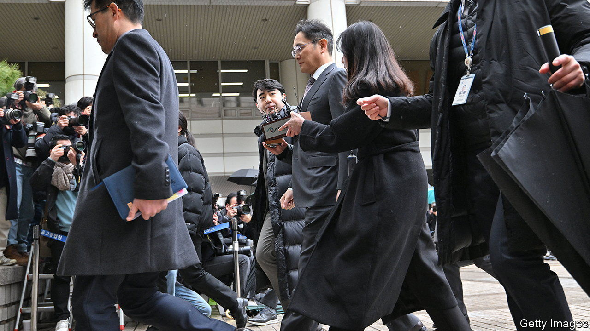

###### Out of the nick, in time

# Samsung’s boss avoids prison, again 

##### Lee Jae-yong’s acquittal will benefit him, but not necessary South Korea 

 

> Feb 8th 2024 

IT HAS BEEN a while since Lee Jae-yong did not have a court date in his diary. In 2017 the scion of the family that controls Samsung, South Korea’s mightiest (conglomerate), was charged with bribing an associate of Park Geun-hye, then the country’s president. After being found guilty that year, he was in and out of prison before being paroled and eventually pardoned in 2022. In 2020, in the middle of that saga, he was indicted for stock-price manipulation, breach of trust and auditing fraud. He has since made 95 trips to Seoul Central District Court.

Mr Lee’s schedule is finally clear. On February 5th the court acquitted him, and 13 other Samsung employees, of all charges. Mr Lee will hope to put his legal troubles behind him and get back to business. 

Both cases stemmed from the merger in 2015 of Cheil Industries and Samsung C&amp;T, the group’s unofficial holding company and a big shareholder in Samsung Electronics, its crown jewel. The deal, which valued each Cheil share at just under three Samsung C&amp;T shares, passed control of Samsung from the ailing Lee Kun-hee, the group’s chairman, to his son, the younger Mr Lee, who was the largest shareholder in Cheil but had little stake in Samsung C&amp;T. 

Prosecutors alleged that Mr Lee and his co-conspirators engaged in underhanded practices to inflate the value of Cheil relative to Samsung C&amp;T. These included spreading false information and illegally lobbying South Korea’s pension fund, a big shareholder in Samsung C&amp;T. The sole purpose of this scheme, the prosecutors argued, was to tighten Mr Lee’s grip on the group. As a result, other shareholders lost out. The court ruled that prosecutors had not provided sufficient evidence to prove either that the merger was meant to hand control of the group to Mr Lee or that shareholders had suffered a financial loss. 

Mr Lee, who maintains his innocence, asked the court to acquit him so he could focus “on moving the company forward”. Now that it has, he has much to do. A slowdown in parts of the chip business, Samsung’s main cash cow, has cut Samsung Electronics’ operating profit for 2023 to just $5bn, its worst result since 2008 and down from a peak of $54bn in 2018. Profits from memory chips, Samsung’s speciality, picked up in the final quarter of 2023. But Mr Lee still faces challenges, from the Sino-American tech war to stiffer competition. 

Then there is domestic politics. If the less business-friendly Democratic Party keeps its majority in a general election in April, it may revive a bill that would limit insurers’ assets from being overly concentrated in individual firms. This would force Samsung Life Insurance, the largest shareholder in Samsung Electronics, to sell most of its stock. That in turn would imperil Mr Lee’s control of Samsung Electronics, which he exercises through Samsung Life Insurance, in which Samsung C&amp;T is the biggest shareholder. To maintain it, he may need to simplify the conglomerate’s Byzantine corporate structure. 

Mr Lee’s acquittal may yet benefit his family business. South Korean capitalism, not so much. Last year the World Bank’s arbitration court found that the government had improperly meddled in the controversial merger. That the Seoul court has now let its architect off the hook reinforces the sense among many investors that heads can still do as they please. ■


