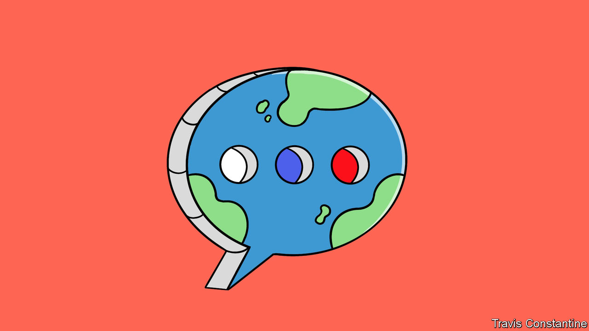

###### TsarGPT

# Vladimir Putin wants to catch up with the West in AI 

##### Good luck with that 

 

> Feb 8th 2024 

SIX YEARS ago, before anyone had heard of ChatGPT, Vladimir Putin said that the country that led the development of artificial intelligence (AI) would become the “ruler of the world”. He echoed the sentiment in December, when he suggested that Russia should “head and lead” the march of AI. Those comments came in response to a video-caller during a televised phone-in who had taken on the Russian president’s likeness using an apparently AI-generated deepfake, seemingly startling the real-life strongman for a moment. 

For Mr Putin, “leading” on AI is part of an ideological battle with the West. The success of tools such as ChatGPT, developed by an American startup called OpenAI, has led him to decry the dangers of relying on Western AIs trained on English-language data. Western “large language models” (LLMs) could, Mr Putin avers, “cancel” Russia’s perspective on the world if unchallenged. They also threaten a regime that has sought to control the Russian internet in recent years, a process accelerated by the invasion of Ukraine. To no one’s surprise, the Kremlin banned ChatGPT shortly after its launch in November 2022. Several Russian companies are hard at work trying to build alternatives. 

Last year Sber, a state-controlled lender with tech ambitions that was first tasked by the Kremlin with AI development in 2019, launched GigaChat, a chatbot that combines a command of Russian with the ability to generate computer code and images. Yandex, Russia’s search giant, has integrated an LLM, YandexGPT-2, into its virtual-assistant service, known as “Alice”.

The models are excellent at hewing to the party line. Alice, for example, refused to answer ’s questions about the war in Ukraine or Alexei Navalny, Russia’s main opposition leader imprisoned in Siberia. It is less clear that they are capable of outsmarting Western AIs. Yandex claims that YandexGPT-2 does better than GPT-3.5, the model behind an earlier version of ChatGPT, when answering queries in Russian. But Western experts consulted by  have found no independent analysis to confirm this contention, and there have been no public comparisons with GPT-4, the much more powerful current iteration of OpenAI’s model. 

Russia also lags behind the West on a variety of AI-innovation indicators. A report compiled by Stanford University said that, in 2022, the country produced only one “significant” machine-learning system, compared with 16 in America and eight in Britain. As of June 2023 Russia was thought to have just seven of the world’s 500 most powerful supercomputers, in contrast with America’s 150. Russia also ranked 38th out 193 countries in the latest AI-readiness index by Oxford Insights, a consultancy; America came first. 

To catch up, Mr Putin envisages an ambitious AI strategy to replace an earlier one from 2019. The Kremlin’s list of initial “instructions”, released in January, suggests this new plan will aim to increase Russia’s supercomputing capacity, expand training for AI professionals and improve co-operation among the BRICS, a bloc that includes China and India. 

Mr Putin’s instructions seem unrealistic, to put it politely. The war has led many Russian developers and engineers to flee from the country: one Kremlin official has suggested that 100,000 IT specialists left in 2022 alone, roughly 10% of the tech workforce. Arkady Volozh, Yandex’s founder, lives in exile in Britain and Israel after criticising the invasion. Sanctions limit Russia’s access to advanced chips, which are made almost exclusively by companies in America, South Korea and Taiwan, all part of the anti-Russian alliance. In Russia’s war economy, private investment in tech is, unsurprisingly, dwindling. The value of venture capital going into the sector was just $71m in 2023, according to DSight, a business-intelligence firm based in Moscow, a fall of 83% from the previous year. 

Mr Putin’s response is, as with most things in Russia these days, to tighten the state’s grip over the industry. In 2022 Yandex sold its news and blogging services to VK, a state-controlled online conglomerate. On February 5th its parent company, which is based in the Netherlands and listed in New York, said it would sell the Russian business (which accounts for 95% of its revenues) for $5bn to a consortium led by an arm of Lukoil, an energy company. The Kremlin welcomed the deal. State-run entities such as Rostec, a defence group, and Gazprom Neft, a subsidiary of the country’s largest energy firm, are also dabbling in AI. Sber’s chief executive, German Gref, says the bank is investing some $1bn a year in the technology. 

These sums are, though, trifling next to the tens of billions of dollars being spent by American AI champions such as Alphabet and Microsoft (which has a partnership with OpenAI). The state money brings with it inefficiency and a lack of competition—hardly a recipe for innovation. It also encourages developing AI for the battlefield rather than the marketplace. 

On the defensive

Russia has made progress in military AI, says Katarzyna Zysk of the Norwegian Institute for Defence Studies, a think-tank, particularly in drones. But in the West and even in China, a Russian ally, the excitement over machine learning has been fuelled chiefly by recent leaps in general-purpose applications such as ChatGPT, not specialist ones like pilotless aircraft. Western and Chinese strategists are counting on such fast-improving civilian AI to confer an economic and, ultimately, geopolitical and military edge. So long as it remains on a war footing, Russia will not make much progress on that front. ■


