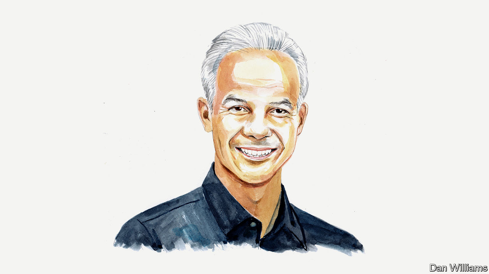

###### Indonesia’s election

# A presidential candidate sees daunting challenges at home and abroad 

##### Indonesia can help keep peace in the Indo-Pacific, says Ganjar Pranowo 

 

> Feb 7th 2024 

SUKARNO, THE first president of Indonesia, saw independence as a “golden bridge” to becoming an advanced economy and a prosperous society. It is a national ideal to fulfil those goals by 2045, when the country will celebrate the centennial anniversary of independence. However, the journey has not been easy and will continue to be studded with enormous challenges.

The most evident challenge is the climate crisis. It poses a serious threat to the global economy, affects geopolitics, undermines maritime communities and threatens the livelihood of indigenous peoples. At the same time, the world is trying to grapple with the rise of artificial intelligence. We are yet to see if AI will improve lives or exacerbate social inequality. 

These challenges are hard enough to tackle, even without great-power competition looming in the background. America and China are locked in a strategic rivalry that could undo the achievements of globalisation. After three decades of a WTO-led global trading order, protectionism is surging: the number of unilateral restrictions imposed by countries on international trade and investment quadrupled between 2017 and 2022, to more than 2,600, according to the Global Trade Alert, a data provider. Geopolitics is fragmenting as the two great powers compete for influence and look to build coalitions. One can only hope that this strategic rivalry does not lead to war.

The backdrop to these challenges is a world which has seen years of democratic backsliding. On the face of it, 2024 will be a festival of democracy. Countries with a combined population of over 4bn are expected to hold national elections, including, on February 14th, my own, Indonesia, where I am standing as one of three presidential candidates. But the decline in the quality of democracy is a serious concern. Many countries are experiencing a weakening of democratic institutions. In some, the integrity of elections is being undermined by the very participants in the democratic process.

Unfortunately, Indonesia, the world’s third-largest democracy after India and America, faces the same set of challenges. When the very people who are expected to abide by democratic rules of the game begin to bend those rules, the future of our democracy is indeed at stake. For example, the Constitutional Court, whose head is President Joko Widodo’s brother-in-law, in a controversial ruling, changed the age limit for presidential and vice-presidential candidates, allowing the president’s son to run for vice-president. There have also been reports and allegations that the state apparatus is no longer neutral and is, in fact, actively supporting one of the candidates.

Indonesia does, however, have some enduring advantages. It is blessed with abundant assets. It is reaping a demographic dividend as its working-age population—those between the ages of 15 and 64—continues growing. It is forecast that, by 2030, around 203m Indonesians, around 68% of the population, will belong to this group. That is a huge base of human potential to drive economic development.

Indonesians realise that this opportunity will not last forever. According to the latest report on population projection from our National Planning Agency, the productive-age boom is set to end in 2041. It is, therefore, time for Indonesia to intensify its efforts to push for faster human-capital development: high-quality education, better access to health care and narrowing the digital gap. This focus is all the more important given the need to reduce Indonesia’s heavy reliance on natural resources as the engine of economic growth and development. 

After the collapse of the New Order regime led by General Suharto in 1998, we made a choice as a nation: that democracy is the most suitable system for us to flourish and prosper. We need to defend democracy resolutely, step up our fight against corruption, eradicate nepotism and avoid conflict of interests. It is only within a properly functioning democracy that every citizen will have equal opportunity to thrive. It is only within a consolidated democracy that the tendency to abuse power using the apparatus of the state can be prevented.

We understand that our standing among nations will be greatly enhanced if we can show the world that Indonesia is a force for peace. In Indonesia we often say “kami cinta damai, namun lebih cinta kemerdekaan” (“we love peace, but we love freedom more”). That is why, since independence, Indonesia has pursued, and will continue to pursue, a free and active foreign policy. But this principle should not be understood as neutral or indifferent. It means Indonesia must maintain its strategic autonomy vis-a-vis any power and ensure that its national interest is always at the forefront of every policy choice.

Foreign policy is also about balancing national interests and international obligations as mandated by international law. In this regard, Indonesia, as a maritime nation, should see itself as “Garda Samudera”, the Guardian of the Seas. As a power between two oceans—the Indian and Pacific—and as a country transforming itself into a global maritime fulcrum, Indonesia should play a role in ensuring the seas remain global public goods. This will require it to work with others in the region to ensure a peaceful Indo-Pacific, by maintaining maritime security, addressing maritime pollution and preserving the maritime ecological environment.

These developmental, geopolitical and ecological challenges are daunting, to be sure. By rising to them we hope to realise the vision of Sukarno, to build Indonesia anew. ■


