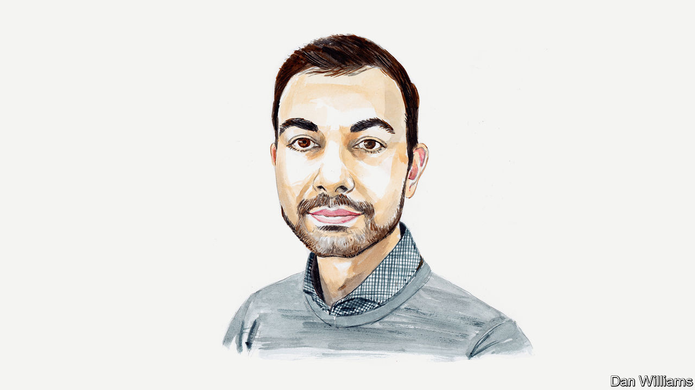

###### Artificial intelligence and democracy

# An AI-risk expert thinks governments should act to combat disinformation 

##### An election may already have been swayed, says Philip Fox 

 

> Feb 6th 2024 

ONE DAY last November, Olaf Scholz addressed the German people with an unexpected announcement: his government was to request the Federal Constitutional Court to ban the “fascist” Alternative für Deutschland, a far-right political party. A video containing the German leader’s message appeared on a website created specifically for that purpose.

Only it wasn’t the real Mr Scholz. A German group of guerrilla artists had used artificial intelligence (AI) to create a “deepfake”: an image or video generated by machine-learning software. Just a few hours after the clip went live, a government spokesman condemned the “manipulative” nature of such videos and their potential to “stir up uncertainty”.

Britain’s National Cyber Security Centre recently raised similar concerns that deepfakes could compromise democratic discourse and upcoming elections through targeted disinformation. As politicians fret about the trend, ordinary voters are growing more worried, too. According to a poll by Ipsos last year, a majority of people in numerous countries, including America, Britain and France, believe that AI will make disinformation worse.

Yet there is actually a lot of uncertainty about how real this danger is. Despite the use of advanced AI, the deepfake of Mr Scholz is easily given away as fake by out-of-sync lip movement and an unnatural voice. The same is true for the majority of deepfakes currently circulating on social media. Are fears of AI-generated disinformation exaggerated?

Some experts point to studies from before the rise of generative AI that show that disinformation campaigns are generally of limited success. For example, Chris Bail, a sociologist at Duke University, and colleagues looked at a concerted Russian disinformation campaign on Twitter in 2017 and concluded that it largely failed to sow political division among Americans. People’s general reluctance to change their political views in response to  piece of information, though often a curse, might in this case be a blessing.

AI is already changing the disinformation landscape, but the impact is different for static media like text and images than for audio and video. In the case of the former, AI doesn’t really boost the quality of disinformation. Studies suggest that AI-generated text is at best slightly more convincing than human-written text, and often no more so; Photoshop made sophisticated fake images possible long before generative AI was available. The change is, rather, quantitative: AI makes it much easier to produce and distribute disinformation at scale.

Large language models (LLMs) such as ChatGPT generate high-quality text at practically no cost; tools like Midjourney allow even amateurs to create realistic-looking images with simple prompts. LLMs can help write computer code to automate the spread of disinformation. They have been used to generate “alternative news” websites that mix truth and lies but are hard to shut down because of concerns over censorship. AI-operated social-media profiles, so-called “social bots”, can manipulate algorithms to push certain types of content. In the future, such bots might turn into full-blown online personas that enter into relationships with users and target them with subtle personalised messages.

Perhaps none of this would be enough to sway mass opinion. But that doesn’t mean there’s no danger. Studies have found that merely knowing about the spread of disinformation lowers public trust in the media, even the most reliable sources. That, in turn, increases the “liar’s dividend”: the relative ease with which politicians can denounce compromising evidence as fake. 

The biggest concerns are reserved for dynamic media. On top of a quantitative boost, AI adds a whole new qualitative dimension to audio and video. Previously, it just wasn’t possible to create realistic fake videos of public figures, except perhaps for Hollywood studios. We’re moving closer to a world where anyone can craft such footage on their laptop.

Last August Brendan Nyhan of Dartmouth College said in : “We still have not one convincing case of a deepfake making any difference whatsoever in politics”. We might have seen such a case just a few weeks later, in Slovakia. Two days before the national election in September 2023, an audio deepfake began circulating on social media. The widely shared clip appeared to be of Michal Šimečka, leader of the Progressive Slovakia party, discussing plans to rig the election. Because the clip gained traction during a 48-hour news moratorium before the vote, it was hard to debunk in time. After a tight race, Mr Šimečka’s party lost by five percentage points to that of Robert Fico, a pro-Russian populist.

Experts remain divided on the impact of AI-generated disinformation on democracy and elections, and it may be some time before it is clear. But politicians can’t afford to wait for the dust to settle; AI is moving too fast for a “wait and see” approach. They must decide now how much risk to public discourse they are willing to accept. Fortunately, there are a number of interventions that can be made to boost its resilience.

First, AI companies should be incentivised to develop watermarking and detection tools, used to distinguish AI-generated from authentic content, that actually work (current tools can too easily be evaded, or “washed out”). They could be given a choice: develop models that refuse to generate certain types of content, such as realistic videos of public figures, or find a way to reliably watermark their output (or make it otherwise detectable).

Second, such technical fixes should be flanked by tried-and-tested “prebunking” interventions. These can be media campaigns, short videos or games that educate people about the goals and strategies of disinformation campaigns and enhance public resistance to fake news.

Third, we need robust monitoring regimes and third-party evaluations to keep future model capabilities in check. For example, governments must know when models become able to autonomously wage manipulation campaigns via online personas. Without such oversight, policymakers won’t be able to react in time if things go really awry.

Before the age of generative AI, Photoshop didn’t make it impossible to tell true from false, just as Wikipedia didn’t make everyone intellectually lazy. Yet AI brings risks of a different order of magnitude. Since the technology is moving at a daunting pace, countermeasures might come too late unless policymakers act now. That this is a “year of elections”, with more than half the world’s population living in countries that will send citizens to the polls, makes it even more urgent to act. Taking a soft stance on AI-generated disinformation is not worth the risk.■


