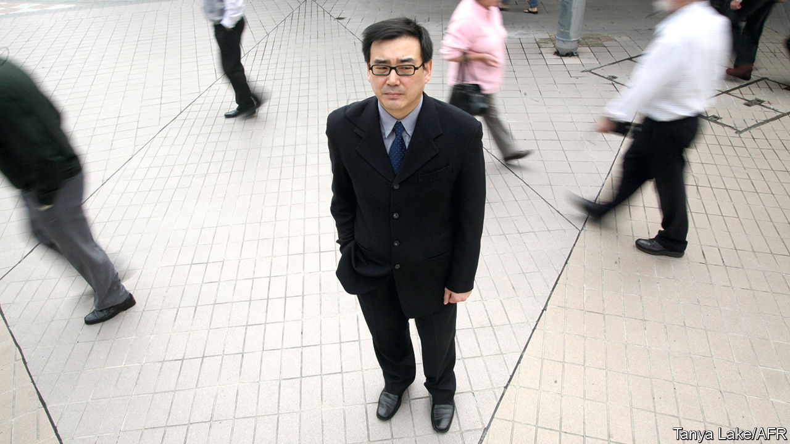

###### Shrouded in secrecy

# An espionage case hurts Chinese relations with Australia 

##### The mysterious story of Yang Hengjun who is now sentenced to death 

 

> Feb 8th 2024 

In November Anthony Albanese, Australia’s prime minister, met Xi Jinping, China’s leader, in Beijing. Mr Xi declared that China and Australia had “embarked on the right path of improving relations” after years of estrangement. Just over two months later that path has a big pothole. On February 5th Yang Hengjun, an Australian citizen (pictured), was given a suspended death sentence by a Chinese court, after facing charges of espionage. 

Mr Yang’s story is murky. Born in China, he may once have had ties to the country’s foreign or security ministries, though the foreign ministry says it never employed him. He was better known as a writer, publishing spy novels online and posting about democracy and human-rights abuses. He was detained in the city of Guangzhou in 2019. Two years later his trial began—behind closed doors. His death sentence could be commuted to life imprisonment after two years of good behaviour. Mr Yang denies the charges.

Australia’s foreign minister, Penny Wong, said her government was “appalled” by the decision. The bilateral relationship has been fragile for years. Chinese leaders did not like Australia’s deepening security co-operation with America, its call for an inquiry into the origins of covid-19 and its decision to bar Huawei, a telecoms giant. China froze ministerial exchanges and embargoed some Australian exports. The intimidation tactics did not work and the arrival of Mr Albanese’s government in Australia in 2022 offered China a face-saving opportunity to back down.

One interpretation of Mr Yang’s sentence is that he is guilty. But China “would be rubbing Australia’s face” in the evidence, if they had any, says Dominic Meagher of the John Curtin Research Centre in Australia. Another theory is that China’s government is split. The resolution of a case similar to that of Mr Yang helped clear the way for better relations. In 2020 a Chinese-born Australian citizen called Cheng Lei was arrested in China. She had been working as an anchor on Chinese state television. Convicted of espionage (with few details given), Ms Cheng spent three years in prison before being released in October. 

Mr Yang’s sentence cuts against this precedent. It would have been approved by Communist Party leaders. Perhaps it indicates a struggle between competing bureaucracies. China’s diplomats seem to favour friendlier ties with Australia, while security officials are keen to show that Chinese who acquire foreign citizenship are not beyond their reach (China does not allow dual nationality).

The most obvious lesson is that the extent of any rapprochement was always going to be limited, given Australia’s alliance with America. That means even polite Chinese diplomacy is accompanied by a note of menace. Just after the conciliatory meeting between Mr Albanese and Mr Xi, the Chinese navy approached an Australian frigate in international waters, emitting sonar pulses that may have injured Australian divers. ■

