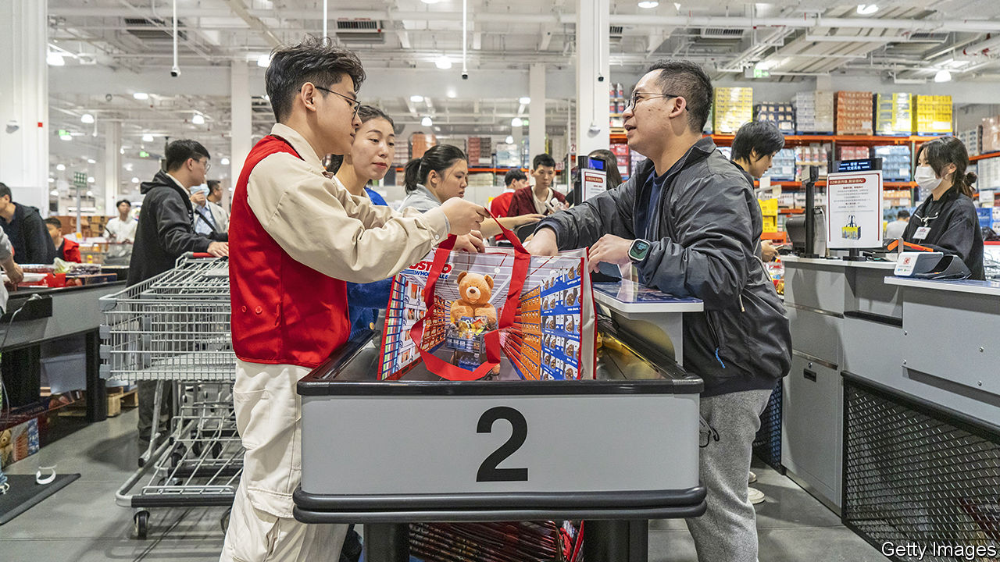
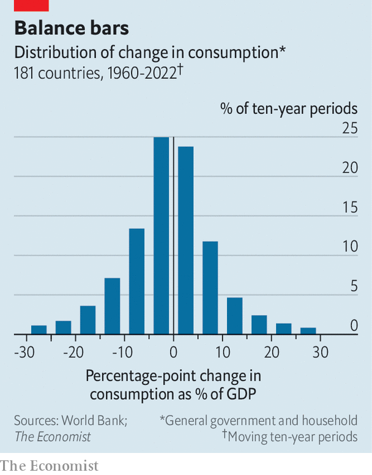

###### Spend more, please

# Can China’s consumers save its economy? 

##### Our number-crunching suggests economic “rebalancing” will be exceptionally hard 

 

> Feb 6th 2024 

MOST EMERGING economies struggle to live within their means. China, however, struggles to live up to them. Even in the best of times, the combined spending of its households, firms and government is not enough to buy all that it can produce, leaving a surplus that must be exported. The country has run a trade surplus for 34 of the past 40 years. And these are not the best of times. China is enduring its longest spell of deflation since the Asian crisis over a quarter of a century ago. An epic stockmarket rout since late 2022 has seen investors lose $2trn.

Behind that panic lies a deeper fear among investors and officials, namely that China no longer has a reliable engine of growth. The country’s property boom is over. Cash-strapped developers are afraid to start building flats and people are afraid to buy them. The infrastructure mania has run out of road: indebted local governments lack the funds. Exporting goods to the rest of the world, which China relied on for decades to escape poverty, is getting harder as protectionism rises and Western countries become increasingly wary of relying on authoritarian states.

Much therefore rests on one remaining source of growth: boosting the spending of China’s 1.4bn people. “The Chinese market, with its vast space and growing depth, will play an important role in boosting aggregate global demand,” Li Qiang, China’s prime minister, told the World Economic Forum in Davos last month. A new IMF review of China’s prospects published on February 2nd contains 61 references to the word “consumption”.

The goal of raising it makes sense. China’s stingy consumers often prefer to save, not spend. Consumption accounts for 53% of GDP, compared with 72% for the world. On this measure China ranks 156th out of 168 countries. Its resulting lopsided contribution to the world economy is stark. It accounts for 32% of global investment and 18% of GDP, but only 13% of consumption, according to Michael Pettis, an economist. Even among emerging economies, China stands out: it consumed 7% less per person than Brazil in 2022, though it produced about 40% more.

What are the prospects of rising consumption bailing China out? The good news is that 2023 showed some recovery as the end of pandemic-era restrictions allowed people to return to restaurants, shops and travel. As a result, consumption accounted for over 80% of growth, the biggest share since 1999. The bad news is that the prospects of a step change appear slight, based on the public mood, cross-country maths and China’s own history.

Start with the public mood. The turmoil in the property market has damaged the income, assets and . Take Mr Chen, a construction worker from Jiangsu province. He has struggled to find work—and is not always paid when he does. He ploughed his savings into a flat for his children in a town near his village, where many homes cannot find buyers. “What’s frightening is not the past, but the future,” he says. The mood is mirrored in forecasts: the IMF expects consumption growth to slow during 2024. 

 


Then consider the cross-country maths. Even if China escapes deflation this year, the long-term pivot required is daunting. For China to rebalance its economy successfully, consumption would need to rise by about ten percentage points of GDP, according to calculations by Mr Pettis.  has examined how often this sort of shift has occurred around the world, looking at the experience of 181 countries since 1960 and dividing their economic history into rolling ten-year intervals. We found that only in 11% of cases did consumption rise by more than ten percentage points in the space of a decade (see chart). Some of these examples are not encouraging. Albania had a consumption mania in the early 1990s but also experienced hyperinflation. Taiwan managed a ten-point shift from 1986 to 1996, but the consumer boom was associated with a big stockmarket bubble.

Finally, consider China’s own history. Its policymakers have talked about rebalancing the economy towards consumption, and away from exports and investment, for almost 20 years, since an economic conference at the end of 2004. Back then, consumption’s share of GDP was around 55%—about the same as today. Rebalancing is easier said than done.

Despite this, China has little choice but to try. One option is to promote a new consumer culture. Mr Li, in his Davos speech, spoke of rapidly unlocking China’s “supersize market” and “upgrading consumption” towards new products such as electric vehicles, smart homes and “green lifestyle” services. But social change cuts both ways. Even as they say they want to promote spending, officials are on guard against the wrong kind. Draft regulations on the video-gaming industry, issued in December and then withdrawn, instructed companies to punctuate their games with pop-up warnings against “irrational consumption behaviour”. China’s leaders could, alternatively, stimulate consumption through short-term handouts to households. But they seem to view such giveaways as ineffective, wasteful or worse: an invitation to laziness. 

That means the most plausible lever is to make citizens feel more financially secure, so that they save less and splurge more. Expanding health care and pension provision is important in the long run. Citizens like Mr Chen might feel relaxed about spending more if it were easier for them to settle in the cities in which they work. Under China’s  system, a household registry, Mr Chen is officially a resident of his home village. That makes it harder for him to access schools and hospitals in the cities where he earns a living. 

Cai Fang of the Chinese Academy of Social Sciences thinks giving migrant workers urban  could raise their consumption by as much as 30%, although other studies report less dramatic results. A study by economists at Southwestern University of Finance and Economics in Chengdu found that rural migrants who obtain urban  spend about as much as native city-dwellers, but do so more conspicuously. The end of the housing bubble could also liberate consumers. The cost of saving for a down-payment and servicing a mortgage was 11% of city-dwellers’ disposable income in 2021, according to rough estimates by Goldman Sachs, a bank. That figure could fall to about 6% in a decade, it estimates. 

Yet for now China’s approach to reform is timid and piecemeal, any dividend from the housing pivot is years away, and there is little sign of comprehensive welfare reform. Consumption will probably increase somewhat as a share of GDP, as a large cohort of retiring workers keeps spending but stops producing. The associated demographic drag, however, is hardly positive for growth. For economically insecure citizens like Mr Chen, the equation points only one way. At 51 he is just nine years from the customary retirement age for blue-collar workers. But he must look after his parents as well as his youngest child. “It all depends on me. I don’t dare do the maths.” For China’s government the calculations are similarly daunting. ■


