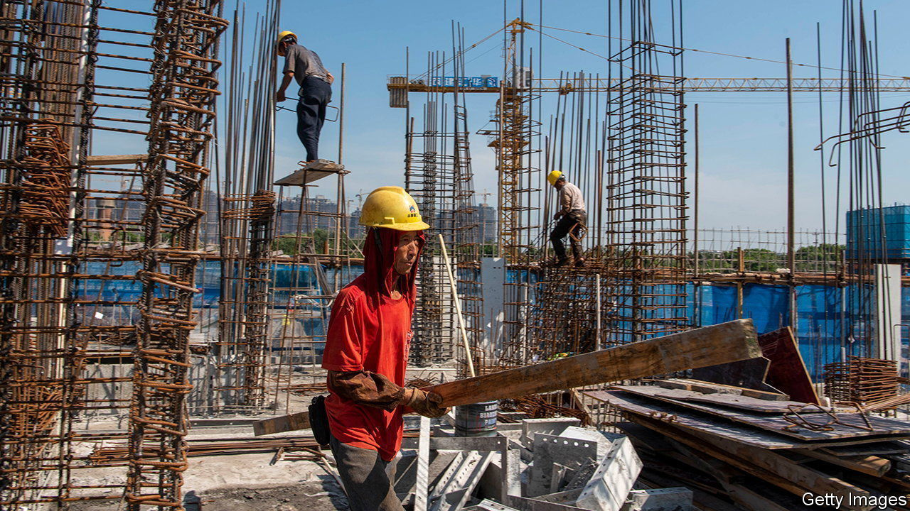
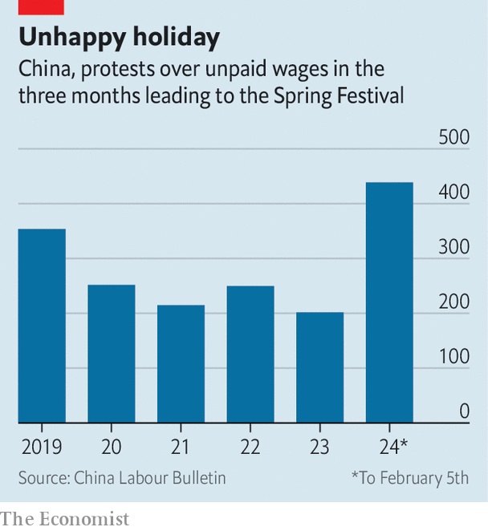

###### Pay up

# Protests are soaring, as China’s workers demand their wages 

##### They are coming up with creative stunts to put pressure on companies 

 

> Feb 8th 2024 

“Whether you’ve got money or not, do go home for lunar new year.” So goes a sentimental Chinese pop song. This year’s Spring Festival, as the occasion is also known, begins on February 10th. In recent weeks millions of China’s migrant workers, who spend most of the year toiling in cities, have been travelling back to their villages to celebrate with their families. Some are returning with hard-earned cash, which they might stuff into red envelopes (per tradition) and give to their children. Others, though, are coming home empty-handed—not because they are lazy, but because they have not been paid. 

Unpaid wages are a chronic problem in China. Migrant workers are rarely given formal employment contracts. China’s state-run labour unions (independent ones are banned) often side with management in disputes. So companies are under little pressure to pay workers in a timely manner. Sometimes, when business is bad, they refuse to pay them at all. Tensions typically come to a head in the period before the Spring Festival, when migrant workers scramble to get months of back pay before going home.

 


This year, as China’s economy sputters, things are worse than usual. Protests over unpaid wages in the period before the Spring Festival have doubled compared with last year, according to data from China Labour Bulletin, a watchdog organisation in Hong Kong (see chart). Several local governments have voiced concerns. The “severity and complexity of the situation cannot be ignored”, said the Communist Party boss of Huaibei, a city in the eastern province of Anhui, last month. 

Many of those demanding back pay are construction workers, of which China has about 52m. Four years ago the government introduced policies designed to cool an overheating property market. But the measures proved too effective, sending the industry into crisis. Meanwhile, the uncertainty of the pandemic caused potential buyers to save their money instead. As a result of all this, many developers halted big projects—and many workers on those projects have not been paid. 

One of them is Zhang Yongyin, who is from Guizhou, a poor province in the south-west of China. Last summer he worked on a project by Evergrande, a property behemoth that has been crippled by debt. Mr Zhang says he is still owed 30,000 yuan ($4,220) by one of the subcontractors. He needs the money to pay his mortgage and buy his child new clothes. “Everyone doing construction work has lost heart,” he says.

Unpaid workers often band together to put pressure on companies. Some block roads. Others are more creative. In January a group of workers at a factory in Zhejiang province threatened to jump off a government building unless they were paid. Such stunts are usually posted online to drum up support. (The group did not jump.)

The central government says it wants to help. In December officials launched a campaign to “eradicate” the problem of unpaid wages, threatening to punish recalcitrant firms. But previous efforts have had little effect. Although the government can force state-owned companies to cough up, it has little sway over the private contractors that are at the heart of the problem, says Aidan Chau of China Labour Bulletin. 

In any case, the government is more concerned about social stability. That means it often targets workers, too. Officials fume about “illegal gatherings” aimed at shaming companies. A county in the western province of Gansu has threatened to punish workers for the dangerous act of displaying banners during protests.

At an informal labour market in southern Beijing, two dozen workers recently waited in the cold, hoping to earn a little extra money before heading home for the holiday. Few jobs are on offer, though. It has been a tough year, they say. The workers at least take some comfort in their shared hardship. Going home with no money would usually be humiliating. But this year, says Mr Zhang, many of his neighbours have no money either. ■


