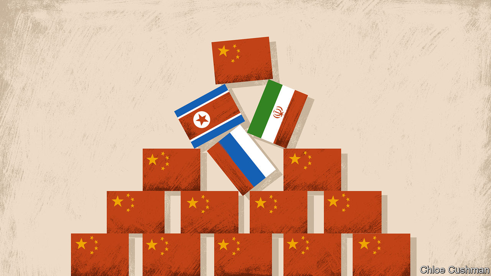

###### Chaguan

# Xi Jinping’s chaos-loving friends 

##### Why is stability-obsessed China aligned with Iran, North Korea and Russia? 

 

> Feb 8th 2024 

TURMOIL FASCINATED Mao Zedong, a revolutionary who enthused that when “there is great chaos under heaven, the situation is excellent”. Today China is the indispensable patron of regimes with a Maoist relish for disorder and for terrorising neighbours, including Iran, North Korea and Russia. Without China as a trading partner and diplomatic defender—notably at the UN, when sanctions are on the agenda—those troublemakers would pay a higher price for their lawless, aggressive ways. 

China’s embrace of disruptive powers is something of a puzzle. Chairman Mao’s China was poor, paranoid and largely closed to the world. Today’s Communist Party chief, Xi Jinping, presides over a country whose prosperity and strength rely on globalised commerce. China’s economy is slowing, and would suffer greatly if the Middle East, North-East Asia or Russia and its backyard were to descend into wider conflict. Nor is Mr Xi a revolutionary. He is obsessed by order and stability.

Officially, China deplores the turbulent state of the world. China insists that it does not endorse the invasion of Ukraine or North Korea’s development of nuclear weapons. Instead China sees the frustrations of disruptive powers as vindicating its worldview. While talking of peace and of the just cause of creating a Palestinian state, China’s preferred order seeks security by coldly balancing the interests of rival states, with no nonsense about universal values or individual rights. Its diplomats duly accuse the American-led West of stoking tensions by ignoring the “legitimate security concerns” of countries like Iran, North Korea and Russia. 

Does chaos suit China, then? Chaguan can report a striking lack of consensus among foreign governments. Some voices argue that China sees opportunities in a degree of “controlled chaos”. In that view, crises are welcome that divide the West, distract America or—in China’s immediate neighbourhood—advance Mr Xi’s stated goal that “Asian security should be maintained by Asians” (ie, that America should retreat to its shore of the Pacific). 

A second camp insists that China’s mood is one of fatalism rather than glee. In this telling, China did not choose this world of chaos and only pretends to align itself with disruptive powers for propaganda purposes. Still another camp, which comprises some foreign governments and Chinese scholars, argues that China is reluctant to put pressure on turmoil-seeking partners, even when they do something unwelcome, as long as those countries, like China, face pressure from America. Solidarity does not add up to an identical worldview, though. “Russia really wants bloc politics, and wants China and Russia to stand in one bloc against the West. That is not what China wants. We would like a stable world in which the US is not the only superpower,” says a Chinese scholar.

Debating China’s view of chaos is more than an academic exercise. Lots of governments are now asking China to use its leverage to rein in disruptive partners. Their argument is usually an appeal to China’s self-interest. It is unclear whether China is convinced.

Take tensions caused by North Korea. In the past few months it has forged closer ties with Russia, shipping missiles and other weapons to Russian forces in Ukraine. It has also tested ballistic missiles capable of hitting anywhere in America. Some hopeful sorts detect signs of Chinese dismay over these North Korean provocations. They note for instance that Russia may see an interest in helping North Korea improve its missiles, now that it is using them in Ukraine. Such Russian aid would give South Korea another reason to strengthen defence ties with America and Japan: the last thing China wants. Optimists note that China’s rhetoric has changed, a bit. In recent times Chinese officials have called for the security concerns of all relevant parties on the Korean peninsula to be heeded, rather than North Korea’s alone. Pessimists note that China continues to block new sanctions on North Korea at the UN. China would prefer to have friendly rather than hostile relations with a nuclear-armed neighbour, gloomy voices conclude. 

As for Iran, foreign governments tell China that its interests suffer when Iran and its proxies create trouble, as when Houthi rebels fire missiles at ships in the Red Sea. In reply, it is said, Chinese officials question whether there is evidence that Iran controls the Houthis, or knew in advance about last October’s Hamas attacks on Israel. Some observers wonder whether China had convinced itself, naively, that Iran is a rational power that sees economic development as its path to greater regional clout. Now China is learning that Iran is radical and dangerous, not least after watching the country’s Revolutionary Guards shoot missiles at militants based in Pakistan, a nuclear-armed friend of China’s. Either way, despite buying lots of Iranian oil, China is forging far deeper commercial ties with Saudi Arabia and Gulf Arab states that fear Iran.

China hails Putin as a force for stability

Then there is Russia. Western leaders tell Mr Xi that warm ties with Russia’s dictator, Vladimir Putin, have harmed European views of China. Mr Xi is said to retort that China does not support war in Ukraine, but that it took centuries to establish lasting peace along the 4,300km-long Sino-Russian border and this achievement cannot be jeopardised. China’s messaging to Russia is rather different. According to Russian state media, China’s defence minister told his Russian counterpart on January 31st: “We have supported you on the Ukrainian issue despite the fact that the US and Europe continue to put pressure on the Chinese side.” In China’s account of the same call, its minister agreed—apparently without blushing—to work with Russia on “global security and stability”.

Perhaps China is best understood as a cynical, opportunist power, concludes an observer. “They don’t want to see instability and terrorism. But if America is humiliated in the Middle East, that works well for them. So they wait, and in the meantime they will do a lot of business.” Much about today’s Communist Party would startle Mao. Cynicism, he would recognise. ■


