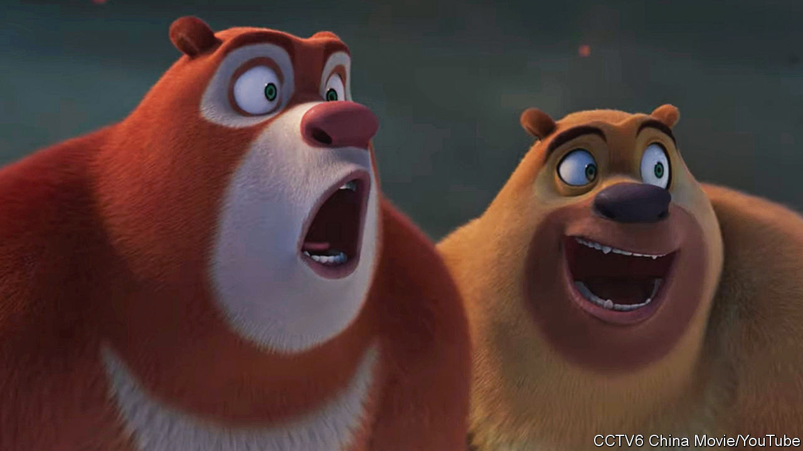
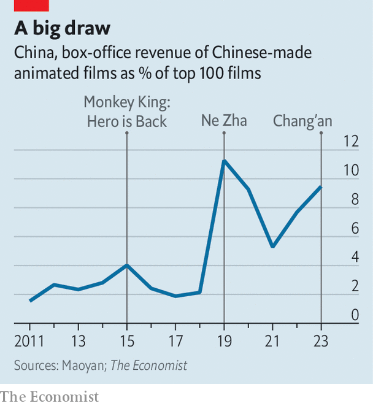

###### Name that toon

# Chinese animated films are booming 

##### But they would be even better if censors relaxed 

 

> Feb 8th 2024 

The “Black Cat Detective”, released 40 years ago, was a childhood fixture for many Chinese. The protagonist was a stern-faced, feline cop with a law-and-order demeanour befitting a cool communist cat. His adventures involved apprehending suspects (rats), prosecuting criminals (rhinos and hippos) and protecting citizens (rabbits and pandas). Cheers from grateful onlookers greeted him as he rode around on his motorbike. 

Chinese cartoons have come a long way since then. While “Black Cat Detective” was simply drawn and packed with blunt propaganda, today’s offerings boast technical sophistication and engrossing narratives. The aesthetics of “The Storm”, which opened in cinemas in January, look a lot like Studio Ghibli, the celebrated Japanese animation studio behind films such as “”. Another new movie, “Boonie Bears: Time Twist” (pictured), released on February 10th, is a family-friendly adventure with slick scenes reminiscent of Pixar, a pioneering animation studio now owned by . 

 


These recent leaps in quality have propelled Chinese cartoons to success at the domestic box office. “Ne Zha: Birth of the Demon Child” was the highest-grossing film in China in 2019, beating out “Avengers: Endgame”, a superhero movie by , and “The Wandering Earth”, a home-grown sci-fi epic.  crunched data from Maoyan, a movie-ticketing service in China, and found the share of box-office receipts going to Chinese animated films took off after 2019 (see chart). In 2023 animations’ share of the top 100 films’ box-office intake was 9.5%, more than four times that in 2018. 

China’s burgeoning animation industry withered during the purges of the , launched by Mao Zedong in 1966. After China opened up economically, studios in America and Japan trotted their films into China. Japanese anime (including “Doraemon”, starring a schoolboy and a robot cat) and Western cartoons (such as “Finding Nemo” and “Cars”) dominated television and cinema screens. Chinese animators turned to outsourcing work for Western clients.

Things changed in 2015 with “Monkey King: Hero is Back”, the first breakout success for Chinese animation at home. It was based on “Journey to the West”, a famous Chinese novel from the 16th century. (In August 2023  started streaming on Netflix, though not in China.) A big step up in graphical fidelity helped draw audiences, and so did film-makers’ insistence that the storytelling appeal to adults. The movie’s protagonist, the Monkey King, is portrayed as emerging from a mid-life crisis. “I never believed that cartoons are just for children,” Tian Xiaopeng, the director, has said.

Just as Pixar helped animated films captivate an audience beyond popcorn-popping children, Light Chaser Animation, a studio in Beijing, has boosted cartoons’ popularity in China. Light Chaser’s first three productions were cinematic marvels but financial flops. It was not until “White Snake” (2019), a love story between a snake hunter and snake spirit (made for adults), that the studio enjoyed its first success. Its “30,000 Miles from Chang’an”, which was the seventh-highest-grossing film of 2023, featured lyrical recitals of poetry from the Tang dynasty and blended elements from Chinese culture, history and mythology. 

That is a common theme among successful Chinese animations: the top three highest-grossing ones all drew on traditional themes. This chimes with the Communist Party’s drive for “cultural confidence”; in other words, China should be proud of its heritage and not in thrall to Western cultural influences. 

Indeed, authorities have taken an interest. China’s 14th five-year plan, which guides policy priorities, called for supporting development of the domestic animation industry. Traditional culture is the “best foundation” for Chinese animation, ran a boosterish headline last June in , a nationalist tabloid. Cartoons have become like other industries, from automobiles to internet companies: inspired by Western innovations but with added “Chinese characteristics”.

Ironically, China’s censorship-heavy environment may have fostered the relative success of its cartoons. Animations are usually chaste and do not touch on topics like sex, drugs or crime. That means they are less likely to fall foul of regulators, who vet and approve all films. But if Chinese animators can make films like the ravishing “Chang’an”, imagine what they could accomplish if they did not have to contend with censors, who are the real villains no hero (animated or otherwise) has been able to defeat. ■


