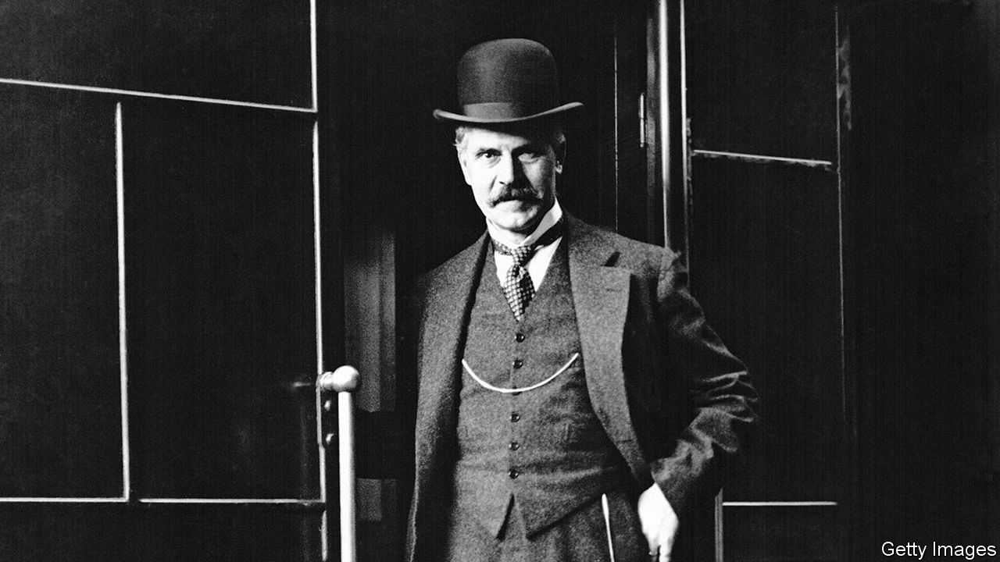

###### Labour pains

# Lessons for Keir Starmer from Britain’s first Labour government 

##### The Labour Party first took power 100 years ago 

 

> Feb 8th 2024 

 By David Torrance. 

IT SEEMS all but certain that the Labour Party will win the British , expected later this year. Rishi Sunak’s Conservatives are lagging in the polls, consumed by . All this makes for a propitious moment to assess the first-ever Labour government, which took office in January 1924. The leader of the opposition, Sir Keir Starmer, himself christened after Labour’s first leader, Keir Hardie, could learn from the story.

In “The Wild Men”, David Torrance, a journalist, recounts how Labour rocked the political establishment when it came to power. The minority Labour government, led by Ramsay MacDonald (pictured), lasted only nine months, during which it managed to make some progress with reforms in areas ranging from welfare to education and health. But its principal achievement was simply to demonstrate that, contrary to loud claims by Tories, Labour was fit to govern. In doing this, MacDonald paved the way for the collapse of the Liberal Party in the election of October 1924, creating the two-party system that has largely prevailed ever since.

Even such a short period in office offers useful lessons for later Labour governments. One was the fiscal austerity shown by Philip Snowden as chancellor of the exchequer. Contrary to the usual charge that Labour is addicted to taxing and spending, in office the party has often held down public expenses, partly to protect the value of the pound. In the 1920s Labour scotched plans for a Channel tunnel. Rachel Reeves, today’s shadow chancellor, promises to be similarly austere.

A second lesson is the big role that Labour leaders often find themselves playing in foreign affairs. MacDonald, who was his own foreign secretary (exhausting himself in the process), presided over two big European conferences to settle diplomatic and economic problems caused by the first world war. Once again, later Labour leaders have followed suit: Clement Attlee helped to set up NATO in 1949; Harold Wilson pulled British troops back from east of Suez in 1968; and , who served as leader of the Labour Party from 1994 to 2007, carved out a big—and not always successful—global role.

And third is Labour’s tradition of treating its leaders as betrayers of the party’s fundamental beliefs. MacDonald was criticised by his political peers for not being sufficiently committed to socialism; he was later branded a traitor for forming a national government with the Tories in the 1930s. Wilson was similarly attacked as unprincipled. As for Sir Tony, despite his three election victories, many in the party still hate him today. Only Attlee seems secure in Labour’s pantheon.

Sir Keir, who has weeded out many of those most closely linked to , his far-left predecessor as party leader, may have his work cut out to avoid being seen by some in the party as just another traitor. He could do worse than read this book to ponder what history can teach. ■


