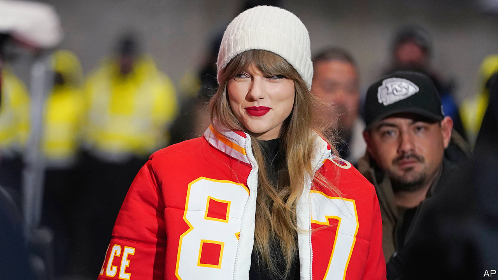

###### Back Story

# The meaning of the hysteria over Taylor Swift 

##### It reflects the overlap of politics, conspiracy and celebrity 

 

> Feb 6th 2024 

As every paid-up conspiracist knows, the NFL was rigged to ease the Kansas City Chiefs into the  on February 11th—ensuring the attendance of , girlfriend of one of the players, or so they say. But why? Not just to lift the TV ratings, surely. No, the scheme is a deep-state “psy-op” to boost Joe Biden’s electoral hopes. Or the real aim is to promote satanism, as online exorcists reckon Ms Swift’s concerts do. In any case, don’t fret about the singer getting from her gig in Tokyo to Las Vegas for kickoff. Elvis is flying her in his UFO. 

Only that last bit was made up by Back Story (though—you never know—playing Ms Swift’s new album backwards might confirm it). The rest of the wacky conjecture is, in part, the one-off fallout of a pop juggernaut colliding with a mainstay of sport. But it also reflects two important overlaps: between celebrity and conspiracy theories, and between both and American politics.

Claims that starry love affairs are shams, such as Ms Swift’s with Travis Kelce of the Chiefs, are a common strand of conspiracy theories. More often they involve death. Some celebrities are said to be secretly alive: thus Tupac Shakur, a murdered rapper, is safely ensconced in Cuba. Others were supposedly assassinated, such as Bob Marley, allegedly poisoned by contaminated sneakers. Still others have died and been replaced with clones, by nefarious spooks or greedy executives or just for the hell of it. 

Doubting the fact or manner of a star’s demise invests consoling meaning in the dust of mortality. If Elvis can simply die, what hope is there for everyone else? Yet, as Swiftmania suggests, there is a wider synergy between the worship of celebrities and the peddling of conspiracies.

It isn’t just that both appeal to people with too much time on their hands. At the astral heights Ms Swift has reached, celebrity can be a form of mass hypnosis or magical thinking. Fans conspire to imbue their idol with powers and significance beyond the merely mortal. Many feel they share a personal connection with a total stranger. A conspiracy theory doesn’t have to make sense to you, only to its adherents; likewise the cultish devotion of Swifties can seem baffling to the uninitiated. Ask any parent forced to listen to “Illicit Affairs” on repeat.

Conspiracists have often worried about artists being manipulated for political ends. After Anna Akhmatova, a Russian poet, gave a recital in Moscow, Stalin is said to have raged: “Who organised the standing ovation?” In the 1950s America’s paranoid “Red Scare” blighted careers and lives, including .

As during the cold war, American politics is now especially conducive to suspicion of entertainers. One of them became president, a reality-TV star whose rallies combine the vitriol of a witch-burning with the reassuring formula of a game show. Donald Trump blurred to vanishing the line between politics and showbiz; he also dragged conspiracy theories to the centre of debate. And he exacerbated a prior political trend—America’s extreme polarisation—which encourages conspiratorial thinking.

In an , your opponent is not a rival but an enemy, and he is always up to something. Political strife spreads into unlikely crannies of life, from beer to sport to music. Politics starts to resemble a contest between conspiracy theories. This ratchet effect mirrors the momentum of conspiracism, which is always moving on to new, more outlandish speculations. The most ambitious claim to be comprehensive, decoding not this or that murder but the hidden mechanism of the universe. 

It may seem odd for Ms Swift to feature in the fantasies of conspiracists and the rants of apparatchiks—to be the actress starring in their bad dreams, as she might put it—but looked at in this light, it is natural. Her ongoing tour has been blamed for  in Singapore and an earthquake in Seattle. She is so famous that both the Pentagon and Japanese diplomats have made cringey statements punning on her lyrics. She must be explained.

Perhaps, at half-time during the game, the conspiracists will be vindicated, and Ms Swift will somehow endorse Mr Biden (as she did in 2020). Maybe Mr Kelce will be outed as a shape-shifting lizard. If not, the conspiracy-mongers will find an explanation, as millenarians do when the world fails to end on the appointed day. It is theoretically possible that the Chiefs got to the Super Bowl on merit, and that Ms Swift and Mr Kelce are a likeable young couple in love. But only a sap would believe that.■


