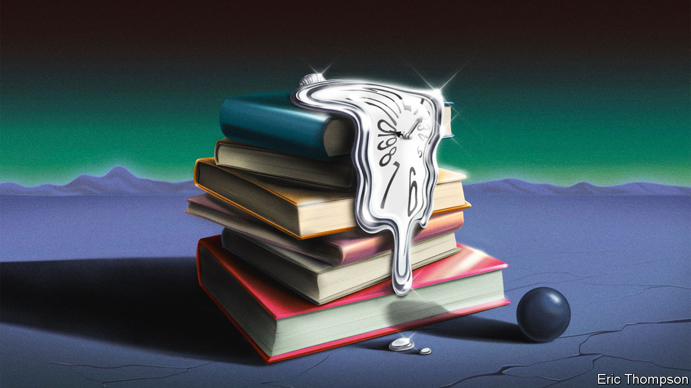
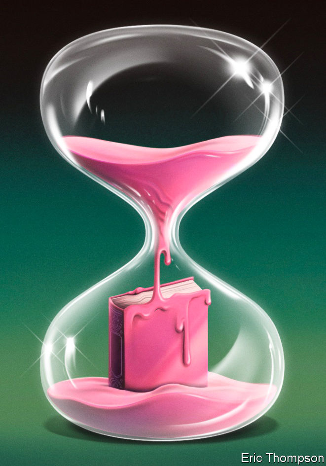

###### Chronicling the past

# When is it too soon to write history? 

##### Early accounts can stand the test of time, but they have to be riveting 

 

> Feb 5th 2024 

 By Eric Klinenberg. 

The signs, at first, were small. On December 15th 2019 mentions of “pneumonia” and the Chinese word  (SARS) started to spread on WeChat, a Chinese social-media app, multiplying faster than any disease. By February people outside China had started buying tissues, gloves and masks. Then, as “2020”, a new history of covid, explains, people started keeping their children home from school. Without giving too many spoilers, the reader can guess what happened next. The  happened next. History, in other words, happened next.

It has been an alarming few years. History—widely assumed to have stopped somewhere around the fall of the  and the Spice Girls’ first record—has got going again, with gusto. In just the past five years there has been the pandemic (plaguey history), the  (bloody history) and now the  (nested history-within-history history). Much is changing, and people are writing about it. “2020” by Eric Klinenberg, a professor of sociology at New York University, joins a rash of other books about the disease. Histories of the Ukraine war have also started to appear (one was even published in May 2023); those of the Israel-Hamas war are doubtless not far off.

To go quickly from missile launch to book launch is an impressive feat of publishing. Whether such speed makes for equally impressive histories is less clear. History has a long history of sniffing at the quick turnaround. When Thomas Carlyle, a Scottish essayist, published a book analysing the French revolution, a reviewer tutted that it was too soon. (It was half a century after it.) A certain unease about haste remains today. It is not clear when the mundane “present” (to be dealt with by journalists) becomes the monumental “past” (to be dealt with by historians). Is it after a month? A year? A decade? In short: how soon is too soon to write history?

The worry, ironically, is a modern one: history used to be much less historical. “In the classical period it was pretty much an assumption that you can’t write about something that you haven’t been an eyewitness to,” says Tom Holland, a historian and translator of , a Greek historian. Herodotus, the “father of history”, was notably nippy. In his “Histories” he wrote about a series of wars (the Greco-Persian ones) that he had lived through. 

Among some writers the tradition persisted. Caesar’s “Gallic Wars” gives the sense of a man writing while the mud and blood of Gaul are still wet on his sandals. Much later, Winston Churchill made pandemic histories look slow: he published “The Gathering Storm”, more than 600 pages of billowing prose, just four years after the end of the second world war. 

Few would suggest that these memorable works suffered from such speed. Caesar is studied as a stylist to this day; Churchill won the Nobel prize in literature. (The accolade disappointed him; he had been hoping for the peace prize.) “The Showman”, a recent biography of , Ukraine’s president, by Simon Shuster, a journalist at , has been described as “thoroughly researched and deeply insightful”. But swift books can often raise other worries. 

For example, prompt history can prompt questions of impartiality. Books by those on the front lines of wars or pandemics should make readers wonder whether they are history or self-serving memoir. After the war, Churchill observed that analysis of the past should be left to history but added that “I propose to write that history myself.”

Churchill, like all historians, was being selective. It was not just winning prose but winning the war that led to him being so admired. Had Nazism enveloped Europe his book, replete with phrases about how Britain chose to “march against evil”, would have been received less rapturously—or perhaps never written. After Russia’s invasion of Ukraine, Ukrainians and Russians removed each other’s books from shelves, sometimes burning them or turning them into toilet paper. Understanding of the past depends not merely on what histories are written but on the onward march of history itself.

To the victor, the spoilers

The sheer passage of time matters, too. It is too soon to tell whether swift histories of the Ukraine war will stand that test, but if books about the second world war are any guide, they are unlikely to. There was a “time lag” of perhaps 20-30 years between the end of the second world war and the appearance of really good histories on it, says Sir Ian Kershaw, an English historian. When Sir Ian studied history at Oxford University in the 1960s, the curriculum simply ended in 1914: “It was felt to be too close to be able to deal with properly.”

Some of the problems the prompt historian faces are practical. It takes time for good sources to become available. Many recent books on Ukraine read like dry assemblages of press clippings, with little analysis. It takes yet more time for classified documents to become declassified. Intelligence gained from Bletchley Park’s cracking of the Enigma code changed the course of the second world war, but since Ultra was kept ultra-secret until 1974, it is absent from all early histories. 

 


Arguably the greater difficulties are emotional. Wars are not nice things. As anyone who has attempted to discuss the recent Israel-Hamas war will know, emotions run high; dispassionate analysis is rather lower. 

Self-interest and self-justification can be rampant on all sides, and this is inevitably reflected in the pages of history. Consider the second world war. In its immediate aftermath, French histories played up the ; British histories played up British pluckiness; everyone’s histories played down any earlier enthusiasm for dictators. In many cases, people simply did not want to talk about such a “traumatic period” at all, says Sir Ian. One of the most important books on the Holocaust, Raul Hilberg’s “The Destruction of the European Jews”, was written in 1948 but not published in America until 1961 and not translated into German until the 1980s.

History plays tricks on the reader. It looks like it is about the past—it is full of people in odd, old-fashioned clothes, doing odd, old-fashioned things. But it is often just as much about the present. All history, as Benedetto Croce, a philosopher, observed, is “contemporary history”. Your view of past events is “completely shaped by the way that those past events are useful to actors in the present day”, says , a professor of political science at Stanford University. He would “clearly” not have written “The End of History and The Last Man”, a book arguing that, in some ways, history was over because Western liberal democracy had won out, today. “Things change,” Mr Fukuyama admits: “I was writing about the things that were going on in 1989.” 

The onward march of history (the discipline) as well as history (the thing with bombs and plagues) also matters. Historical accounts change; certain “accepted narratives” are adopted and repeated, “just like conformism with any other social norm”, says Professor Fukuyama. Western history books, once full of tales of biffing foreigners in far-flung places, are now more likely to reflect on the evils of imperialism. At universities today, courses boast less naval history and more navel-gazing.

But to concentrate only on the writing of history is perhaps to miss the point. Read “2020” or indeed any recent book on covid, and another problem with recent history starts to arise in the reader’s mind. Mr Klinenberg’s book is elegantly written and well researched. It is filled with impressive detail on arguments over herd immunity, lockdowns, masks and all the rest of it. It is, in short, for readers who have just lived through all of that, not much fun. So perhaps as well as the complex question of how soon is too soon to write history, another, rather simpler, question should also be considered. Namely, how soon is too soon to read about it? ■


