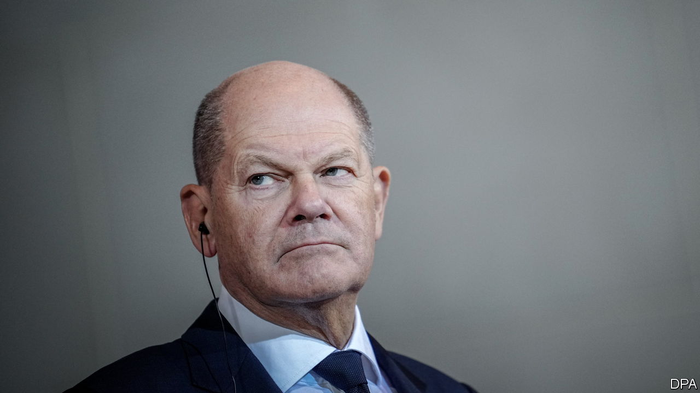
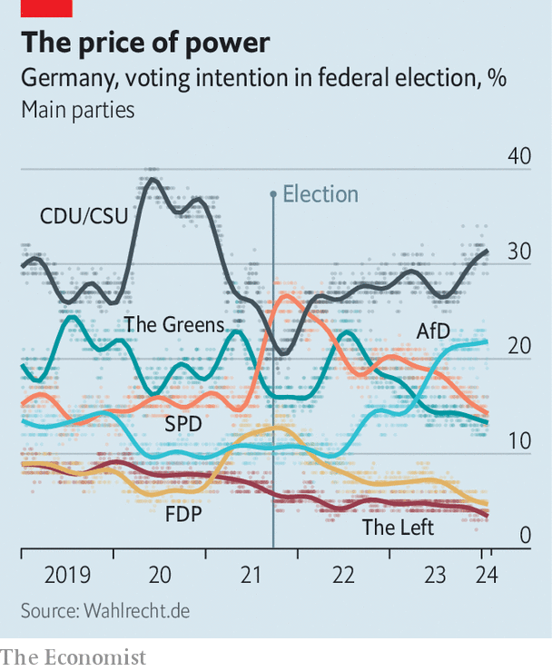

###### A party in a death spiral?

# A mounting crisis of confidence confronts Olaf Scholz 

##### Germans are grouchy, the hard right is rampant and the economy sluggish 

 

> Feb 4th 2024 

ONE HUNDRED AND SIXTY-ONE years is a long time in politics. Through two devastating world wars and a long cold one, through fat years and lean right up to the present, Germany’s Social Democrats (SPD) have kept a prime seat at the table of power. The left-of-centre party has been a junior or senior coalition partner in every government for all but four years in the past quarter-century. , the eighth man (yes, all of them) from the SPD to serve as chancellor since 1919, leads the “traffic-light” coalition, named for its three parties’ colours, that  after Germany’s last national election, in 2021.

But since then the SPD’s popularity, and that of Mr Scholz, has collapsed. The party came first in the 2021 election, and peaked in polls of “voting intentions” at 28%. The same polls now put it in third or even fourth place, attracting barely 15%. The downward trajectory has been so fast and steady that, barring a helping hand from fate, the SPD looks likely to be humiliated in European elections in June, then trounced in September in elections in three eastern German states, where hostility to Mr Scholz’s government seethes. Like the traditional socialist party in France, which has tumbled from national dominance to terminal irrelevance, the SPD could find itself facing extinction.

 


This decline is not inevitable. Plenty of Germans still agree with what the SPD stands for: a generous welfare state, strong protection of workers’ rights, a progressive social agenda, commitment to the European Union. On recent weekends hundreds of thousands have gathered on German streets, with Mr Scholz’s encouragement, to denounce the hard-right Alternative for Germany (AfD), in a strong show of passion that favours the SPD. 

Yet an accumulation of factors weighs on the old party, including the decline of its blue-collar support base, a limp economy, a threatening global environment and policy clashes between partners in the three-party coalition. Add to these Mr Scholz’s dry predilection for management rather than bold leadership, and you have a perfect storm.

One measure of this peril is the depth of shared anger at the government across very different sectors of society. When  blocked roads across the country in early January, protesting against a government plan to scrap tax exemptions that they benefit from, lorry-drivers and independent tradesmen joined in. Despite the disruption, polls reported that more than three-quarters of Germans sympathised with the protests. 

Big businesses are not happy, either. Rainer Dulger, the head of the Confederation of German Employers’ Associations, a trade group, says his members increasingly have no faith in the government. “It hurts me to see how low Germany has sunk in the last two years,” he told journalists in mid-January.

An obvious cause of the anger is the flattening or, in many cases, shrinkage of real disposable incomes in the past two years, as inflation spiked to levels not seen since the early 1990s. Mr Scholz’s government has been trying to mitigate this, in part by raising benefits paid to jobless people. But despite bringing relief to some 5.5m, the wider impact seems to have been to convince Germans that the SPD’s generosity with taxpayers’ money rewards scroungers and undermines the work ethic. A recent survey showed that 62% of the party’s own supporters believe its policies discourage people from working. 

In a sign of dysfunction inside the coalition, Christian Lindner, the finance minister and leader of the small, pro-business Free Democratic Party, has repeatedly denounced his partner-party’s policies. “Is this still the old aunt SPD, the employee’s lawyer, or is this the agent for those receiving benefits from the welfare state?” he asked one interviewer in January.

But the damage to Mr Scholz’s party is not only of its own making. Mr Lindner’s refusal to touch Germany’s “debt brake”, a constitutional rule that cripples the government’s ability to borrow, is one reason for the policy contortions that, for example, pushed the government to provoke farmers by trimming their perks. 

The third partner in the coalition, the Greens, have caused even more trouble. Many Germans viewed their insistence on switching off the country’s last three nuclear-power plants last April, amid an energy crisis created by the halt to Russian fuel supplies, as utterly barmy. Soon after that, an ill-judged push by the Greens to cajole homeowners into installing costly heat pumps became political gold dust for the opposition, which branded the effort a glaring example of government overreach.

This charge struck home in part because the SPD has in fact drifted away from its traditional working-class electoral base. This class has shrunk as more Germans moved into white-collar jobs, while in declining industrial regions, as well as in the former East Germany, many former socialists have shifted to the right. Research shows that supporters of the AfD are far more likely to be worried about inflation than are SPD voters, presumably because the latter are more comfortable with their lot. The shrinking of the SPD’s catchment area can also be seen in the party’s age profile. Since 2000 the party’s membership has fallen by nearly half, to just 365,000 last year. Some 57% of them are over 60.

It may be natural that with time, the party’s vigour would fade a bit. Fewer excuses can be made for the failings of Mr Scholz’s leadership. Germans have not forgotten that the former Hamburg mayor won the 2021 election less through merit than because, whereas his opponents all committed campaign blunders, he stuck relentlessly to a bland script. The persona he projected was of a calm, comforting clone of his predecessor Angela Merkel, a popular and famously unflappable chancellor (albeit one from a different party). Mr Scholz even copied Mrs Merkel’s habit of pressing her fingers and thumbs together in a downward-pointing diamond.

But instead of seeming open and decisive in power, Mr Scholz comes across as aloof and hesitant. Shying from grand gestures and disdaining the press, he prefers boardrooms to public podiums. He has repeatedly left controversies to fester and allowed his ministers to clash, only intervening when the political damage has already been done. “Olaf takes the approach that you only engage in fights where you can win; other issues it is best not to touch,” says one party insider. The insider adds that this approach is fine if you are running a ministry, but not so good when running Europe’s most pivotal country in a time of multiple crises. 

Mr Scholz, who visits Washington on February 8th-10th, has defenders at home and abroad who praise his caution in troubled times. The German public has been less impressed. The chancellor’s popularity soared briefly in March 2022, after Mr Scholz bravely declared a —an epochal change—in response to Russia’s invasion of Ukraine. His approval rating has since fallen to 20%, the lowest for any chancellor since the pollster Deutschlandtrend started keeping a record in 1997. Only 12% say that he “communicates effectively.”

Not surprisingly, there are rumblings of discontent from within the SPD. Mostly, though, complains another party insider, there is complacency and what they call “a moving of deckchairs”. Some pin hopes on a mid-term change of leadership, with the far more popular defence minister, Boris Pistorius, brought in to shore up the sagging team. But a recent poll by Forsa, a political research group, suggests that in a fresh national election Mr Pistorius, a gruff, ruddy-faced SPD stalwart, would boost the party’s chances by just three percentage points. The spiral looks likely to continue.■


