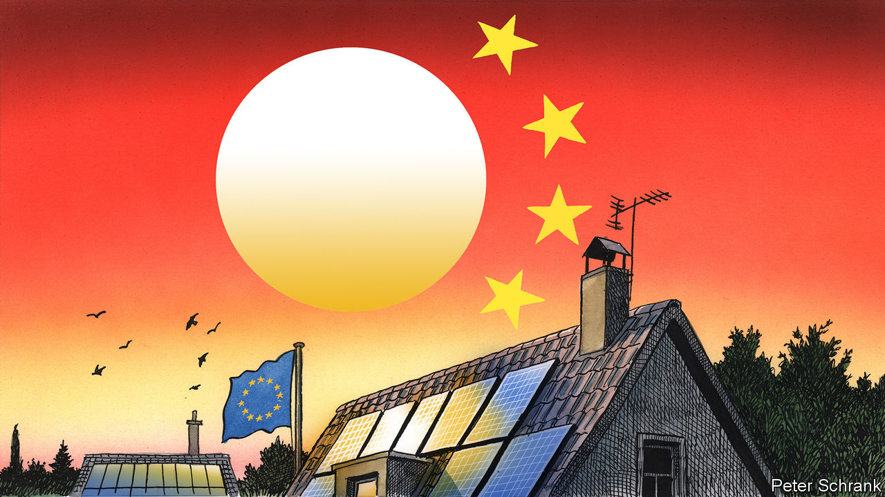

###### Charlemagne

# Europe is importing a solar boom. Good news for (nearly) everyone 

##### Cheap Chinese solar modules are delivering the EU’s green promises 

 

> Feb 8th 2024 

A banner running down the side of the European Commission’s headquarters in Brussels depicts cartoon workers recladding its 13-floor façade with solar panels. The illustration might come across as a cruel joke to residents of the Belgian capital, for whose leaden skies the phrase “fifty shades of grey” could have been coined. But thanks to green edicts devised by the Euro-wallahs at the commission, the continent’s fields and rooftops are being paved with very real photovoltaic cells. In 2023 the equivalent of one nuclear reactor of solar power was installed every single week. In the past three years nearly as many panels have been plugged into EU power grids as had been since the industry dawned at the century’s start. By 2030 the bloc is aiming to triple the number of solar panels installed, thus covering an area bigger than 300,000 football pitches, two dozen times the size of Paris.

The sizzling solar sector has been an unexpected ray of hope for a continent still reeling from the cut-off of Russian gas. But amid the cheering some are squealing for help. Companies that make solar panels in Europe are teetering on the brink of failure; the outlook for them is not so much cloudy as apocalyptic. For the European solar boom is in truth a repackaged Chinese one: 95% of modules installed in the EU are imported from the world’s dominant producer, which can churn them out at unbeatable prices. This makes policymakers anxious. Part of the case made to voters sceptical of the need for an economy-disruptive ecological transition was that going green would do more than merely fend off climate change. It was also meant to make Europe more resilient—less dependent on Russian gas, say—and create lots of new jobs. Does meeting ecological targets with containers full of Chinese solar panels merely change the autocratic regime Europeans will depend on, and crush employment to boot?

In short, no. For some green goods, such as electric vehicles, trade-offs between jobs, economic security and environmental targets do indeed exist. For solar, the case for learning to stop worrying and love Chinese photovoltaic cells is much clearer. 

For one, it is clear that cheap imports have indeed fuelled the installation craze. In the early 2010s Europe throttled the arrival of Chinese solar modules after struggling EU producers successfully lobbied for import restrictions. Deployment of solar arrays soon fell; consumers and utilities turn out to be willing to fork out only so much for virtuous electricity. As soon as the trade restrictions were lifted six years ago, installations rose again. Now European solar-panel producers are again lobbying for import restrictions, or at least subsidies to keep them afloat. Given that Chinese panels now sell for around half the cost of European ones—aided by cheap labour and energy costs, and also by ample state backing—that would mean vast and probably sustained levels of largesse.

Isn’t a little market distortion a price worth paying for a home-grown energy source? That is the line of thinking in France, whose politicians have yet to come across an industry they did not deem “strategic” (a yogurt-maker was once kept out of an American rival’s clutches on that basis). “Sovereignty might have a cost, but it also has no price,” its deputy ambassador to the EU said recently according to the , in a valiant bid to sound like a Gallic Braveheart. Some wince at ordering solar panels from China, since over a third of one of their key inputs is sourced from Xinjiang, a restive region where forced labour is rife. But two fears predominate. The first is that China could one day cut off the supply of solar panels as Russia’s Vladimir Putin did with its gas, leaving Europe once again in the lurch. The second is that China will corner the solar manufacturing market, then raise prices when other producers have been wiped out. 

The Russian parallel is “far-fetched”, says Simone Tagliapietra of Bruegel, a Brussels think-tank with a paper out this week on the merits of solar imports. Gas stops flowing as soon as a pipeline is cut, whereas already-installed solar panels keep generating juice. There are currently enough modules stockpiled in the EU for over a year’s worth of installations. China would also suffer if Europe was deprived of green technology, given the planetary effects of climate change. And lots of other producers—notably America, which is providing huge subsidies for each domestically made solar panel in a bid to curtail dependence on China—are entering the fray, thus leaving future Europeans with lots of choice. 

How about jobs? Protecting a few European solar factories would help workers there. But raising prices would slow down installation. This in turn would destroy jobs among those deploying solar panels, which is far more labour-intensive, point out the Bruegel boffins. Short of Chinese engineers teleporting to Belgium to install rooftop panels, those jobs will not soon be outsourced.

Where the sun don’t shine

The EU has yet to decide whether it wants the cake or its eating. The commission on February 6th laid out plans to cut greenhouse-gas emissions by 90% of 1990 levels by 2040. But the “Net Zero Industry Act”, also agreed this week, calls for 40% domestic production of green technologies by 2030. Nobody knows how a viable solar industry could be magicked up in just a few years without a protectionist revival. More sensibly, the new law will nudge firms to look beyond a single dominant global supplier (ie, China) for green-technology projects funded with public money, pushing importers to source panels from India, for example. And everyone agrees that researchers in Europe should be among those inventing the next generation of solar modules.

Given its expensive workers, high energy costs and weak industrial supply chains, the EU should not be making photovoltaic cells. Those who worry about French-style “strategic autonomy” should splurge on defence, not on coddling industries that will never be able to turn a profit. Europe has the chance to green itself fast and cheaply through imports. It should seize it. ■


