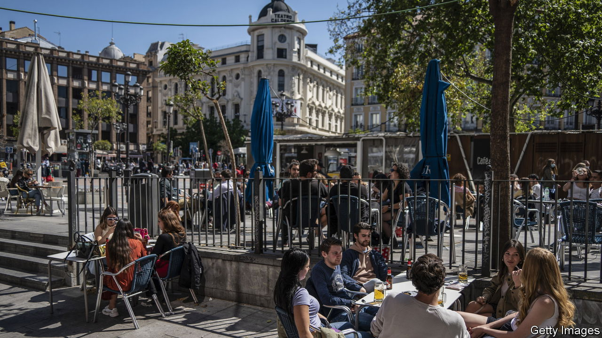

###### A moment in the sun

# Madrid is booming. Growing while keeping its cool will be the tricky part 

##### A southern success story 

 

> Feb 6th 2024 

“JUST TO BE something, I’ll be a ” Not a stirring sentiment, and yet the line is part of the official anthem of Madrid, which has often “just been something”. King Felipe II made the middling town his new capital in 1561 in part simply because it was dead central and lacked competing powerful institutions; amazingly in such a Catholic country, Madrid did not even get its own completed cathedral until 1993. But later, as Spain’s empire declined, so did Madrid’s profile. 

Now Madrid is having a moment. Tourists are flocking, as well as would-be residents. They include Americans fleeing toxic politics, northern Europeans seeking an easy-living big city, and, most of all, Latin Americans. Some come to work in construction, care or hospitality. Others are rich Venezuelans and Mexicans fleeing confiscatory populism. The foreign population has grown by 20% since 2016, much of that Latino, making Madrid a growing rival to Miami as the “capital of Latin America”. The Madrid region is richer than Rome’s and not far behind Berlin’s.

The city’s and region’s governments, both of them run by the conservative People’s Party, have welcomed the influx. Last year the region announced a plan to let people who invest in Madrid—including in property—offset 20% of the cost from their taxes, for example. Isabel Díaz Ayuso, the pugnacious regional president, gleefully contrasts Madrid’s low-tax, light-regulation approach with a supposedly overbearing national government. But that Socialist-led national government has done its bit for Madrid, too. It has so far kept a “”—giving residency to those who invest €500,000 ($537,000)—while passing a “digital-nomad” law to attract knowledge workers.

José Luis Martínez-Almeida, Madrid’s mayor, says a turning-point came with the pandemic, when Ms Ayuso battled the prime minister, Pedro Sánchez, to keep businesses open. Covid-19 took a terrible toll, but Madrid emerged with a reputation for openness. “Before, it was the best-kept secret. Now it is the ,” says Mr Almeida, uttering the final phrase in English.

The attractions include culture, low and high. For a long time the Prado museum’s stuffy, traditional presentation of a brilliant collection was not enough to attract foreigners away from the coasts. Now it anchors a trio of stylish museums (with the Reina Sofia and the Thyssen-Bornemisza) that welcome over 7m visitors a year. But the museum of the Bernabeu stadium, home to the Real Madrid football club, attracts over a million a year too, and the city has just nabbed the Spanish Formula 1 Grand Prix race from Barcelona. The number of musicals in the city has doubled to 14-15 since the pandemic. Cheap tapas are being joined by an increasingly sophisticated gastronomy, often drawing on Spanish regions far from Madrid.

The city’s weight in Spain is growing, too. In 1980 the region accounted for 15% of Spanish GDP. In 2022 the share was 19%, expanding even faster than Madrid’s proportion of Spain’s population. In 2018-22 the region attracted about 71% of foreign investment in Spain, with the next-highest region, Catalonia, at 11%. The signal that “you are welcome” is powerful for investors, says Nuria Vilanova of CEAPI, a group that promotes links with Latin America. And though Spanish universities are middling, its business schools are an exception. Madrid has campuses of three such schools that come high in global rankings.

The price of success

The biggest problem facing Madrid is where it can put people. The region, with 7m inhabitants, is expected to add another million in the next decade. But the city lacks housing, the reason growth has gone to suburbs and dormitory towns. The newest housing developments are soulless, unwalkable places. Since a peak in 2006, new building permits have fallen by 69% in Madrid, according to Neinor, a property developer. Getting them is still onerous.

Hence the hopes for Madrid Nuevo Norte, a new district around Chamartín railway station. Where five skyscrapers now stand, a host of new ones are planned by 2050, creating a new business hub. But the developers hope to avoid the fate of projects that lack shops, residents and green space. Around a third of the planned 10,500 apartments are to be affordable (and rent- or price-protected), while ground floors in many buildings are to be for small retail. But some, including Rita Maestre, the co-chair of Más Madrid, the left-wing opposition in the city, fear the project may exacerbate the city’s divisions between a rich north and far poorer south.

“It’s such a clean city,” Ms Maestre says she hears—from people who know just half of it. Usera or Carabanchel in the south, with incomes per head of €11,000-12,000, get about one-third of the street-cleaning budget of the rich north, she says. If the city needed a piece of ugly infrastructure such as a dump or a water-purification facility, “100% of the time” it was built in the south, she says. But even the poorest areas are orderly and safe, thanks to tight-knit local communities, she argues. Those include foreign ones. Usera, with over 10,000 Chinese residents (most from a single county, Qingtian), is home to the city’s bustling Chinatown.

Can the city keep its cool while changing so quickly? Internationalisation and the rapid change in demography inevitably leave some grumbling about the good old days. But Ian Gibson, an Irish Hispanist author who has lived in Madrid since the 1970s, says “Don’t worry—it’s never changed,” despite the worries over the years. “It has become itself more fully.” ■


