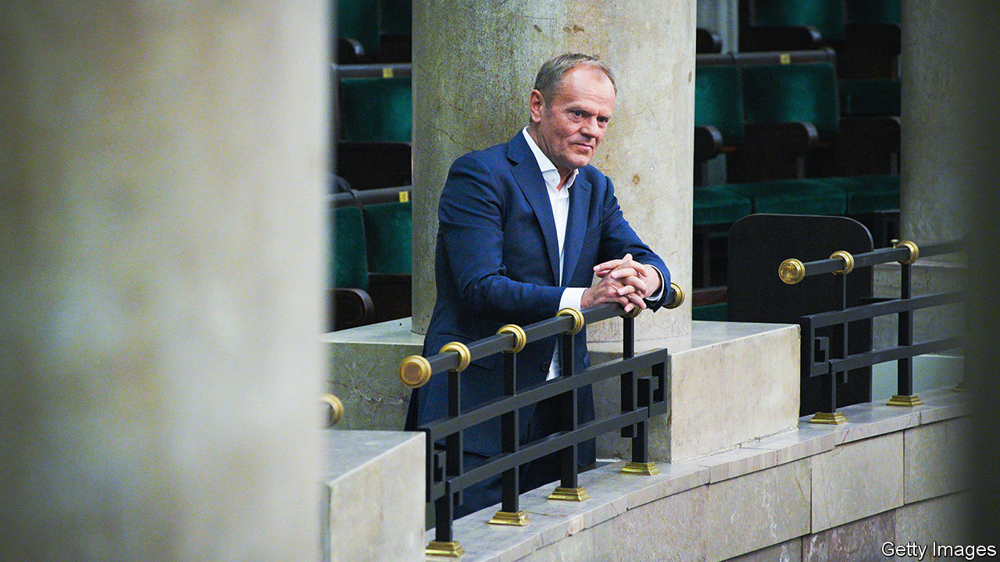

###### Return of law

# Poland is trying to restore the rule of law without violating it 

##### Donald Tusk seeks to undo a hard-right party’s capture of the state 

 

> Feb 7th 2024 

SINCE DECEMBER Kalina Ostrowska has been coming home from school and doing something that would shock most parents of 16-year-olds: she turns on the television and watches the Sejm, Poland’s parliament. Lots of her friends are watching, too. Young Poles have become strangely interested in politics. In the election last October turnout among those under 30, who normally vote at low rates, reached 69%, not far below the overall figure of 74%. They overwhelmingly backed the opposition, helping Donald Tusk and his centrist Civic Coalition (KO) to beat the hard-right Law and Justice (PiS) party that had run Poland for eight years. 

One reason the Sejm makes such good television is its new speaker, Szymon Holownia. Mr Holownia, who leads the centre-right Poland 2050 party (now part of Mr Tusk’s alliance), is a long-time talk-show host and master showman. “It’s funny when the opposition protests and Holownia shuts them up with some pointed retort,” says Ms Ostrowska. Yet the main reason to watch is the riveting conflict playing out in Poland’s government. 

Like many populist parties in power, PiS grabbed control of independent state institutions and packed them with loyalists. Poland wound up having its EU funds withheld for violating the rule of law. Mr Tusk is trying to fix this, which means rewriting statutes and firing apparatchiks. But Andrzej Duda, the president, who comes from PiS, has pledged to veto the government’s efforts. The constitutional tribunal, dominated by PiS appointees, is gumming things up too. Mr Tusk’s government faces a tricky job: restoring the rule of law without abridging the rule of law in the process.

The biggest challenge is the judiciary. PiS changed the law so that the Sejm, where it had a majority, appointed members of the National Council of the Judiciary (NCJ), which nominates and promotes judges. It then put loyalists in place throughout the courts. When the EU’s top court ruled that this violated the separation of powers, Polish prosecutors began going after judges who had the temerity to appeal to that court. Meanwhile PiS fused the offices of minister of justice and prosecutor-general, created a new post of national prosecutor, and—just before the election—passed a law requiring presidential consent to dismiss him. Analysts said PiS was trying to cement its control of state institutions.

The new justice minister, Adam Bodnar, wants to break up the cement. To ditch the national prosecutor without risking a veto from Mr Duda, Mr Bodnar announced on January 12th that his appointment was void, on the grounds that the procedures the government used to bring him out of retirement were wrongly applied. Experts think Mr Bodnar is right, but PiS and the constitutional court have cried foul. The justice minister is also trying to replace regional court presidents.

PiS’s deputies in the Sejm, who eagerly packed the courts when they were in power, denounce Mr Bodnar’s house-cleaning as a coup d’etat. The difference is that where PiS grabbed control over the judiciary, Mr Bodnar wants to give it away. The government plans to split the posts of justice minister and prosecutor-general, and to allow judges themselves to pick most members of the NCJ. Mr Bodnar is “trying not to gain power, but to give it back to judges”, says Zuzanna Rudzinska-Bluszcz, a deputy justice minister. But that reform will require Mr Duda’s signature.

The second area of conflict is the media. Under PiS state TV, radio and the national press agency were transformed into propaganda outlets. PiS created a new supervisory council and packed it with allies. To circumvent it, on December 19th the new culture minister used commercial law to replace the state media’s staff, acting as the companies’ owner. PiS-appointed TV employees staged a sit-in, but soon gave up. To reorganise the media, the government has put them into liquidation. But some courts refuse to register the liquidations.

Not just PiS but some civil-society groups dislike these manoeuvres, which ignore the bits of the constitution concerning the state media. The Helsinki Foundation for Human Rights, a watchdog, said the takeover “raises serious legal doubts”. The government argues PiS’s supervisory council was unconstitutional, too. But it has done little to reassure the public that it will not create a mouthpiece of its own.

The final battleground is the state’s economic institutions. The central bank’s governor, Adam Glapinski, is a pro-PiS braggart. But his policy decisions show little evidence of bias, and Mr Tusk has dialled back talk of investigating him. 

More troubling stories are emerging concerning certain state-owned companies. Orlen, a government-owned oil firm, took over its rival Lotos (also government-owned) in 2022. EU competition regulators ordered Lotos to divest some assets first, which mainly went to Mol, a Hungarian company, and to Saudi Aramco. On February 5th government auditors said those assets were sold for $1.24bn less than their worth. Critics say PiS wanted an oil monopoly for political reasons: Orlen held fuel prices below market level during the campaign. The government has fired the company’s CEO and supervisory board.

At any rate, many Poles seem to be thoroughly enjoying the turmoil. The approval rating of Mr Tusk’s KO has risen since December, while PiS’s has fallen. At the state TV broadcaster “the end of political pressure” has restored morale, says Pawel Moskalewicz, its news director. But the judiciary is a much bigger problem. Undoing PiS’s takeover of the state will be a long and controversial slog. ■


