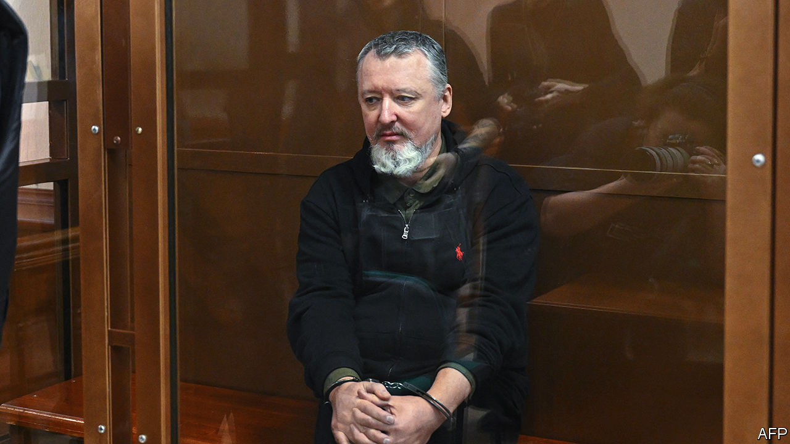

###### Silencing the Kremlin’s critics

# Vladimir Putin extends his crackdown in Russia 

##### Even troublesome war supporters are targeted 

 

> Feb 8th 2024 

On January 25th a Russian court sentenced Igor Girkin, a former officer of the FSB, Russia’s main security service, to four years in a penal colony for the crime of “public incitement of extremist activity”. His arrest last July, days after he had criticised Vladimir Putin’s wartime decisions and called the Russian president a “cowardly mediocrity” on social media, has sent shockwaves through Russia’s active community of pro-war nationalists, many of whom deem him a hero.

Mr Girkin’s reputation rests on his paramilitary career; under the codename Strelkov (“Marksman”), he proved a key figure in both the annexation of Crimea in 2014 and the initial organisation of rebel groups in Ukraine’s eastern Donbas region. He remains a strong supporter of both the war and Russia’s resurgent national project, notwithstanding running afoul of the Kremlin. The case has heralded a shift in Kremlin prison policy, which now not merely punishes critics of the war but also seeks to rein in the excesses of troublesome supporters. 


Politically motivated cases in Russia have long resulted in draconian prison sentences, but the motivations for such prosecution have shifted with time. In the 2000s cases were brought against prominent business figures like Mikhail Khodorkovsky, an oligarch, and Sergei Magnitsky, a tax adviser who later died violently while in custody. In the 2010s political prisoners tended to be involved in protest movements, as was the case with the band Pussy Riot and with the house arrest in 2014 of Alexei Navalny, Russia’s most prominent opposition leader. 

Following Russia’s invasion of Ukraine in February 2022, however, the policy shifted again and Russia’s many prisons started to be used as an instrument for punishing opponents of the war. Mr Navalny, who has been held in custody since 2021, has received two additional sentences since the invasion began: first for nine years and then for another 19.

Punishment even against grassroots activists has veered into the absurd. One example is the seven-year sentence imposed in mid-November on Sasha Skochilenko, an artist who replaced grocery-store price tags with criticisms of the Russian army and the war effort. Last summer Olga Smirnova, an activist, was sentenced to six years in jail in connection with seven war-related posts she had made on Vkontakte, a Russian social-media platform. 

Cases such as these are launched selectively, and to set an example, says Sergey Troshin, a St Petersburg municipal councillor who has expressed public support for both Ms Smirnova and Ms Skochilenko. “The task the state set for itself was to take a few people and publicly hand them large sentences,” he said. “You can think of this as ‘precision repression’, and it makes people scared enough to halt their activism.” 

According to OVD-Info, a human-rights monitor, approximately 160 Russians have been imprisoned and over 850 have been prosecuted for anti-war activities since the start of the full-scale invasion of Ukraine in February 2022. 

The prison system has also been used as a reward for loyalty as much as a punishment for defiance. Prisoners, many of whom had been convicted for multiple, violent crimes, have walked free with full pardons after serving in the Russian army in Ukraine for as little as six months. This has been framed in state-run media outlets and friendly social media as a reward for loyalty to a new national project centred on resistance to the West, the promotion of a multipolar world and Russia’s continuing influence in the “near abroad”. 

However, a recent investigation conducted by BBC Russia uncovered a shift in policy. In an effort to curb local resentment, and probably to distance the president from what has proved to be a controversial policy during the runup to the presidential elections next month, ex-convict veterans are now required to serve until the war’s end in return for probation rather than a pardon. Exoneration may only be received in cases when soldiers reach the military’s age limit, earn a special commendation or are maimed in combat, described as “health loss”. ■


