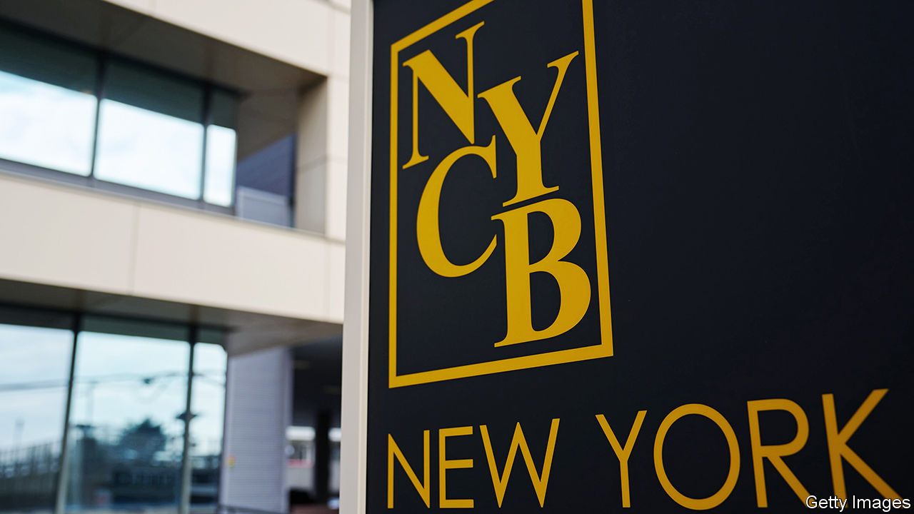

###### Spring fever

# Are NYCB’s troubles the start of another banking panic? 

##### Probably not. But they do suggest broader problems 

 

> Feb 8th 2024 

A bank publishes lousy earnings or an “update” on its business. Its share price plunges. Its name is splashed on newspaper front pages. The bank’s bosses hold a conference call urging calm. Its share price slides some more. Anyone who has paid attention to America’s banking industry over the past year will recognise these events. They ended in failure for Silicon Valley Bank (svb) in March and First Republic Bank (frb) in April. 

At first glance, the same script seems to be playing out once again. On January 31st New York Community Bancorp (NYCb) of Hicksville, New York, reported a quarterly loss. Its stock promptly dropped by 46%. During a hastily organised conference call with investors on February 7th, Alessandro DiNello, the bank’s hastily appointed executive chairman, attempted to soothe fears. Shares sagged, dropping another 10% when markets opened that morning. 

Yet the surface-level similarities in these stories belie two big differences. The first, and most important, is that nycb does not appear to be on the brink of failure, nor is it easy to see how it will fail in the coming weeks. Indeed, its shares later rallied on February 7th. The second is that its problems indicate a different type of trouble has begun. When interest rates rise their impact on things like bond prices is immediate. Their impact on borrowers’ ability to repay debts takes longer to play out. svb and frB were both imperilled by a combination of flighty deposits and their investments in low-interest-rate securities or loans, the value of which collapsed when rates climbed. nycb is struggling, in large part, because a big loan went bad. 

 


Start with nycb’s balance-sheet. The bank, which holds $116bn in assets, earned around $200m in the third quarter of 2023. But in the final quarter it had to set aside $552m to cover property loans, resulting in a $252m loss. Even before this, it was working to beef up capital levels. In 2023 it acquired assets and deposits from Signature Bank, which failed along with SVB last March. This pushed NYCb’s assets past $100bn, subjecting it to stricter regulation. Compared with its new 12-figure peers, NYCb is no fortress. The bank’s common equity tier-1 ratio, a measure of capital based on the riskiness of its assets, fell to an unimpressive 9.1%, down from 9.6% in September. In a bid to retain more equity, the bank slashed its dividend.

More than half of the bank’s value has now evaporated, leaving it with a market capitalisation of $3bn, less than a third of the book value of its equity. Analysts have slashed their profit forecasts for the bank. On February 6th Moody’s, a rating agency, downgraded NYCB to junk status, citing the bank’s exposure to commercial property and the recent exit of important audit and risk-management personnel.

Grim stuff. But NYCB’s deposits provide reassurance. More than two-thirds of the $83bn deposited at the bank is insured, a far larger share than at SVB and FRB before their failures, which should mean depositors are less flighty. If they do run, the bank should stay standing. Against uninsured deposits of $23bn, nycb holds $17bn in cash, $6bn in securities and collateral that could be used to borrow $14bn from the Federal Home Loan Banks (FHLB) system or the Federal Reserve’s discount window. In addition, NYCB can exchange $10bn of “reciprocal deposits” with other banks, which could in effect reduce the share of its deposits that are uninsured.

Run along

Some sources of liquidity are easier to tap than others, but the bank could have access to almost three times the cash it needs to pay out all uninsured depositors. And, for now at least, depositors do not appear to be going anywhere. Deposit levels have risen since the end of 2023, according to unaudited figures the bank published on February 6th. “We have seen virtually no deposit outflow from our retail branches,” Mr DiNello told investors on February 7th. 

Nevertheless, NYCB’s troubles might provoke broader unease. One reason for this is its reliance on the FHLB system. This inconspicuous part of America’s financial plumbing comprises 11 government-sponsored banks, with total assets of $1.3trn. America’s lender of “second-to-last resort” raises money from capital markets, and does so cheaply owing to the assumption that the government would backstop its borrowing. It then lends to FHLB members, which are also its dividend-receiving owners. By the end of March 2023 FHLB advances, a type of loan usually secured against mortgages, had nearly tripled since the year before. SVB alone had increased its borrowing to $15bn by the end of 2022. 

Because nycb holds more loans than deposits it has long relied on FHLB advances as a source of funding, especially before its recent purchases brought in more depositors. At the end of 2023, NYCB had borrowed $20bn of FHLB advances. This borrowing amounts to 17% of NYCB’s assets, up from 12% at the end of September. The bank taps the FHLB system at nine times the rate of similar peers. 

Another reason for broader unease is that this could be the first sign that a crisis in commercial property is now harming the banking system. Although total lending to office buildings is small as a share of loan books across small banks—at around 5% of total assets—the slump in office-building values has been steep. 

Other firms are also struggling. Aozora, a Japanese lender that tried out American commercial-property lending, reported losses related to its loans on January 31st. On February 7th Deutsche Pfandbriefbank, a German bank, announced it had increased loss provisions for its commercial-property loans. Given the post-pandemic fall in office use, more losses are likely. These are unlikely to imperil the broader banking system—but they might keep some banks on the front pages. ■


