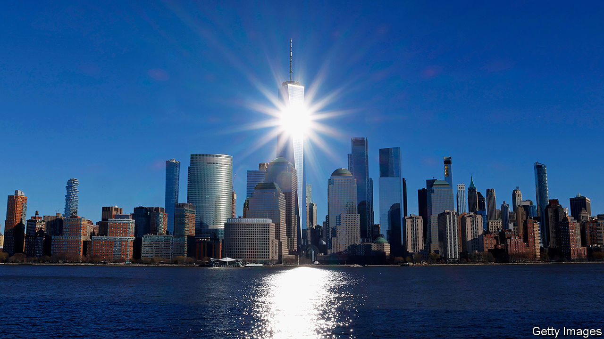

###### Capital punishment

# Bankers have reason to hope Trump triumphs 

##### Will they now spend big on his campaign? 

 

> Feb 8th 2024 

Have you noticed that America’s bankers are seething over proposed new capital rules? What gave it away? Perhaps it was the advertisements that warn of dire consequences for the economy, which blare out during prime-time spots in Sunday-night football games. Maybe it was the not-at-all-veiled threats from executives. Suing your regulator is “never a preferred option”, Jeremy Barnum of JPMorgan Chase told investors on a recent earnings call, but “it can’t be taken off the table.” Or perhaps it was the deluge of letters that recently arrived in the postboxes of the Federal Reserve and other banking agencies.

America’s process for creating new bank rules has many stages. Regulators publish their agenda in the Federal Register, a scintillating journal published every weekday, which chronicles plans for rules, proposed rules, finalised rules and so on. They talk to industry members and carry out impact analyses. Back-and-forth between industry and overseer, at this stage, is done over coffee, often in private rooms in federal buildings. Then a “Notice of Proposed Rulemaking” is published, the “comment period” begins, interested parties submit letters to regulators—and the battle emerges into the open. 

The process is normally pretty technical. It has been anything but for proposals on how to implement Basel III, known as “Basel III endgame”, that were first published in July. Bosses of large banks seem to have been personally offended by them. Perhaps their thought process goes as follows: are we really so incompetent at managing risk that system-wide capital levels must be raised by 16%? After grievances piled up, the comment period was extended from November 30th to January 16th.

Now all complaints have been filed, and letters published, the depth of opposition is clear. Latham &amp; Watkins, a law firm, finds that whereas 347 submissions disagreed in whole or in part with the rules, just nine supported them as proposed. A wide range of groups found fault. It is hard to imagine another cause that would unite BlackRock and Goldman Sachs with the National Association for the Advancement of Coloured People, environmentalists, estate agents and most sitting senators.

The rules are long and complicated, and so are the complaints. But they boil down to three themes. First, a big increase in capital is unnecessary. Second, the rules will hamper banks’ ability to intermediate capital markets. Third, they will crush lending to important parts of the economy, such as housing and environmental projects (especially ones favoured by President Joe Biden’s Inflation Reduction Act). 

Last year bank bosses seemed resigned to their fate. Marianne Lake of JPMorgan described the proposals as “a little bit like being a hostage”. The requirement was so shocking at first that “even if it changes a bit, you sort of are grateful for that, but it’s still probably going to be high.” They now seem more confident that the rules will be amended. “I don’t think anyone [thinks] that this is going to move forward as proposed,” said Denis Coleman of Goldman Sachs on January 16th. 

Fed governors usually try to come to a consensus on regulatory matters. This time, however, they are split, with Michelle Bowman and Christopher Waller, two Donald Trump appointees, opposing the rules when they were first proposed. On January 16th Mr Waller told the Brookings Institute, a think-tank, that it “might even be best to just pull it back” and start again. On January 17th Ms Bowman told the Chamber of Commerce, a lobbying group, that agencies should make “substantive changes” to the rules. Even Jerome Powell, the Fed’s chairman, has expressed reservations. 

Capital punishment

There are three ways things can proceed. Regulators could press on undeterred, and finalise the rules. This would almost certainly result in the lawsuit to which Mr Barnum alluded. Any legal action would centre on procedural issues—bank lobbyists argue that agencies have violated legislation requiring data and analysis behind proposals to be made available to the public. (Banks allege it was not; the agencies have not yet responded.)

The two other options are equally unpalatable: agencies could make more substantial changes to the rules or they could pull them back and start again. Either approach would require a repeat of the proposal-and-comment cycle. 

A difficult situation is made still more difficult by the fact that the agencies are starting to run out of time. The Congressional Review Act allows an incoming Congress to throw out any rule that is finalised less than 60 legislative days before it assumes power. Given the forthcoming presidential election and time off for summer recess, that deadline is closer than it seems. It will fall in July. If rules are not finalised soon and Mr Trump, who watered down bank capital requirements when last in office, wins the election in November, it seems likely that extra-tough standards would be tossed out entirely. 

Thus bankers have every incentive to delay the time at which the rules might be finalised. Will that sway their politics? Bank bosses are not typically big political donors. According to data compiled by Open Secrets, a non-profit outfit, neither Jamie Dimon of JPMorgan nor David Solomon of Goldman Sachs has given money during this presidential campaign. Among more junior staff, there does not seem to have been a rightward swing. If anything, donations from people employed by JPMorgan, Citigroup and Bank of America favour Democrats by a wider margin than in 2020. Perhaps some things are more important than capital requirements—which is not what you would gather from listening to bank advertisements. ■


