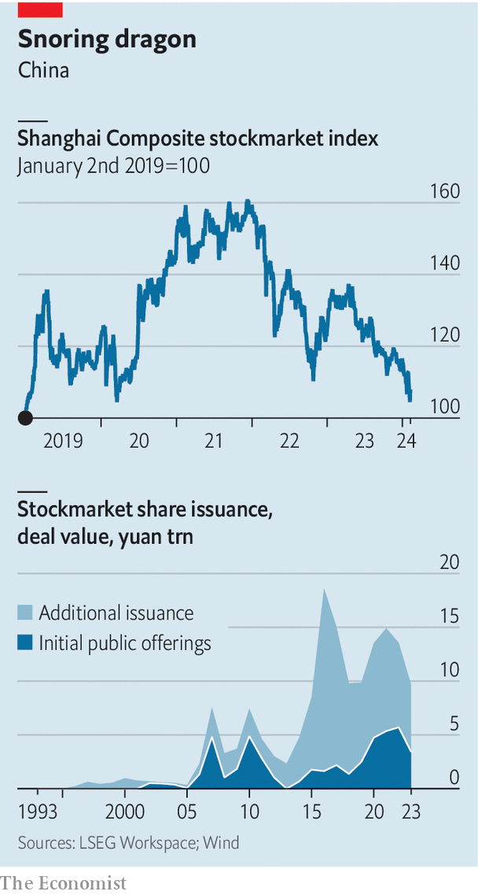
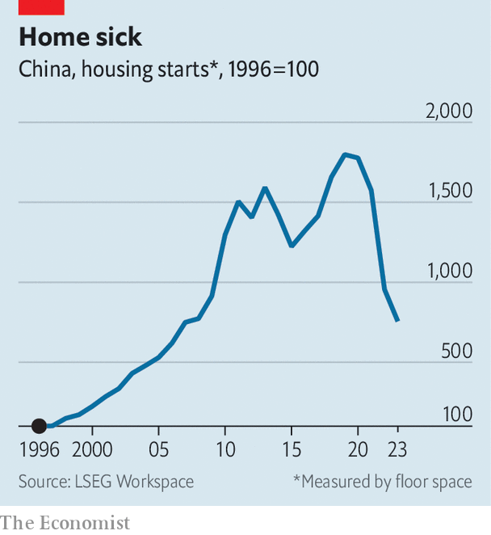

###### Fanning the flames

# China’s stockmarket nightmare is nowhere near over 

##### The situation ought to worry Xi Jinping 

 

> Feb 7th 2024 

Running China’s securities watchdog is a perilous job. A market rout can end your career, or worse. On February 7th, after weeks of , Yi Huiman, the head of the China Securities Regulatory Commission (CSRC), was suddenly fired and replaced. He is not the first official to fall after a period of plummeting stock prices. Liu Shiyu, his predecessor, was sacked in 2019, and later investigated for corruption. Xiao Gang, the boss before that, was treated as a scapegoat for the market crash in 2015. 

Before his dismissal, Mr Yi would have been aware that he was on dangerous ground. Already this year, more than $1trn in market value has been wiped from exchanges in China and Hong Kong. On February 5th the Shanghai Composite plummeted to a five-year low. All told, the index is down by more than a fifth since early 2022. And as miserable as the performance of Chinese stocks has been for most of their three-decade history, the present downturn feels different. 

That is because China’s economic prospects are gloomier than at any point in recent history. The dire state of the  is the chief problem. Prices and sales have fallen for more than a year; policymakers have failed to prevent the correction. During the stock rout of 2015 retail investors had a slogan: “Sell your stocks and buy real estate.” No one is chanting it these days. To make matters worse, the government’s rescue plans do not look up to the task.

For many citizens, it feels as if China never truly emerged from its dismal zero-covid years. An economic recovery that was expected to play out in 2023 instead faltered during the first half of the year, leaving the country mired in deflation. Pessimism has clouded the market ever since. Goldman Sachs, a bank, recently asked a dozen of its local clients—asset managers, insurers and private-equity types—to rate their bearishness towards China on a scale of zero to ten, with zero being equal to their outlook during the lockdowns of 2022. Half gave the country a score of zero; the other half said three. 

The situation ought to worry Xi Jinping, the country’s leader, for several reasons. One is that more than 200m Chinese people own stocks, and officials risk taking the blame. Few things enrage Chinese social-media warriors more than a market rout. One recent post suggested that food deliveries to the Shanghai Stock Exchange were being searched for dangerous materials, such as bombs or poison. Many have piled onto the American embassy’s social-media account to gripe. And a flurry of angry posts have been directed at Hu Xijin, a nationalist media personality who often tries to whip up support for Chinese shares. He said last year that he would jump off a building if he lost too much money on stocks—not because of the loss itself, but because of embarrassment. As the Shanghai Composite hit its five-year low, some advised that he keep his word. 

 


Another reason for Mr Xi to worry is that markets reflect the perception of China and his leadership abroad. Until relatively recently global investors were in love with Chinese stocks. Their inclusion in MSCI’s flagship emerging-markets index in 2018 was welcomed by asset managers, and hailed as a step forward in attempts to make Chinese stockmarkets more international. Needless to say, the excitement has since faded. Zero-covid policies hurt China’s reputation.  despite his invasion of Ukraine has done further damage. But nothing, most investors agree, has harmed Mr Xi more than allowing the property downturn to drag on for years.

Although Chinese authorities still hope to attract investment, foreign investors are fleeing. They have been net sellers for months, dumping $2bn-worth of shares in January alone. The sell-off has been so severe that some experienced foreign investors are shutting down. Asia Genesis, a hedge fund in Singapore, announced in January that it would close its doors following the unexpected price drops. 

Most foreign investors hold little hope for a recovery any time soon. One investment manager at a foreign bank in Shanghai suggests that the stockmarket may stabilise in the coming weeks. Indeed, on February 6th the CSI 300, an index of firms, finished the day up by more than 3%, its best performance in more than a year. Yet the low level of confidence will persist until leaders put forward a sufficiently ambitious plan to fix the property market. That might take years, the manager notes.

Money talks

Regulators have put out a series of statements about market stabilisation since late January. Most recently, on February 6th Central Huijin, the domestic arm of China’s sovereign wealth fund, indicated that it would start buying shares to help stabilise the market. On February 4th the CSRC said that it would prevent abnormal movements in trading, while cracking down on “malicious” short-selling. Such announcements have made fund managers uneasy. Foreign investors need to use hedging tools, like short-selling, to operate normally. Talk of a crackdown has therefore caused them to withdraw from Chinese markets in case they can no longer hedge positions. Some are also pulling back owing to fear that their staff could be detained and accused of financial crimes.

 


Both foreign and domestic investors are awaiting a state bail-out fund, about which there have been hints but nothing more. On January 23rd Bloomberg, a news service, reported that a stabilisation fund armed with some 2trn yuan ($280bn, or about 3% of China’s stockmarket capitalisation) could start buying up shares. The “national team”, a handful of state-owned asset managers, which includes Central Huijin, often steps in during downturns. In 2015 the team hoovered up about 6% of the entire market capitalisation via purchases of individual stocks. More recently, these investment firms have bought exchange-traded funds to avoid claims of insider-trading when the names of their targets leak. Although investors have seen signs of the national team at work in recent weeks, so far they have probably bought less than 100bn yuan-worth of shares—far below the amount required to produce a serious turnaround in the markets.

The central government may eventually step in with a bigger bail-out package, perhaps after the Chinese New Year holiday, which will shut markets for a week starting on February 12th. But Mr Xi is also eyeing sweeping reforms to how China’s stockmarkets work and how investors value the companies that trade on them.

One part of the plan is to shift China’s markets from a focus on capital-raising to one on helping investors preserve their wealth. The distinction often perplexes foreign market-watchers. Shouldn’t stockmarkets serve both capital-hungry companies and regular investors? In theory, yes. But in China markets are different, since they often serve state objectives, too. In recent years, for instance, one of Mr Xi’s main aims has been to open capital markets to industries such as artificial intelligence, green technology, robotics and semiconductors, as part of a push to compete with America and dominate a number of advanced-tech industries. The government has also been keen on companies in these sectors listing within China rather than on foreign exchanges, which led to the largest wave of initial public offerings (IPOs) and follow-on issuance in Chinese history. Indeed, such was the response, it turned the country into the world’s biggest IPO market for several years. Chinese companies raised more capital on local stock exchanges between 2020 and 2023 than they did in the decade before.

This helped meet Mr Xi’s aims. But it also drained liquidity from secondary markets, where investor value is stored. Firms often went public at high valuations only to see their share prices fall. Now regulators want to shift towards a more “investor-oriented” market that protects average investors. That means fewer IPOs and more liquidity directed to secondary trading.

History repeats

China’s markets have moved through such a cycle before. In 2012 regulators halted all IPOs in the hope that excess liquidity would support share prices. As a consequence, no company went public in 2013, even as hundreds joined a queue to do so in the hope of raising funds. IPOs resumed in 2014. The following year the stockmarket launched into a historic rally that ended in a dramatic crash. The experience hurt the standing of both China’s capital markets and its regulators. As officials try once again to make markets more friendly to investors, capital allocators will be supremely conscious of what happened previously.

 


Another part of the Chinese government’s long-term plan is to raise the market value of state-owned enterprises (SOEs). Although such companies already dominate China’s markets, they are valued at just half the level of similar non-state companies. This is because SOEs are viewed by investors as clunky operators that are more loyal to party apparatchiks than to shareholders. Policymakers have therefore proposed creating a “valuation system with Chinese characteristics” in order to boost their share prices. 

Such a system would aim to “educate” investors on the broader social roles, such as reducing unemployment during downturns, that state enterprises are supposed to play. But it would also involve reforms within SOEs themselves. State managers have historically cared little about investor relations, and have not used return on equity as an internal metric for judging performance. This would change. Meanwhile, regulators want the firms to pay out regular dividends and conduct share buybacks that reward investors. If the reforms are successful they would not only increase prices on China’s stock exchanges, they would boost the wealth of the state through its holdings in these companies. 

These changes would have been easier to make when China’s stockmarket was smaller and the country’s economy was still growing rapidly. Most of the reforms require investors to accept the state’s dominant position in the market, whether in directing capital flows or in making SOEs more palatable. Investors now have decades of experience in trading Chinese shares. They remember the initial attempts to list and market SOEs, as well as the desire to guide capital into certain parts of the economy, and they have witnessed the results. Ultimately, Chinese investors may have little choice but to return to the country’s stockmarkets. Foreign investors, however, have other options. ■


