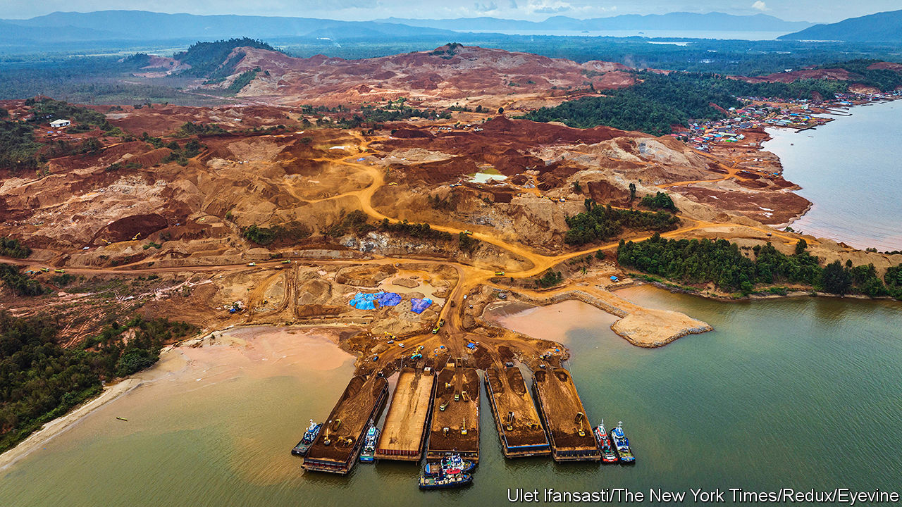
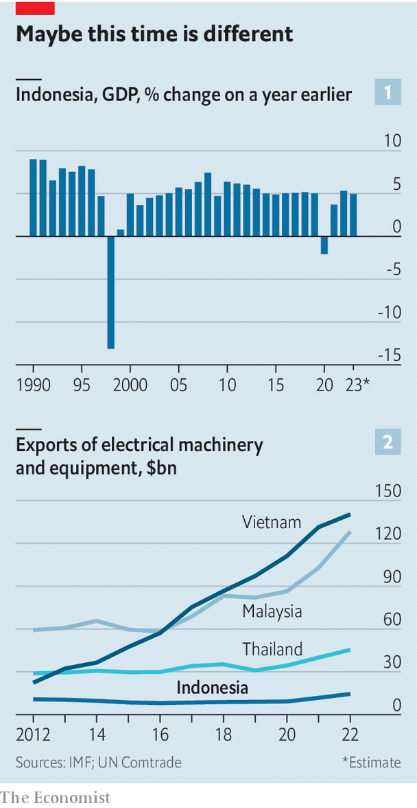

###### Running out of road

# The false promise of Indonesia’s economy 

##### Presidential candidates vow to deliver 7% growth. Voters have heard it before 

 

> Feb 8th 2024 

In politics, repetition is a crucial part of any campaign. But for Indonesian voters, who go to the polls to elect a new president on February 14th, one pledge is starting to sound a little too familiar. Candidates hoping to lead the world’s third-largest democracy have now, for the better part of two decades, been vowing to raise the country’s growth rate to 7%. 

Joko Widodo, the outgoing president known as Jokowi, was elected on such a promise in 2014. So was his predecessor, Susilo Bambang Yudhoyono, who came to office in 2004. This time, two of the three contenders are making similar pledges. Ganjar Pranowo, former governor of Central Java, has a growth target of 7%. Prabowo Subianto, Indonesia’s minister of defence and the front-runner, has suggested that double-digit growth is possible. 

 


So far, two decades of promises have fallen short. Indonesia’s economy grew by around 5% last year, close to the average rate over the past two decades. The country’s last 7% expansion was in 1996, the year before the Asian Financial Crisis (see chart 1). Since Indonesia’s transition to democracy in 1998, promises of higher growth have been far more common than the policies that might encourage such a shift. 

The outgoing president has achievements to flaunt. A decade ago the country was one of the “Fragile Five”, a group of emerging-market economies vulnerable to high interest rates abroad and a strong dollar. Today its current account is roughly balanced and its external debts modest. After legislative and legal speed bumps, Jokowi’s omnibus bill, which cuts restrictions on foreign investment and simplifies licensing, finally became law last year. Indonesia’s infrastructure has improved over the past decade, helped by the construction of thousands of kilometres of roads.

Yet the government’s proudest achievement is its nickel-focused industrial policy. The metal is used in electric-vehicle batteries, and Indonesia has the world’s largest deposits. Export of most raw ore has been banned since 2014, the aim being to force companies to process and manufacture in Indonesia. BYD, Ford and Hyundai are among the carmakers now investing in the country. Exports of ferronickel, a processed form of the metal, rose from $83m in 2014 to $5.8bn in 2022. 

Although openness to investment from both China and the West and an enormous stockpile of a vital battery metal is proving to be a powerful combination, there are risks to the approach. One is technological. Cullen Hendrix of the Peterson Institute for International Economics, a think-tank, notes that lithium-iron phosphate batteries, which contain no nickel, are becoming more popular. Sodium-ion batteries, which need neither nickel nor lithium, could surpass both types. Last month JAC Motors, a Chinese carmaker backed by Volkswagen, a German one, delivered the first commercial vehicles powered by sodium-ion batteries to customers. 

There are also signs that Indonesian policymakers are learning the wrong lessons from their nickel success. Despite obvious opportunities in the sunny archipelago, solar-power investment is suppressed by rules that panels must contain lots of domestically produced materials. Last year TikTok, a short-form video platform, was prodded into a shotgun tie-up with Tokopedia, an Indonesian e-commerce firm. It paid $840m for a 75% stake in the firm after new regulations halted its own e-commerce operations in the country. 

Moreover, Indonesian businesses remain stifled by local regulations, despite reforms introduced by the omnibus law. Rules requiring imports to be screened at particular entry points are equivalent to a 22% tariff, according to research by the World Bank—more than twice the South-East Asian average. Indeed, non-tariff barriers impose costs equivalent to 60-130% of the cost of computers, electronics and transport equipment. The election campaign has featured few concrete economic-policy proposals, but none of the candidates has expressed any zeal for peeling back the country’s many trade restrictions.

Indonesia’s industrial policy undermines officials when they seek to attract investors who do not need the country’s resources. Malaysia, Thailand and Vietnam, which place fewer restrictions on outside investors, are more obvious destinations for firms looking for alternatives to Chinese manufacturing. As a consequence, Indonesia’s exports of electronics are not just lower than any other large economy in South-East Asia; they have grown more slowly, too (see chart 2). The share of Indonesian exports heading to America is lower than in any of its local competitors. 

Although Indonesia is a relatively young country, by the time of the next presidential election in 2029 this tailwind will have disappeared. The country’s dependency ratio—the number of children aged under 15 and adults over 65 per 100 working-age adults—will begin to rise steadily from that year. Without more effective attempts to boost the economy, talk of 7% growth will remain illusory. ■


